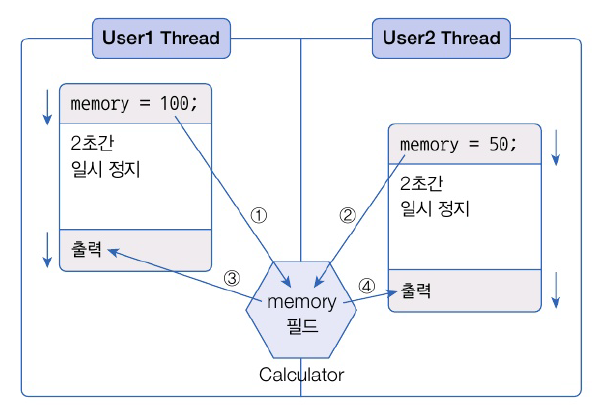
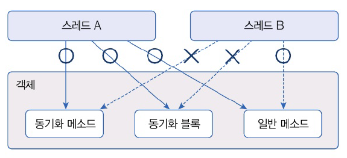
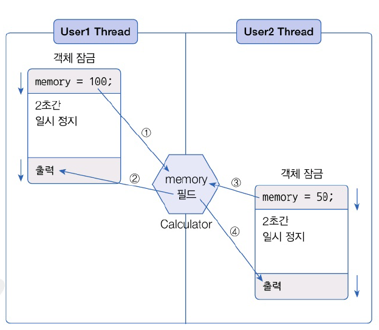

# 14.6 스레드 동기화
- 멀티 스레드는 하나의 객체를 공유해서 작업할 수 있음
- 다른 스레드에 의해 객체 내부 데이터가 쉽게 변결될 수 있음 -> 의도했던 것과는 다른 결과 나올 수 있음



- User1이 정지해앴는 동안 User2가 필드 값을 변경하고 그 후에 User1이 출력을 진행하면 변경된 값이 출력
- User1에서 저장한 데이터가 날라감
- 동기화 메소드와 블록  : 스레드가 사용중인 객체를 다른 스레드가 변경할 수 없도록 스레드 작업이 끝날 때까지 객체 잠긍



- 객체 내부에 동기화 메스도와 동기화 블록이 여러 개 있다면 
  - 스레드가 이들 중 하나를 실행할 때 다른 스레드는 해당 스레드와 다른 동기화 메소드 및 블록 실행 X 
  - 일반 메소드 실행 가능

## 동기화 메소드 및 블록 선언
- 동기화 메소드 선언 방법 : `synchornized` 키워드 (인스턴스와 정적 메소드 어디든)
- 스레드가 동기화 메소드를 실행하는 즉시 객체는 잠금
- 메소드 실행이 끝나면 잠금이 풀림
- 메소드 전체가 아닌 일부 영역을 실행할 때만 객체 잠금 걸고 싶은 경우 동기화 블록 생성

```java
package java_240906;

public class Calculator {
    private int memory;

    public int getMemory() {
        return memory;
    }

    // 동기화 메소드
    public synchronized void setMemory1(int memory) {
        this.memory = memory; // 메모리 값 저장
        try {
            Thread.sleep(2000); /// 2초간 일시 정지
        } catch (InterruptedException e) {}
        // 메모리 값 읽기
        System.out.println(Thread.currentThread().getName() + ": " + this.memory);
    }

    public void setMemory2(int memory) {
        // 동기화 블록
        synchronized (this) {
            this.memory = memory;
            try {
                Thread.sleep(2000); /// 2초간 일시 정지
            } catch (InterruptedException e) {}
            // 메모리 값 읽기
            System.out.println(Thread.currentThread().getName() + ": " + this.memory);
        }
    }
}

```

```java
package java_240906;

import java_240906.ex01.Calculator;

public class User1Thread extends Thread {
    private Calculator calculator;

    public User1Thread() {
        setName("User1Thread"); // 스레드 이름 변경
    }

    // 외부애서 공유 객체인 Calculator를 받아 필드에 저장
    public void setCalculator(Calculator calculator) {
        this.calculator = calculator;
    }

    @Override
    public void run() {
        calculator.setMemory1(100); // 동기화 메소드 호출
    }
}

```

```java
package java_240906;

import java_240906.ex01.Calculator;

public class User2Thread extends Thread {
    private Calculator calculator;

    public User2Thread() {
        setName("User2Thread"); // 스레드 이름 변경
    }

    // 외부애서 공유 객체인 Calculator를 받아 필드에 저장
    public void setCalculator(Calculator calculator) {
        this.calculator = calculator;
    }

    @Override
    public void run() {
        calculator.setMemory2(50); // 동기화 메소드 호출
    }
}

```

```java
package java_240906;

import java_240906.ex01.Calculator;
import java_240906.ex01.User1Thread;
import java_240906.ex01.User2Thread;

public class SynchronizedExample {
    public static void main(String[] args) {
        Calculator calculator = new Calculator();

        User1Thread user1Thread = new User1Thread();
        user1Thread.setCalculator(calculator);
        user1Thread.start();

        User2Thread user2Thread = new User2Thread();
        user2Thread.setCalculator(calculator);
        user2Thread.start();
    }
}

```



## wait()와 notify()를 이용한 스레드 제어
- 두 개의 스레드를 교대로 번갈아가며 시랭할 수도 있음
- 정교한 교대 작업이 필요한 경우, 자신의 작업이 끝나면 상대방의 스레드를 일시 정지 상태에서 풀어주고 자신은 일시 정지 상태로 만들면 된다!
- 공유 객체
  - 두 스레드가 작업할 내용을 각각 동기화 메소드로 정해 놓은
  - 한 스레드가 작업을 완료하면  notify() 메소드를 호출해서 일시 정지 상태에 있는 다른 스레드를 실행 대기 상태로 만듦
  - 자신은 두번 작업하지 않도록  wait() 메소드를 호출하여 일시 정지 상태로 만듦


- `notify()` : wait()에 의해 일시 정지된 스레드 중 한 개를 실행 대기 상태로 만듦
- `notifyAll()`: wait()에 의해 일시 정지된 모든 스레드를 실행 대기 상태로 만ㄷ름
- 이 두 메소드는 동기화 메소드 또는 동시화 블록 내에서만 사용 가능


```java
package java_240906.ex02;

public class WorkObject {
    // 동기화 메소드
    public synchronized void methodA() {
        Thread thread = Thread.currentThread();
        System.out.println(thread.getName() + ": methodA 작업 실행");
        notify(); // 다른 스레드를 실행 대기 상태로 만듦
        try {
            wait(); // 자신의 스레드는 일시 정지 상태로 만듦
        } catch (InterruptedException e) {}
    }

    // 동기화 메소드
    public synchronized void methodB() {
        Thread thread = Thread.currentThread();
        System.out.println(thread.getName() + ": methodB 작업 실행");
        notify(); // 다른 스레드를 실행 대기 상태로 만듦
        try {
            wait(); // 자신의 스레드는 일시 정지 상태로 만듦
        } catch (InterruptedException e) {}
    }
}

```

```java
package java_240906.ex02;

public class ThreadA extends Thread{
    private  WorkObject workObject;

    // 공유 작업 객체를 받음
    public ThreadA(WorkObject workObject) {
        setName("ThreadA"); // 스레드 이름 변경
        this.workObject = workObject;
    }

    @Override
    public void run() {
        for (int i=0 ; i <10; i++){
            workObject.methodA(); // 동기화 메소드 호출
        }
    }
}

```

```java
package java_240906.ex02;

public class ThreadB extends Thread{
    private  WorkObject workObject;

    // 공유 작업 객체를 받음
    public ThreadB(WorkObject workObject) {
        setName("ThreadB"); // 스레드 이름 변경
        this.workObject = workObject;
    }

    @Override
    public void run() {
        for (int i=0 ; i <10; i++){
            workObject.methodA(); // 동기화 메소드 호출
        }
    }
}

```

```java
package java_240906.ex02;

public class WaitNotifyExample {
    public static void main(String[] args) {
        WorkObject workObject = new WorkObject(); // 공유 작업 객체 생성

        ThreadA threadA = new ThreadA(workObject);
        ThreadB threadB = new ThreadB(workObject);

        // 작업 스레드 생성 및 실행
        threadA.start();
        threadB.start();
    }
}

```