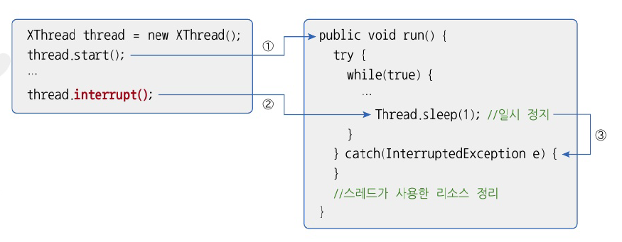

# 14.7 스레드 안전 종료
- 스레드는 자신의 run() 메소드가 모두 실행되면 자동적으로 종료
- 경우에 띠라서는 실행 중인 스레드를 즉시 종료할 필요가 있음
- Thread에 stop() 메소드가 있으나 더이상 사용 하지 않음 -> 리소스들이 불안전한 상태로 남겨지기 때문
- 스레드를 안전하게 종료하는 방법 : 사용하던 리소스 정리하고 run() 메소드 빨리 종료하는 것

## 조건 이용
- 스레드가 while문으로 반복 실행할 경우, 조건 이용해서 run() 메소드의 종료를 유도할 수 있음

```java
package java_240912;

public class PrintThread extends Thread {
    private boolean stop;

    // 외부에서 stop 필드값을 변견할 수 있도록 Setter 선언
    public void setStop(boolean stop) {
        this.stop = stop;
    }

    @Override
    public void run() {
        // stop 필드값에 따라 반복 여부 결정
        while (!stop) {
            System.out.println("실행중");
        }
        System.out.println("리소스 정리"); // 리소스 정리
        System.out.println("실행 종료");
    }
}

```

```java
package java_240912;

import java_240912.ex01.PrintThread;

public class SafeStopExample {
    public static void main(String[] args) {
        PrintThread printThread = new PrintThread();
        printThread.start();

        try {
            Thread.sleep(3000);
        } catch (InterruptedException e) {
        }

        // PrintThread 를 종료하기 위해 sop 필드값 변경
        printThread.setStop(true);
    }
}

```

```java
실행중
실행중
실행중
리소스 정리
실행 종료
```

## Interrupt() 메소드 이용
- 스레드가 일시 정지 상태에 있을 때 InterruptedException 예외를 발생시키는 역할
- 예외 처리를 통해 run() 메소드 정상 종료 시킬 수 있다.



- XThread 생성하여 start() a메소드 실행 -> interrupt() 메소드 실행하면 일시 정지 상태에서 예외 처리 블록으로 이동

```java
package java_240912.ex02;

public class PrintThread extends Thread {
    public void run() {
        try {
            while (true) {
                System.out.println("실행 중");
                // 일시 정지 (Interrupted Exception 발생하도록)
                Thread.sleep(1);
            }
        }catch (InterruptedException e) {}
        System.out.println("리소스 정리");
        System.out.println("실행 종료");
    }
}

```

```java
package java_240912.ex02;

public class InterrtuprExample {
    public static void main(String[] args) {
        Thread thread = new PrintThread();
        thread.start();

        try {
            Thread.sleep(1000);
        } catch (InterruptedException e) {

        }

        thread.interrupt(); // interrupt() 메소드 호출
    }
}

```

- 스레드가 실행 대기. 실행 상태일 때에는 interrupt() 메소드가 호출 되어도 InterruptedException이 발생하지 않음
- 그러나 스레드가 어떤 이유로 일시 정지 상태가 되면 InterruptedException이 발생
- 일시 정지를 만들지 않고도 interrupt() 메소드 호출 여부 할 수 있는 방법이 있음
  - interrupted()외 isInterrupted() 메소드는 interrupt() 메소드 호출 여부를 리턴

```java
package java_240912.ex03;

public class PrintThread extends Thread{
    public void run() {
        while (true) {
            System.out.println("실행 중");
            // interrupt() 메소드가 호출되었다면 while 문을 빠져나감
            if (Thread.interrupted()) {
                break;
            }
        }
        System.out.println("리소스 정리");
        System.out.println("실행 종료");
    }
}

```

```java
package java_240912.ex03;

public class InterruptExample {
    public static void main(String[] args) {
        Thread thread = new PrintThread();
        thread.start();

        try {
            Thread.sleep(1000);
        } catch (InterruptedException e)  {}

        thread.interrupt();
    }
}

```

```java
실행 중
실행 중
실행 중
실행 중
실행 중
리소스 정리
실행 종료
```