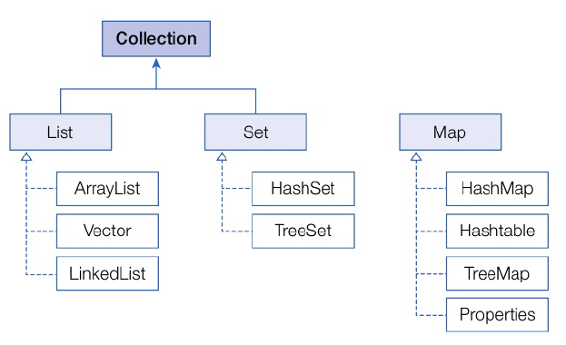
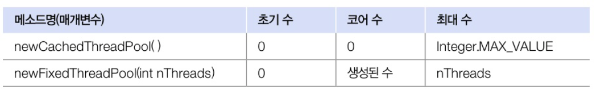

# 14.9 스레드풀
- 병렬 작업 처리가 많아지면 스레드의 개수 폭증 -> CPU가 바빠지고 메모리 사용량이 늘어남, 애플리케이션의 성능 급격히 저하
- 병렬 작업 증가로 인한 스레드의 폭증 방지를 위해 스레드풀 사용!
- 스레드풀 
  - 작업 처리에 사용되는 스레드를 제한된 개수만큼 정해놓고 큐에 들어오는 작업들을 하나씩 맡아 처리하는 방식
  - 작업 처리가 끝난 스레드는 다시 작업 큐에서 새로운 작업을 가져와 처리
  - 이렇게 하면 작업량이 증가해도 스레드의 개수가 늘어나지 않아 애플리케이션의 성능이 급격히 저하되지 않음



## 스레드풀 생성
- java.util.concurrent 패키지에서 `ExcecutorService` 인터페이스와 `Excutors` 클래스 제공



- 초기 수 : 스레드 풀이 생성 될 때 기본적으로 생성되는 스레드 수
- 코어 수 : 스레드가 증가된 후 사용되지 않는 스레드를 제거할 때 최소한 풀에서 유지하는 스레드 수
- 최대 수 : 증가되는 스레드의 한도 수
- `newCacheThreadPool()` : 스레드풀의 초기 수와 코어 수는 0개, 작업 개수가 많아지면 새 스레드를 생성시켜 작업 처리, 60초 동안 스레드가 아무 작업 X-> 스레드 풀에서 제거
- `newFoxedThreadPppl()` : 스레드풀의 초기 수는 0개이고, 작업개수가 많아지면 최대 5개까지 스레드를 생서시켜 작업 처리, 생성된 스레드를 제거하지 않음
- 직접 ThreadPollExcutor로 스레드풀 생성 가능

```java
import java.util.concurrent.ExecutorService;
import java.util.concurrent.SynchronousQueue;
import java.util.concurrent.ThreadPoolExecutor;
import java.util.concurrent.TimeUnit;

ExecutorService threadPool = new ThreadPoolExecutor(
        3, // 코어 스레드 개수
        100, // 최대 스레드 개수
        120L, // 놀고 있는 시간
        TimeUnit.SECONDS, // 놀고 있는 시간 단위
        new SynchronousQueue<Runnable>() // 작업 큐
);
```