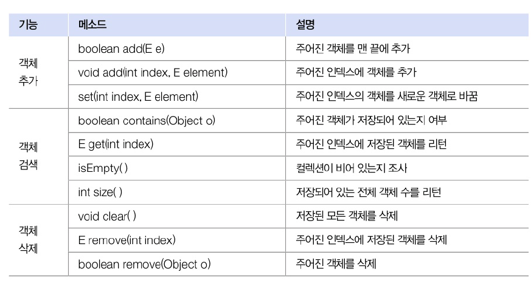
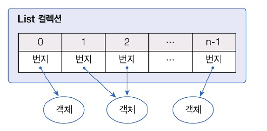

# 15.2 List 컬렉션
- 갤체를 인덱스로 관리하기 대문에 객체를 저장하면 인덱스가 부여됨
- 인덱스로 객체를 검새가 삭젝할 수 있는 기능을 제공
- 공통적으로 사용가능한 메서드 -> 인덱스를 매개값으로 갖는 메소드들이 많은
- List 컬렉션은 객체 자체를 저장 X 객체의 번지 저장
- 동일한 객체를 중복으로 저장하는 경우 동일한 번지 저ㅕ장
- null 또한 저장 가능



## ArrayList
- List에서 가장 많이 사용하는 컬렉션
- ArrayList에 객체를 추가하면 내부 배열에 객체가 저장
- 일반 배열과의 차이점 : 제한 없이 객체 추가 가능



- ArrayList 생성 방법

```java
import java.util.ArrayList;
import java.util.List;

// E에 지정된 타입의 객체만 저장
List<E> list = new ArrayList<E>();
List<E> list = new ArrayList<>(); // List에 지정한 객체 타입과 동일하다면 생략 가능

// 모든 타입의 객체를 저장
List list  = new ArrayList<>();
```

- ArrayList 컬렉션에 객체 추가하면 인덱스 0번 부터 차례러 저장
- 특정 인덱스의 객체를 제거하면 바로 뒤 인덱스부터 마지막 인덱스까지 모두 앞으로 1씩 당겨짐
- 특정 인덱스에 객체를 삽입하면 해당 인덱스로부터 마지막 인덱스까지 1씩 밀려남
- 빈번함 객체 삭제와 삽입이 일어나는 곳에 사용 바람직하지 암ㅎ음 -> LinkedList가 나음


```java
package java_241003;

import java.util.ArrayList;
import java.util.List;

public class ArrayListExample {
    public static void main(String[] args) {
        // ArrayList 컬렉션 생성
        List<Board> list =  new ArrayList<>();

        // 객체추가
        list.add(new Board("제목1", "내용1", "글쓴이1"));
        list.add(new Board("제목2", "내용2", "글쓴이2"));
        list.add(new Board("제목3", "내용3", "글쓴이3"));
        list.add(new Board("제목4", "내용4", "글쓴이4"));
        list.add(new Board("제목5", "내용5", "글쓴이5"));

        // 저장된 총 객체 수 얻기
        int size = list.size();
        System.out.println("총 객체 수: " + size);
        System.out.println();

        // 특정 인덱스의 객체 가져오기
        Board board = list.get(2);
        System.out.println(board.getSubject() + "\t" + board.getContent()
                + "\t" + board.getWriter());
        System.out.println();

        // 모든 객체를 하나씩 가져오기
        for (int i=0; i< list.size(); i++){
            Board b = list.get(i);
            System.out.println(b.getSubject() + "\t" + b.getContent()
                    + "\t" + b.getWriter());
        }
        System.out.println();

        // 객체 삭제 : 인덱스 당겨지는 것 확인 가능
        list.remove(2);
        list.remove(2);

        // 향상된 for문으로 모든 객체를 하나씩 가져오기
        for(Board b : list){
            System.out.println(b.getSubject() + "\t" + b.getContent()
                    + "\t" + b.getWriter());
        }
    }
}

```

```java
총 객체 수: 5

제목3	내용3	글쓴이3

제목1	내용1	글쓴이1
제목2	내용2	글쓴이2
제목3	내용3	글쓴이3
제목4	내용4	글쓴이4
제목5	내용5	글쓴이5

제목1	내용1	글쓴이1
제목2	내용2	글쓴이2
제목5	내용5	글쓴이5
```