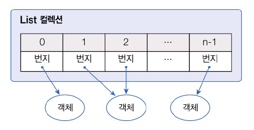
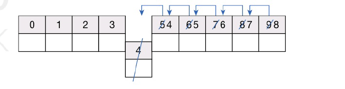
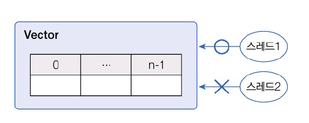
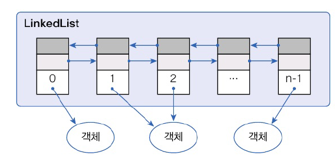
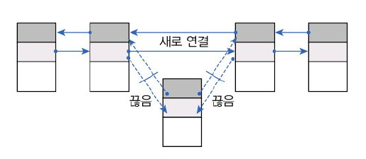

# Chapter 15. 컬렉션 자료 구조
# 15.1 컬렉션 프레임워크
- 컬렉션 프레임워크 
  - 자료 구조를 바탕으로 객체들을 효율적으로 추가, 삭제, 검색할 수 있도록 관련된 인터페이스와 클래스들을 java.util 패키지에 포함시켜둔 것
  - 데이터를 저장하는 **자료 구조**와 데이터를 처리하는 **알고리즘**을 구조하하여 클래스로 구현해놓은 것
  - 객체 지향적이고 재사용성이 높은 코드를 작성할 수 있음
  - 주요 인터페이스 : List, Set, Map
- List 와 Set : 공통된 메소드(객체 추가, 삭제, 검색)를 모아 Collection 인터페이스로 정의, 이것을 상속
- Map : 키와 값을 하나의 쌍으로 묶어서 관리하는 구조

| 인터페이스 분류          | 특징                                     | 구현 클래스                                   |
|:------------------|:---------------------------------------|:-----------------------------------------|
| Collection - List | - 순서를 유지하고 저장 <br/> - 중복 저장 가능         | ArrayList, Vector, LinkedList            |
| Collection - Set  | - 순서를 유지하지 않고 저장 <br/> - 중복 저장 안됨      | HashSet, TreeSet                         |
| Map               | - 키와 값으로 구서된 엔트리 저장 <br/> - 키는 중복 저장안됨 | HashMap, Hahshtable, TreeMap, Properties |


# 15.2 List 컬렉션
- 객체를 인덱스로 관리
- 객체를 저장 시 인덱스 부여 -> 인덱스로 객체 검색, 삭제 기능 제공
- List 컬렉션에서 공통저긍로 사용 가능한 List 인터페이스 메소드
  - 객체 추가
    - `boolean add(E e)` : 주어진 객체를 맨 끝에 추가
    - `void add(int index. E element)` : 중진 인덱스에 객체를 추가
    - `set(int index, E element)` : 주어진 인덱스의 객체를 새로운 객체로 바꿈
  - 객체 검색
    - `boolean contains(Object o)` : 주어진 객체가 저장되어 있는지 여부
    - `E get(int index)` : 주어진 인덱스에 저장된 객체를 리턴
    - `boolean isEmpty()` : 컬렉션이 비어 있는지 조사
    - `int size()` : 저장되어 있는 전체 객체 수를 리턴
  - 객체 삭제
    - `void clear()` : 저장된 모든 객체를 삭제
    - `E remove(int index)` : 주어진 인덱스에 저장된 객체를 삭제

## Array:ist
- List 컬렉션에서 가장 많이 사용하는 컬렉션
- 객체 추가하면내부 배열에 객체가 저장
- 일반 배열과의 차잊머 : 제한 없이 추가할 수 있다는 것



- 객체 자체 저장 X 객체 번지 저장
- 동일한 객체를 중복하여 저장 시 동일한 번지가 저장
- null 저장 가능

```java
import java.util.ArrayList;

List<E> list = new ArrayList<E>(); // E에 지정된 타입의 객체만 저장
List<E> list = new ArrayList<>(); // E에 지정된 타입의 객체만 저장
List list = new ArrayList(); // 모든 타입의 객체를 저장
```

- 객체 추가시 인덱스 0번부터 차례대로 저장
- 특정 인덱스의 객체 제거 시 뒤에 존재하는 인덱스 모든 앞으로 당겨짐. 삽입 시에도 마찬가지
- 빈번한 객체 삭제와 삽입은 바람직하지 않음



### ArrayList 예제
- Board 클래스 생성

```java
package java_241224;

public class Board {
    private String subject;
    private String content;
    private String writer;

    public Board(String subject, String content, String writer) {
        this.subject = subject;
        this.content = content;
        this.writer = writer;
    }

    public String getSubject() {return subject;}
    public void setSubject(String subject) {
        this.subject = subject;
    }

    public String getContent() {
        return content;
    }

    public void setContent(String content) {
        this.content = content;
    }

    public String getWriter() {
        return writer;
    }

    public void setWriter(String writer) {
        this.writer = writer;
    }
}

```

- ArrayList 예제
```java
package java_241224;

import java.util.ArrayList;
import java.util.List;

public class ArrayListExample {
    public static void main(String[] args) {
        // ArrayList 컬렉션 생성
        List<Board> list = new ArrayList<>();

        // 객체 추가
        list.add(new Board("제목1", "내용1"," 글쓴이1"));
        list.add(new Board("제목2", "내용2"," 글쓴이2"));
        list.add(new Board("제목3", "내용3"," 글쓴이3"));
        list.add(new Board("제목4", "내용4"," 글쓴이4"));
        list.add(new Board("제목5", "내용5"," 글쓴이5"));


        // 저장된 총 객체 수 얻기
        int size = list.size();
        System.out.println("총 객체 수: " + size);
        System.out.println();

        // 특정 인덱스의 객체 자겨오기
        Board board = list.get(2);
        System.out.println(board.getSubject() + "\t" +
                board.getContent() + "\t" + board.getWriter());

        System.out.println();

        // 모든 객체를 하나씩 가져오기
        for (int i = 0; i < list.size(); i++) {
            Board b =  list.get(i);
            System.out.println(b.getSubject() + "\t" +
                    b.getContent() + "\t" + b.getWriter());
        }

        System.out.println();

        // 객체 삭제
        list.remove(2); // 2번 인덱스 삭제 -> 3번 인덱스가 2번 인덱스에 위치
        list.remove(2);

        // 향상된 for문으로 모든 객체 가져오기
        for (Board b : list) {
            System.out.println(b.getSubject() + "\t" +
                    b.getContent() + "\t" + b.getWriter());
        }

    }
}
```

```java
총 객체 수: 5

제목3	내용3	 글쓴이3

제목1	내용1	 글쓴이1
제목2	내용2	 글쓴이2
제목3	내용3	 글쓴이3
제목4	내용4	 글쓴이4
제목5	내용5	 글쓴이5

제목1	내용1	 글쓴이1
제목2	내용2	 글쓴이2
제목5	내용5	 글쓴이5
```

## Vector
- ArrayList와 동일한 내부 구조를 가지고 있음
- 차이점 : 동기화된 메소드로 구성되어 있음 -> 멀티 스레드가 동시에 Vector() 메소드를 실행할 수 었다는 것
- 멀티 스레드 환경에서는 안전하게 객체 추가 및 삭제 불가능



```java
import java.util.List;
import java.util.Vector;

List<E> list = new Vector<E>(); // E에 지정된 타입의 객체만 저장
List<E> list = new Vector<>(); // E에 지정된 타입의 객체만 저장
List list = new Vector(); // 모든 타입의 객체를 저장
```

### Vector 예제
- Vector의 경우 2000개 저장
  - Vector의 add()는 동기화 메소드
  - 한 번에 하나의 스르ㅔ드만 실행할 수 있음 -> 경합 발생 X
- ArrayList의 경우 2000개가 나오지 않거나 에러가 발생
  - 두 스레드가 동시에 add()를 호출할 수 있기 때문에 경합 발생 -> 하나만 저장

```java
package java_241224;

import java.util.ArrayList;
import java.util.List;
import java.util.Vector;

public class VectorExample {
    public static void main(String[] args) {
        // Vector 컬렉션 생성
        List<Board> list = new Vector<>(); // 2000개
//        List<Board> list = new ArrayList<>(); // 1965개

        // 작업 스레드 객체 생성
        Thread threadA =  new Thread() {
            @Override
            public void run() {
                // 객체 1000개 추가
                for (int i = 1; i <= 1000 ; i++) {
                    list.add(new Board("제목"+i, "내용"+i, "글쓰기"+i));
                }
            }
        };

        // 작업 스레드 객체 생성
        Thread threadB =  new Thread() {
            @Override
            public void run() {
                // 객체 1000개 추가
                for (int i = 1001; i <= 2000 ; i++) {
                    list.add(new Board("제목"+i, "내용"+i, "글쓰기"+i));
                }
            }
        };

        // 작업 스레드 실행
        threadA.start();
        threadB.start();


        // 작업 스레드들이 모두 종료될 때가지 메인 스레드를 기다리게 함
        try {
            threadA.join();
            threadB.join();
        } catch (Exception e){}

        // 저장된 총 객체 수 출력하기
        int size = list.size();
        System.out.println("총 객체 수 : " + size);
    }
}

```

## LinkedList

- ArrayList와 사용 방법 동일. 구조 다름
- ArrayList : 내부 배열에 객체를 저장
- LinkedList : 인접 객체를 체인처럼 연결해서 관리
  - 특정 위치에서 삽입 및 삭제 -> 앞뒤 링크만 변경하면 됨
  - 빈번한 객체 삭제와 삽입 일어나는 곳에 좋은 성능
  - 


```java
import java.util.List;
import java.util.LinkedList;

List<E> list = new LinkedList<E>(); // E에 지정된 타입의 객체만 저장
List<E> list = new LinkedList<>(); // E에 지정된 타입의 객체만 저장
List list = new Vector(); // 모든 타입의 객체를 저장
```

### LinkedList 예제
- ArrayList와 LinkedList의 객체 삽입 시간 비교
  - LinkedList가 훨씬 빠른 성능
  - ArrayList는 객체 추가시 기존 객체의 인덱스를 한 칸씩 뒤로 미는 작업을 하기 때문

```java
package java_241224;

import java.util.ArrayList;
import java.util.LinkedList;
import java.util.List;

public class LinkedListExample {
    public static void main(String[] args) {
        // ArrayList 컬렉션 객체 생성
        List<String> list1 = new ArrayList<String>();

        // LinkedList 컬렉션 객체 생성
        List<String> list2 = new LinkedList<String >();

        // 시작 시간과 끝 시간을 저장할 변수 선언
        long startTime;
        long endTime;

        // ArrayList 컬렉션에 저장하는 시간 측정
        startTime = System.nanoTime();
        for (int i = 0; i < 1000; i++) {
            list1.add(0, String.valueOf(i));
        }
        endTime = System.nanoTime();
        System.out.printf("%-17s %8d ns \n", "ArrayList 걸린 시간: ", (endTime-startTime));


        // LinkedList 컬렉션에 저장하는 시간 측정
        startTime = System.nanoTime();
        for (int i = 0; i < 1000; i++) {
            list2.add(0, String.valueOf(i));
        }
        endTime = System.nanoTime();
        System.out.printf("%-17s %8d ns \n", "LinkedList 걸린 시간: ", (endTime-startTime));
    }
}

```

```java
ArrayList 걸린 시간:   1499500 ns 
LinkedList 걸린 시간:    810100 ns 
```