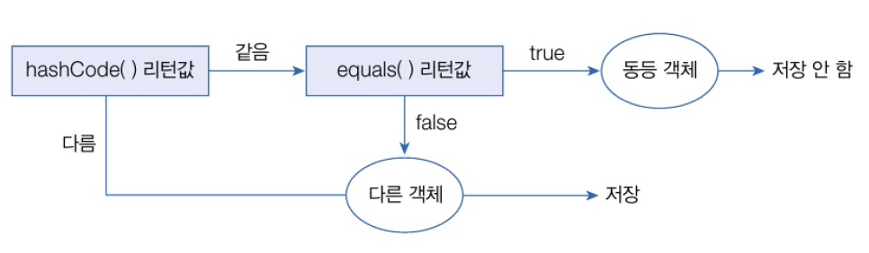

# 15.3 Set 컬렉션
- List 컬렉션 : 저장 순서 유지
- Set 컬렉션
  - 저장 순서 유지 X
  - 객체 중복 저장 할 수 없음
  - 하나의 null만 저장 가능
- HashSet, LinkedHashSet, TreeSet

---

Set 인터페이스 공통 메소드  
- 객체 추가
  - `boolwan add(E e)` : 주어진 객체를 성공적으로 저장하면 true 리턴하고 중복 객체면 false를 리턴
- 객체 검색
  - `boolean contains(Object o)` : 주어진 객체가 저장되어 있는지 여부
  - `isEmpty()` : 컬렉션이 비어 있는지 조사
  - `Iterator<E> iterator()` : 저장된 객체를 한 번씩 가져오는 반복자 리턴
  - `int size()` : 저장되어 있는 전체 객체 수 리턴
- 객체 삭제
  - `void clear()` : 저장된 모든 객체를 삭제
  - `boolean remove(Object o)` : 주어진 객체를 삭제

## HashSet
- Set 컬렉션 중에서 가장 많이 사용됨.
- 생성 방법

```java
import java.util.HashSet;
import java.util.Set;

Set<E> set = new HashSet<E>(); // E에 지정된 타입의 객체만 저장
Set<E> set = new HashSet<>(); // E에 지정된 타입의 객체만 저장
Set set = new HashSet(); // 모든 타입의 객체를 저장
```
- HashSet은 동일한 객체(동등 객체)를 중복 저장 하지 않음
- 다른 객체라도 `hashCode()` 메소드의 리턴값이 같고, `equals()` 메소드가 true를 리턴하면 동일한 객체로 판단, 중복 저장 X
  - 같은 문자열읠 갖는 String 객체 동등한 객체로 간주



### HashSet 예제
```java
package java_241231;

import java.util.HashSet;
import java.util.Set;

public class HashSetExample {
    public static void main(String[] args) {
        // HashSet 컬렉션 생성
        Set<String> set = new HashSet<>();

        // 객체 저장
        set.add("Java");
        set.add("JDBC");
        set.add("JSP");
        set.add("Java"); // 중복 객체이므로 저장하지 않음
        set.add("Spring");

        // 저장된 객체 수 출력
        int size = set.size();
        System.out.println("총 객체 수: " + size);
    }
}

```

```java
총 객체 수: 4
```

