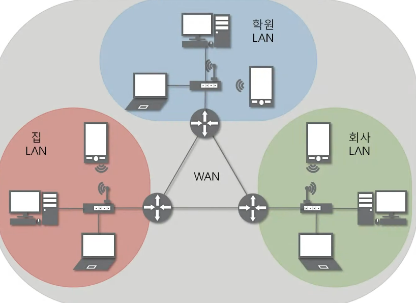
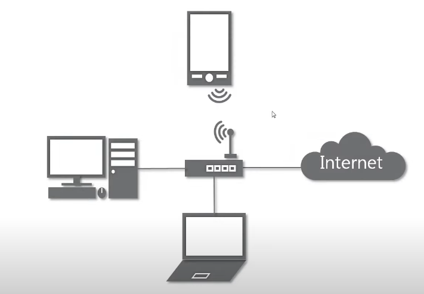
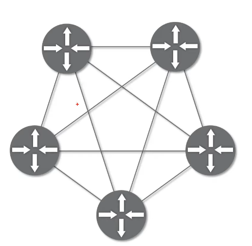
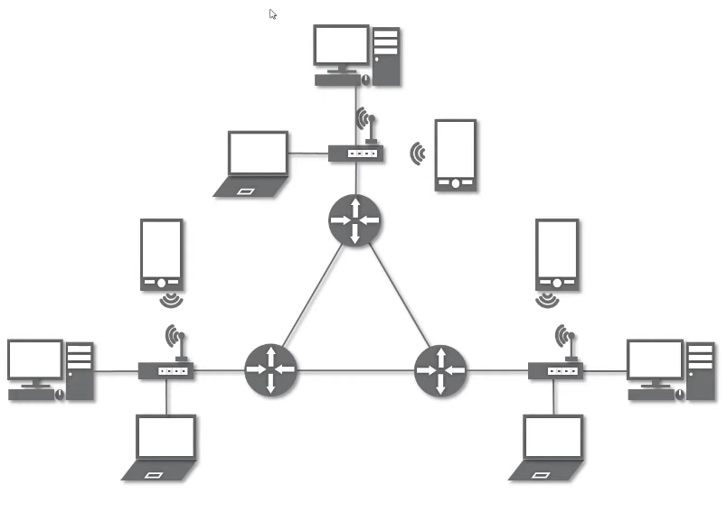

# 01. 네트워크란 무엇인가?
## 네트워크란 무엇인가
### 네트워크
- 노드들이 데이터를 공유할 수 있게 하는 디지털 전기 통신망의 하나
- 분산되어 있는 컴퓨터를 통신망으로 연결한 것
- 네트워크에서 여러 장치들은 노드간 연결을 사용하여 서로에게 데이터를 교환한다

### 인터넷
- 문서, 그림, 영상과 같은 여러가지 데이터를 공유하도록 구성된 세상에서 가장 큰 전세계를 연결하는 네크워크
- www은 인터넷을 통해 웹과 관련된 데이터를 공유하는 것. 인터넷이 아님

## 네트워크의 분류
### 크기에 따른 분류
- LAN (Local Area Network)
  - 가까운 지역을 하나로 묶은 네트워크
- WAN (Wide Area Network)
  - 멀리 있는 지역을 한데 묶은 네트워크
  - 가까운 지역끼리 묶인 여러 개의 LAN을 다시 하나로 묶은 것
  - 
- MAN (Metropolitan Area Network)
- 기타 (VLAN, CAN, PAN 등)

### 연결 형태에 따른 분류
- Star형 : 중앙 장비에 모든 노드가 연결
  - 중앙 장비가 고장나는 경우 연결된 모든 장치 사용할 수 없음
  - LAN 대역(가까운 지역)을 만들 때 사용
  - 
- Mesh형 : 여러 노드들이 서로 그물처럼 연결
  - 장비 하나가 고장나더라도 다른 장치는 사용 가능
  - WAN 대역(넓은 지역)을 만들 때 사용
  - 
- Tree형 : 마치 나무의 가지처럼 계층 구조로 연결
- 기타 : 링형, 버스형, 혼합형 등
  - 혼합형 : 실제 인터넷은 여러 형태를 혼합한 형태
  - 

## 네트워크의 통신 방식
### 네트워크에서 데이터를 주고받는 방식
- 유니 캐스트 : 특정 대상이랑만 1:1로 통신
- 멀티 캐스트 : 특정 다수와 1:N으로 통신
- 브로드 캐스트 : 네트워크에 있는 모든 대상과 통신

## 네트워크 프로토콜
### 프로토콜
- 네트워크에서 노드와 노드가 통신할 때 **어떤 노드**가 **어느 노드**에게 **어떤 데이터**를 어떻게 보내는지 작성하기 위한 양식

### 프로토콜 종류
1. Ethernet 프로토콜 (MAC 주소) : 가까운 곳과 연락할 때
2. ICMP, IPv4, ARP 프로토콜 (OP 주소) : 멀리 있는 곳과 연락할 때
3. TCP, UDP (포트 번호) : 여러가지 프로그램으로 연락할 때

- 패킷
  - 여러 프로토콜들로 캡슐화되어 있음
  - 