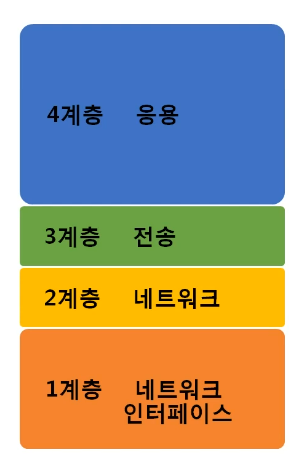
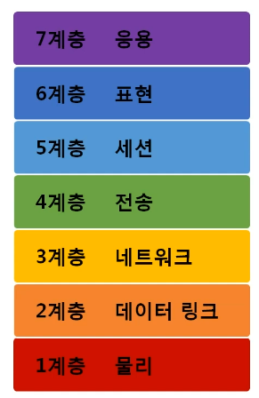
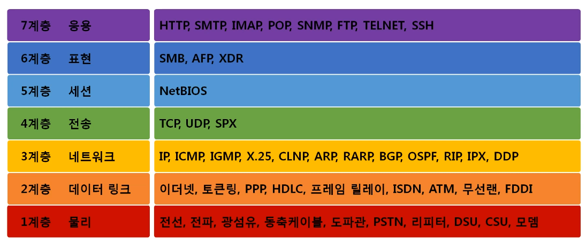
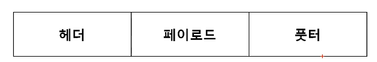
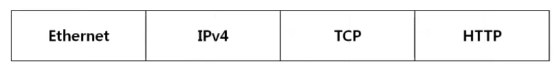
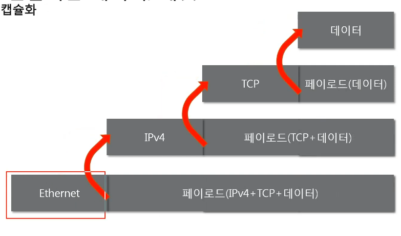

# 02. 네트워크 모델
## 네트워크 모델의 종류
### TCP/IP 모델
- 1980년대 초 프로토콜 모델로 공개
- 현재읜 인터넷에서 컴퓨터들이 서로 정보를 주고받는데 쓰이는 통신 규약(프로토콜)의 모임

### OSI 7계층
- 1984년 ISO(네트워크 통신을 체계적으로 다룸)에서 표준으로 지정한 모델
- 데이터를 주고받을 때 데이터 자체의 흐름을 각 구간별로 나눠 놓은 것

  

## 두 모델 비교
- 공통점
  - 계층적 네트워크 모델
  - 계층간 역할 정의
- 차이점
  - 계층의 수 차이
  - OSI는 역할 기반, TCP/IP는 프로토콜 기반
  - OSI는 통신 전반에 대한 표준. 논리적
  - TCP/IP는 데이터 전송 기술 특화. 실무적

## 네트워크를 통해 전달되는 데이터, 패킷
## 패킷
- 네트워크 상에서 전달되는 데이터를 통칭하는 말
- 네트워크에서 전달하는 데이터의 형식화된 블록
- 제어 정보와 사용자 데이터(페이로드)로 이루어빔
- 순서가 존재, 여러 번 포장된 택배 상자와 같은 형식

  

- 페이로드 : 보내고 싶은 정보
- 풋터 : 거의 사용하지 않음

### 캡슐화(인캡슐레이션, Encapsulation)
- 여러 프로토콜을 이용해서 최종적으로 보낼 때 패킷을 만드는 과정
- 상위 계층에서 하위 계층으로 내려가며 캡슐화
- 하위 프로토콜 앞에 상위 프로토콜이 올 수 없음

- HTTP를 페이로드로 해서 TCP라는 헤더로 감싼 패킷 생성
- 이 패킷을 페이로드로 해서 IPv4라는 헤더로 감싸 패킷 생성
- 또 이 패킷을 페이로드로 해서 Ethernet라는 헤더로 감싸 패킷 생성

### 디캡슐화 (디캡슐레이션, Decapsulation)
- 패킷을 받았을 때 프로토콜을 하나씩 확인하면서 데이터를 인하는 과정

### 계츨별 패킷의 이름 PDU (Protocal Data Unit)
- 세그먼트 : 4계층의 PDU (TCP + 데이터)
- 패킷 : 3계층의 PDU (IPv4 + TCP + 데이터)
- 프레임 : 2계층의 PDU (Ethernet + IPv4 + TCP + 데이터)