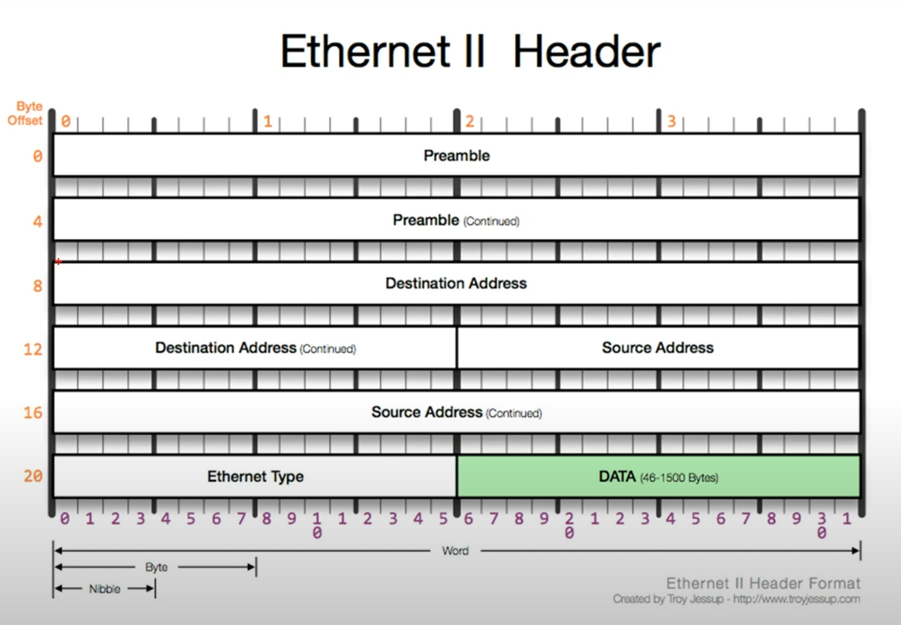

# 03. 가까이 있는 컴퓨터끼리 데이터를 주고받는 방법
## 2계층에서 하는 일
- 2계층의 기능
  - 하나의 네트워크 대역
  - 즉, 같은 네트워크 상에 존재하는 여러 장비들 중에서 어떤 장비가 어떤 장비에게 보내는 데잍를 전달
  - 오류제어(보내는 데이터에 오류가 있는지), 흐름제어(누가 누구에게 데이터를 보내는지) 수행
- 2계층의 네트워크 크기
  - 하나의 네트워크 대역 LAN에서만 통신할 때 사용
  - 다른 네트워크와 통신할 때는 항상 3계층이 도와주어야 함
  - 3계층의 주소와 3계층의 프로토콜을 이용하여야만 다른 네트워크와 통신이 가능
## 2계층에서 사용하는 주소
### 물리적인 주소 MAC 주소
- LAN에서 통신할 때 사용하는 주소
- 물리적인 장비가 부여받은 고유한 주소
- OUI + 고유번호. 12개의 16진수
  - OUI : IEEE에서 부여하는 일종의 제조회사 식별 ID
  - 고유번호 : 제조사에서 부여한 고유번호
## 2계층 프로토콜
### Ethernet 프로토콜

- LAN에서 통신할 때 사용
- Destination Address: 목적지 MAC주소. 6Byte
- Source Address : 출발지 주소. 6Byte
- Ethernet Type : 프로토콜 타입. 페이로드 내 프로토콜(상위 프로토콜)을 알려줌. 26Byte
- 총 14Byte