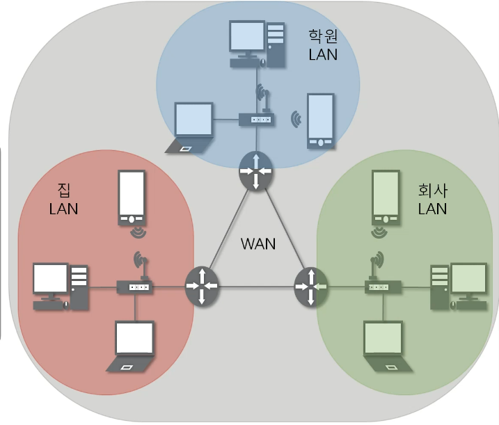
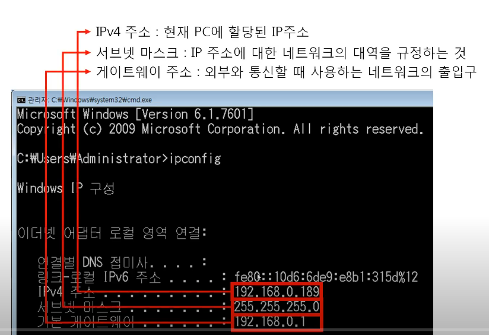
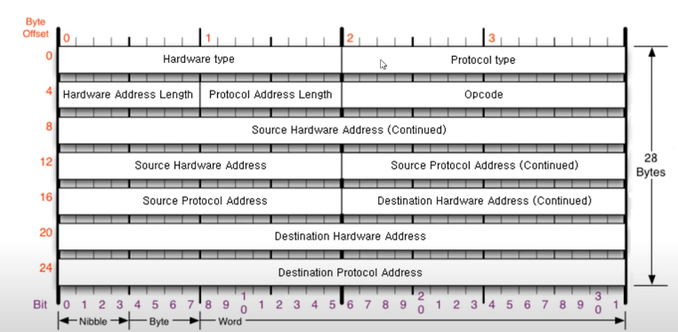
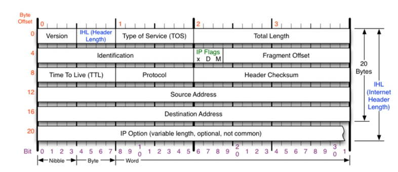
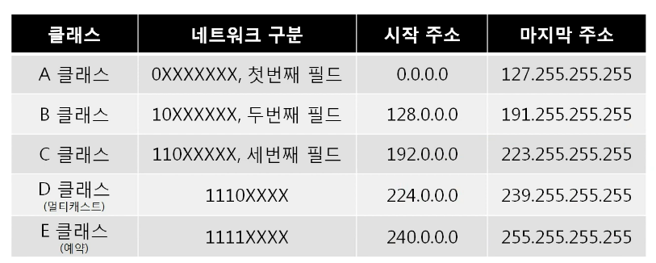
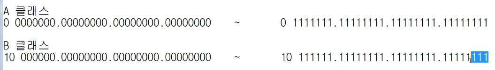
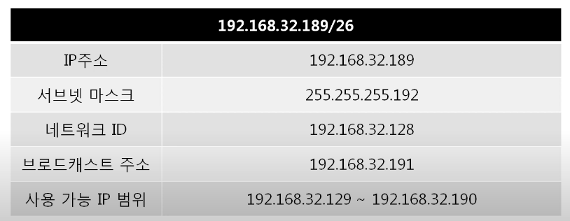
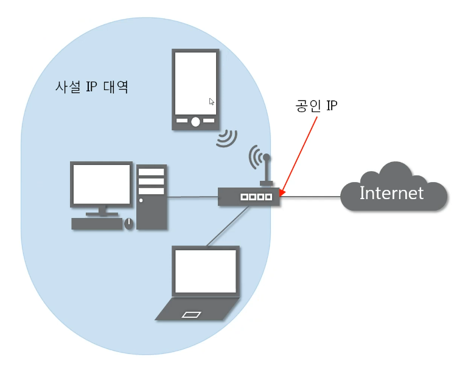
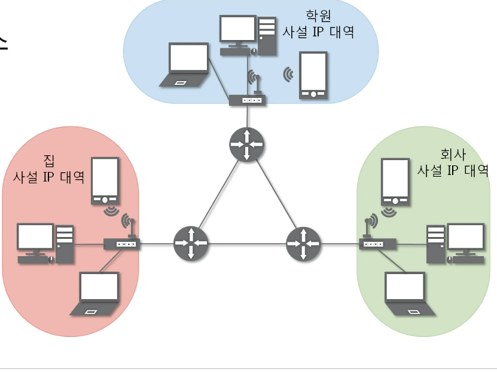

# 실제로 컴퓨터끼리는 IP주소를 사용해 데이터를 주고 받는다
## 3계층의 기능
### 3계층에서 하는 일
- 다른 네트워크 대역. 즉, 멀리 떨어진 곳에 존재하는 네트워크까지 어떻게 데이터를 전달할지 제어하는 일을 담당
- 서로 다른 LAN 대역을 연결시켜주는 역할
- 발신에서 착신까지의 패킷의 경로를 제어

### 3계층에서 쓰는 주소
- IP 주소
  - WAN에서 통신할 때 사용
  - cmd에서 `ipcofing` 명령어로 확인 가능
    - IP 주소로 통신하기 위해 최소한 필요한 것 : IPv4 주소, 서브넷 마스크, 게이트웨이 주소
    - IPv4 주소 : 현재 PC에 할당된 IP 주소
    - 서브넷 마스크 : IP 주소에 대한 네트워크 대역을 규정하는 것
    - 게이트웨이 주소 : 외부와 통신할 때 사용하는 네트워크의 출입구
    - 

### 3계층 프로토콜
- ARP 프로토콜
  - IP 주소를 통해 MAC 주소를 알아오는 프로토콜
  - 
- IPv4 프로토콜
  - WAN에서 통신할 때 사용하는 프로토콜
  - 

## 일반적인 IP 주소
### Classful IP 주소
- 낭비가 심함
- 클래스에 맞게 사용
- 필드 단위로 구분
- IP 주소가 부족함

  

### Classfulless IP주소
- 낭비되지 않도록 아껴쓰는 주소
- 서브넷 마스크 
  - 네트워크 대역을 어디서부터 구분할건지 지정한 값
  - 2진수로 표기했을 때 1로 시작, 1과 1사이에는 0이 올 수 없다는 규칙을 가지고 있음

### 사설 IP와 공인 IP
- 공인IP 1개당 2^32개의 사설IP
- 공인IP : 인터넷 네트워크 통신망이랑 통신할 때 사용하는 IP 주소
- 사설IP : 같은 네트워크 대역에서 사용하는 IP 주소
- 다른 네트워크와 통신하는 순간 공인 IP로 변경된다!
- 인터넷에서 받아온 정보를 공유기가 사설IP에게 전송
- 특정 IP를 다른 IP로 변경하는 NAT 기술을 활용하여 사설IP에서 공인IP으로 변경
- 실제 인터넷 세상에서는 공인 IP로만 통신
- 외부 네트워크 대역에서는 사설 IP대역이 보이지 않음
- 서버는 공인 IP를 사용한다..
- 안에서 바깥으로 나간 것은 통신이 가능하지만 바깥으로 나간 적 없다면 응답을 돌려받을 수 없음

  

## 특수한 IP 주소
- Wildcard 0.0.0.0
  - 나머지 모든 것!
- 127.0.0.1
  - 나 자신을 나타내는 주소
- 게이트웨이 주소
  - 어딘가로 가려면 일단 여기로!