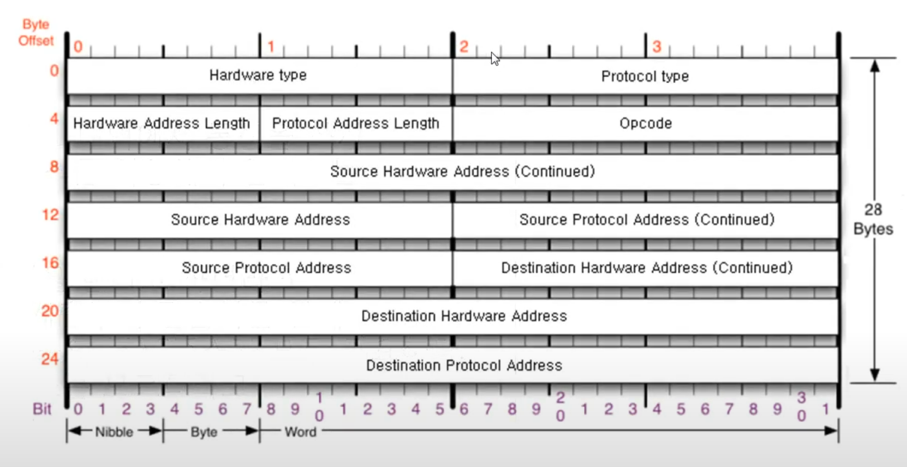
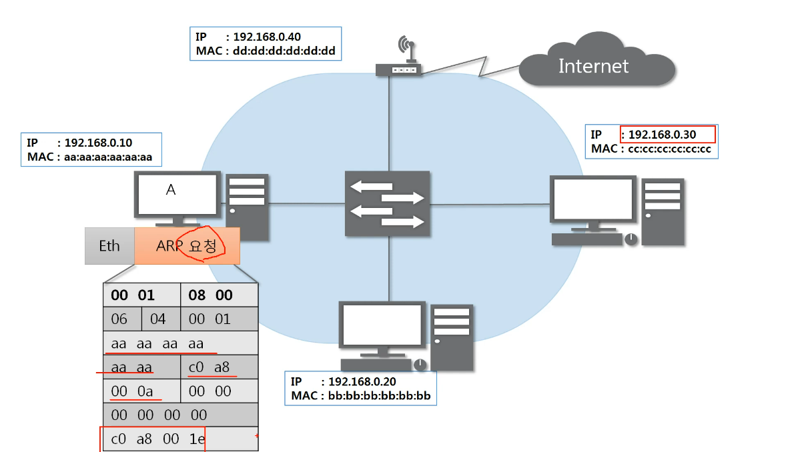
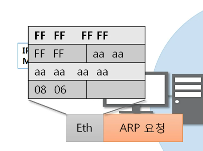
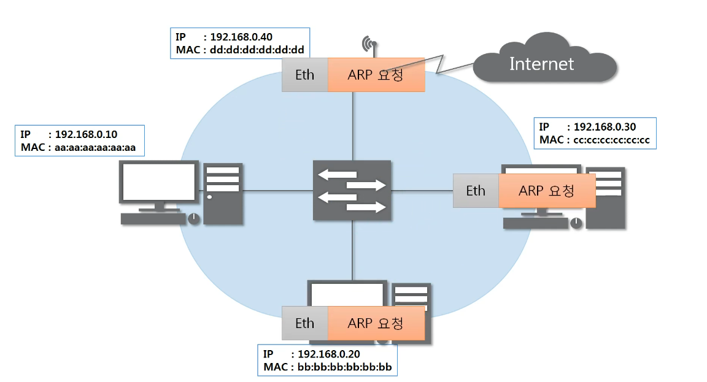
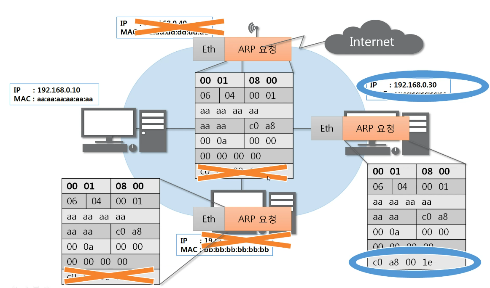
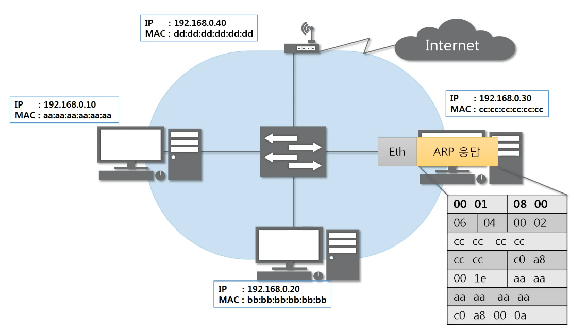
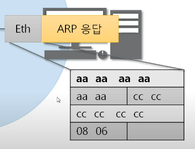
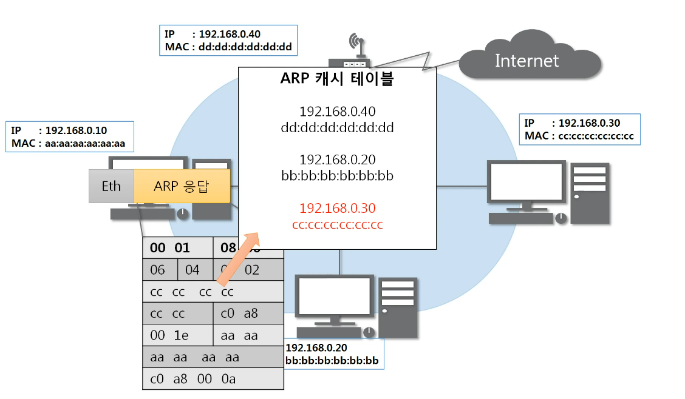
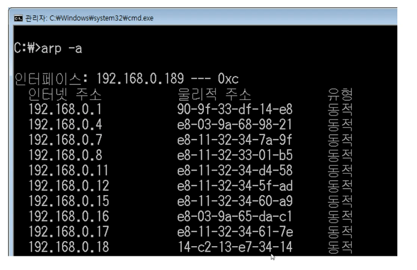

# 05. ARP 프로토콜
## ARP 프로토콜
### ARP가 하는 일
- 같은 네트워크 대역에서 통신을 하기 위해 필요한 MAC주소룰 IP주소를 이용해서 알아오는 프로토콜
- 보완상 중요함
- 같은 네트워크 대역에서 통신을 하더라도 데이터를 보내기 위해서는 7계틍부터 캡슐화 통해 전송
- IP 주소와 MAC주소가 모두 필요함 -> IP주소는 아고 MAC 주소는 모르더라도 ARP를 통해 통신이 가능

### ARP 프로토콜의 구조

- 28바이트
- Source Hardware Address : 출발지의 물리적인 주소 (MAC 주소), 6바이트
- Source Protocol Address : 출발지의 IPv4 주소 (IP 주소), 4바이트
- Destination Hardware Address : 목적지의 물리적인 주소 (MAC 주소), 6바이트
- Destination Protocol Address : 목적지의 IPv4 주소 (IP 주소), 4바이트
- 이더넷 프로토콜만 목적지가 먼저옴. 타른 프로토콜은 출발지가 먼저온다!
- Hardware Type : 2계층에서 사용하는 프로토콜. 거의 이더넷, 2바이트 (0001)
- Protocol Type : IPv4만 온다! (0800)
- Hardware Address Length : MAC주소의 길이 = 6바이트 (06)
- Protocol Address Length : IPv4 주소의 길이 = 4바이트 (04)
- Opcode : 오퍼레이션 코드. 어떻게 동작하는지 알려줌. 요청(1)인지 응답(2)인지
- 보통 앞부분은 0001 0800 0604 000_ 고정

## ARP 프로토콜의 통신 과정
### IP 주소로 MAC 주소를 알아오는 과정 
- 같은 랜대역
- 알아내고자 ARP 요청! -> Opcode를 1로 세팅하고, 도착지 MAC 주소는 비우고 IP 주소는 입력하여 전송

- 이더넷 프로토콜로 인켑슐레이션 : MAC 주소 전부 F로 설정하여 모두에게 전송(브로드캐스트)

- 2계층만 확인 후 모두에게 전송

- 디캡슐레이션에서 IP주소 일치 하는지 확인 후 일치하지 않는다면 패킷을 버림

- 일치하는 경우 응답 프로트콜 생성, 목적지를 알고 있으니 이더넷에 MAC주소도 작성하여 전송

- 응답을 받으면 캐시테이블에 저장

## ARP 테이블
- 통신했던 컴퓨터들의 주소를 저장

