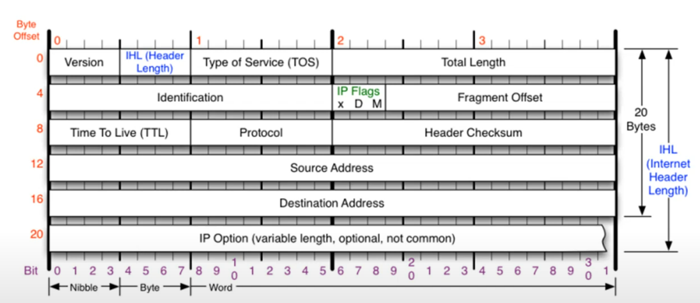
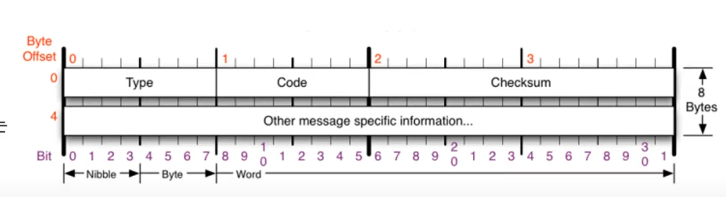

# 멀리 있는 컴퓨터끼리는 이렇게 데이터를 주고 받는다
## IPv4 프로토콜
### IPv4 가 하는 일
- 네트워크 상에서 데이터를 교환하기 위한 프로토콜
- 데이터가 정확하게 전달될 것을 보장하지 않는다.
- 중복된 패키슬 전달하거나 패킷의 순서를 잘못 전달할 가능성도 있다 (악의적으로 이용되면 DoS 공격이 됨)
- 데이터의 정확하고 순차적인 전달은 그보다 상위 프로토콜인 TCP에서 보장

### IPv4의 구조
- 다른 네트워크의 특정 대상을 찾는 IPv4 프로토콜
- 기본 20바이트 옵션 각 4바이트 총 10개까지

- Source Address : 출발지 주소
- Destination Address : 도착지 주소
- Version : IP 프로토콜의 버전. 무조건 4가 온다! 6은 프로토콜 자체가 다름.
- IHL (Header Length) : 프로토콜의 길이. 길이를 4로 나누어 이진수로 표시. 보통 5가온다.
- Type Of Service(TOS) : 비워둔다! 지금은 사용하지 않는 값
- Total Length : 페이로드까지 합친 전체의 길이
- Identification : 데이터를 쪼개서 보낼 때 하나의 데이터였음을 알리는 id값
- IP Flags : 3비트.
  - x : 안씀
  - D : 패킷을 보내는 사람이 쪼개지 않고 보내겠다고 하는 것 -> 최대 전송보다 크게 설정시 전송 안된다. 거의 안씀
  - M : 조각화시에 내 뒤에 더 있다! 없다!. 최대 전송보다 큰 것을 보내면 무조건 1
- Fragment Offset: 13 비트. 데이터의 순서. 시작부터 얼마만큼 떨어져 있다를 나타냄
- Time To Live (TTL) : 패킷이 살아있을 시간. 경로가 잘못된 경우를 대비하여 설정. 상대방 운영체제를 알 수 있음
- Protocol : 상위 프로토콜이 무엇인지! ICMP, TCP, UDP 가 올 수 있음
- Header Checksum : 이 헤더가 오류가 있는지 없는지 체크.

## ICMP 프로토콜
- Internet Control Message Protocol. 인터넷 제어 메시지 프로토콜
- 상대방과 통신이 되나 안되나 확인하기 위함
- 네트워크 컴퓨터 위에서 돌아가는 운영체제에서 오류메시지를 전송 받는데 주로 쓰인다.
- 프로토콜의 구조 Type와 Code를 통해 오류 메시지를 전송 받는다,

### ICMP 프로코로의 구조

- Type : 카테고리. 대분류
  - 0 (Echo Reply), 8 (Echo) : 기본적인 것
    - 8번 : 요청
    - 0번 : 응답
  - 3 (Destination Unreachable), 11 (Time Exceded) : 잘못되었을 때
    - 3 : 목적지를 찾을 수 없음 -> 경로의 문제
    - 11 : 요청 시간이 만료 -> 도착했는데 응답을 받을 수 없음. 상대방의 문제
  - 5 (Redirect) : 보안상
    - 상대방의 라우팅 테이블을 수정할 때 사용
- Code : 소분류
- Checksum : 헤더에 오류가 있는지 없는지 체크.