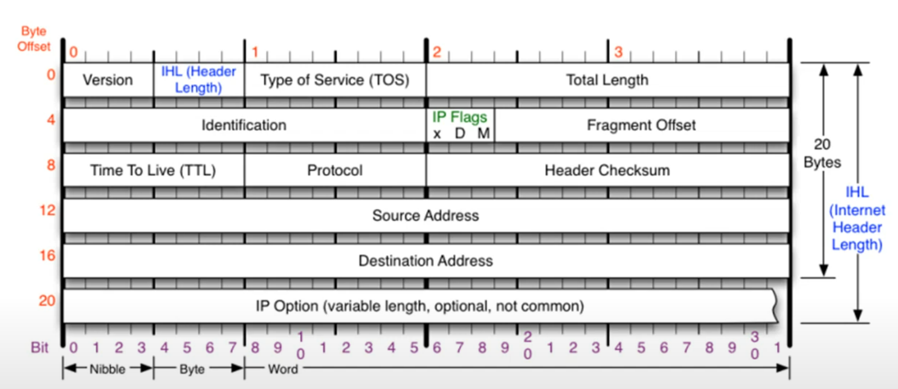
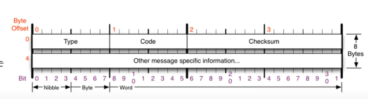
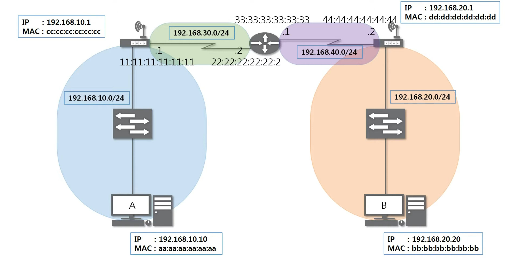
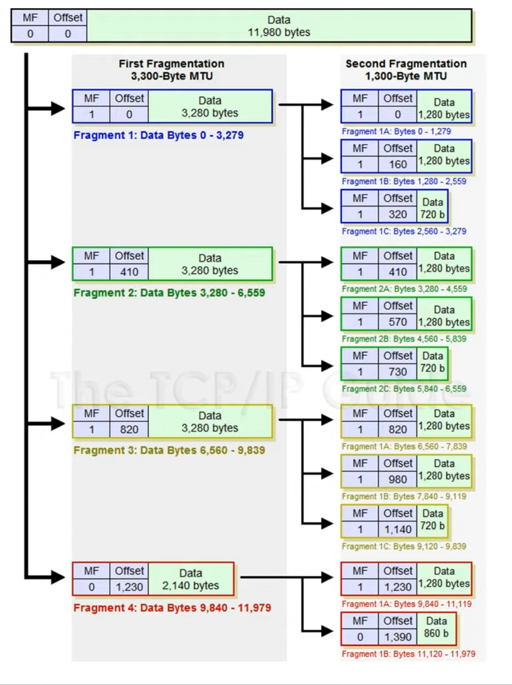
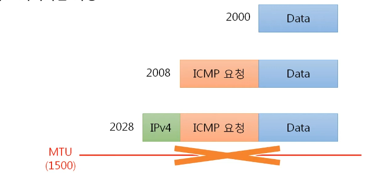
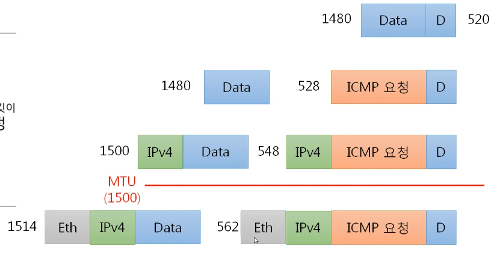

# 멀리 있는 컴퓨터끼리는 이렇게 데이터를 주고 받는다
## IPv4 프로토콜
### IPv4 가 하는 일
- 네트워크 상에서 데이터를 교환하기 위한 프로토콜
- 데이터가 정확하게 전달될 것을 보장하지 않는다.
- 중복된 패키슬 전달하거나 패킷의 순서를 잘못 전달할 가능성도 있다 (악의적으로 이용되면 DoS 공격이 됨)
- 데이터의 정확하고 순차적인 전달은 그보다 상위 프로토콜인 TCP에서 보장

### IPv4의 구조
- 다른 네트워크의 특정 대상을 찾는 IPv4 프로토콜
- 기본 20바이트 옵션 각 4바이트 총 10개까지

- Source Address : 출발지 주소
- Destination Address : 도착지 주소
- Version : IP 프로토콜의 버전. 무조건 4가 온다! 6은 프로토콜 자체가 다름.
- IHL (Header Length) : 프로토콜의 길이. 길이를 4로 나누어 이진수로 표시. 보통 5가온다.
- Type Of Service(TOS) : 비워둔다! 지금은 사용하지 않는 값
- Total Length : 페이로드까지 합친 전체의 길이
- Identification : 데이터를 쪼개서 보낼 때 하나의 데이터였음을 알리는 id값
- IP Flags : 3비트.
  - x : 안씀
  - D : 패킷을 보내는 사람이 쪼개지 않고 보내겠다고 하는 것 -> 최대 전송보다 크게 설정시 전송 안된다. 거의 안씀
  - M : 조각화시에 내 뒤에 더 있다! 없다!. 최대 전송보다 큰 것을 보내면 무조건 1
- Fragment Offset: 13 비트. 데이터의 순서. 시작부터 얼마만큼 떨어져 있다를 나타냄
- Time To Live (TTL) : 패킷이 살아있을 시간. 경로가 잘못된 경우를 대비하여 설정. 상대방 운영체제를 알 수 있음
- Protocol : 상위 프로토콜이 무엇인지! ICMP, TCP, UDP 가 올 수 있음
- Header Checksum : 이 헤더가 오류가 있는지 없는지 체크.

## ICMP 프로토콜
- Internet Control Message Protocol. 인터넷 제어 메시지 프로토콜
- 상대방과 통신이 되나 안되나 확인하기 위함
- 네트워크 컴퓨터 위에서 돌아가는 운영체제에서 오류메시지를 전송 받는데 주로 쓰인다.
- 프로토콜의 구조 Type와 Code를 통해 오류 메시지를 전송 받는다,

### ICMP 프로토콜의 구조

- Type : 카테고리. 대분류
  - 0 (Echo Reply), 8 (Echo) : 기본적인 것
    - 8번 : 요청
    - 0번 : 응답
  - 3 (Destination Unreachable), 11 (Time Exceded) : 잘못되었을 때
    - 3 : 목적지를 찾을 수 없음 -> 경로의 문제
    - 11 : 요청 시간이 만료 -> 도착했는데 응답을 받을 수 없음. 상대방의 문제
  - 5 (Redirect) : 보안상
    - 상대방의 라우팅 테이블을 수정할 때 사용
- Code : 소분류
- Checksum : 헤더에 오류가 있는지 없는지 체크.

## 라우팅 테이블 및 전송 과정
### 라우팅 테이블
- 어디로 보내야 하는지 설정되어 있음
- cmd 창에서 `netstat -r` 입력시 확인 가능
- 라우팅 테이블에 적혀 있는 네트워크 대역만 잦아갈 수 있음
- 기본값을 설정해두어 모르는 테이블 찾아갈 수 있도록 한다!

### 다른 네트워크와 통신 과정
- 다른 네트워크까지 내 패킷의 이동 과정
- 내 컴퓨터에서 보낸 패킷이 다른 네트워크의 컴퓨터까지 어떻게 이동하는가 ?

- A와 B과 통신하는 과정
1. A의 라우팅 테이블에 B 네트워크 대역이 작성되어 있어야한다.
2. 이더넷 프로토콜로 ICMP 요청을 보낸다. -> gateway의 MAC 주소로 목적지 설정
3. gateway(공유기)에서 받음 라우팅
   - 이더넷 프로토콜을 확인하여 자신에게 온 것인지 확인
   - 3계층(IPv4) 확인하여 목적지 주소 확인 -> 자신이 아니면 라우팅 테이블에서 확인
   - 이더넷 프로토콜을 목적지 주소를 변경하여 다시 만든다.
4. 3번 과정을 반복하여 도착
5. 응답 반복

## 조각화 이론
### IPv4의 조각화
- IPv4 프로토콜을 인캡슐레이션하여 데이터를 보낼 때 데이터의 최대 전송 단위(MTU)가 네트워크 장비들마다 설정되어 있음 (1500바이트)
- MTU가 설정되어 있는 네트워크를 통해서 패킷이 전달이 되어야 함 -> 페이로드가 더 크다면 조각화
- 큰 IP 패킷들이 적은 MTU(Maximum Transmission Unit)를 갖는 링크를 통하여 전송되려면 **여러 개의 적은 패킷으로 쪼개어/조각화 되어 전송**
- 목적지까지 패킷을 전달하는 과정에서 통과하는 각 라우터마다 전송에 적합한 프레임으로 변환 필요
- 일단 조각화 되면 -> 최종 목적지에 도달할 때까지 재조립 되지 X 일반적
- IPv4에서는 발신지 뿐만 아니라 중간 라우터에서도 IP 조각화가 가능
- IPv6는 IP단편화가 발신지에서만 가능. 재조립은 항상 최종 수신지에서만 가능

- 프로토콜 크기를 제외한 용량으로 나눔
- MF : 1 -> 내 뒤에 패킷이 더 있다! / 0 -> 더 없다
- Offset : 처음에서 얼마나 떨어져 있는지 /8

  
