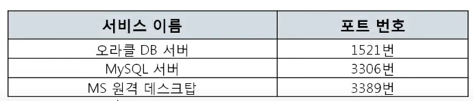

# 07. 컴퓨터의 프로그램끼리는 이렇게 데이터를 주고 받는다.
## 4계층 프로토콜
### 4계층에서 하는 일
- 전송 계층(Transport layer)은 송신자의 프로세스와 수신자의 프로세스를 연결하는 통신 서비스를 제공
- 연결 지향 데이터 스트림 지원, 신뢰성, 흐름 제어, 다중화와 같은 편리한 서비스 제공
- 전송 프로토콜
  - TCP : 연결지향 전송방식을 사용하는 전송 제어 프로토콜
  - UDP : 비연결지향 전송방식. 단순한 전송에 사용되는 사용자 데이터그램 프로토콜

#### TCP
- 연결 지향형. 안전한 연결을 지향
- 상대방이 잘 받았는지 체크하고 다음을 전송
- 과정이 복잡함

#### UDP
- 비연결 지향형. 안정한 연결을 지행하지 않음
- 과정이 간단함

## 포트 번호
- 컴퓨터가 아니라 프로그램이 사용하는 주소
- 특정 프로세스와 특정 프로세스가 통신을 하기 위해 사용
- 하나의 포트는 하나의 프로세스만 사용 가능
- 하나의 프로세스가 여러 개의 포트를 사용하는 것은 가능하다.
- 포트 번호는 일반적으로 정해져 있지만 무조건 지켜야 하는 것은 아니다!!
- ex) 일반적인 웹 서비스 포트번호 80 -> 항상 80을 사용해야하는 것은 아님

### Well-Known 포트
- 전 세계적으로 유명한 포트 번호
- 절대적인 것은 아니다!

### Registered 포트
- 조금은 유명한 포트 번호

### Dynamic 포트
- 일반 사용자들이 사용하는 포트 번호
- 클라이언트가 사용하는 번호

## 프로그램의 연결 정보
- 활성 연결 테이블 : 현재 포트 활성 엽를 나타내는 테이블
- `netstat -ano` 입력시 확인 가능