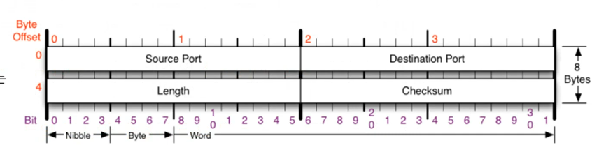
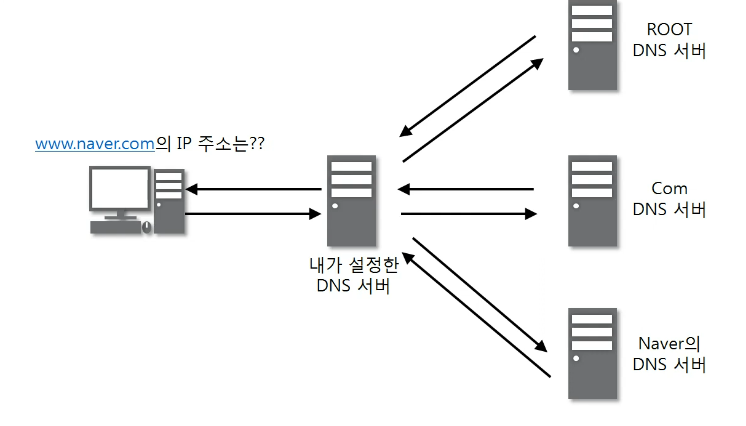
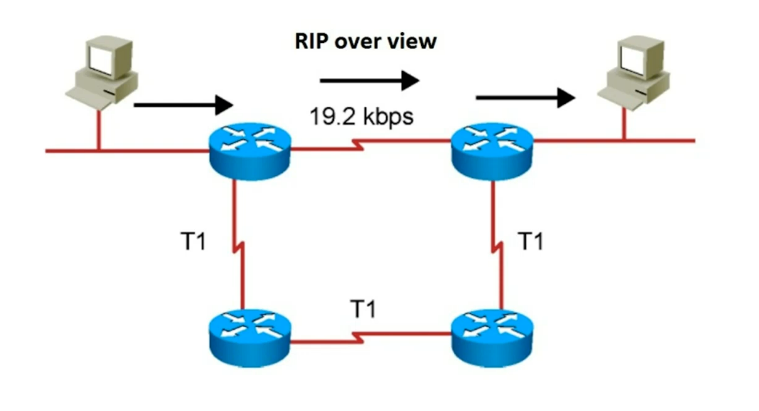

# 08. 비연결지향형 UDP 프로토콜
## UDP 프로토콜
- UDP(User Datagram Protocol) : 사용자 데이터그램 프로토콜
- Universal Datagram Protocol : 유니버설 데이터그램 프로토콜이라고 일컫기도 한다!
- 전송 방식이 매우 단순 -> 서비스의 신뢰성이 낮음. 데이터그램 도착 순서가 바뀌거나 중복, 통보없이 누락시키도 한다.
- 일반적으로 오류의 검사와 수정이 필요 없는 프로그램에서 수행할 것을 가정
- 연결된 상태에서 상대방과 데이터 전달하지 않음

- Source Port : 출발지 포트 번호
- Destination Port : 도착지 포트 번호
- Length : UDP 프로토콜과 페이로드 합한 길이
- Checksum : 헤더의 오류 확인

## UDP 프로토콜을 사용하는 프로그램
### DNS 서버
- 도메인을 물으면 IP를 알려준다

#### tftp 서버
- 라우팅 정보를 공유

