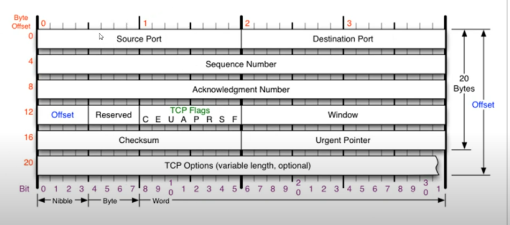
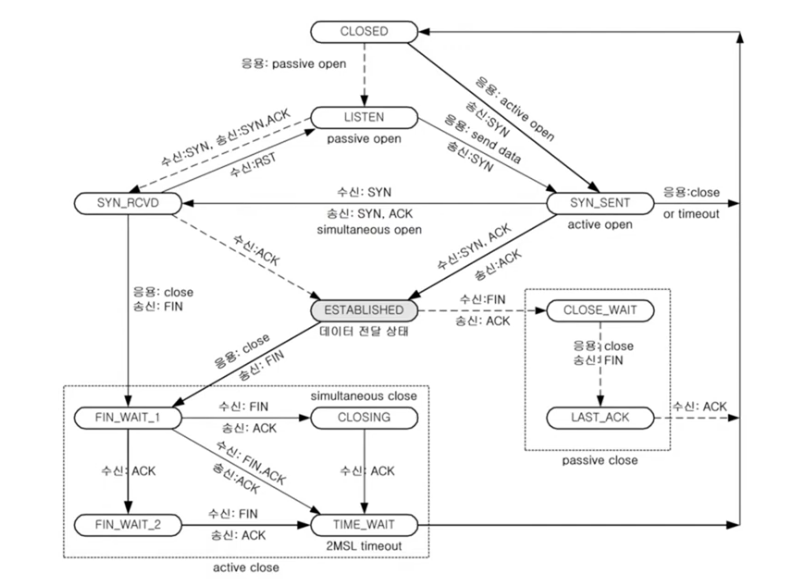

# 09. 연결지향형 TCP 프로토콜
## TCP 프로토콜
### TCP가 하는 일
- 전송 제어 프로토콜(Transmission Control Protocol)
- 인터넷에 연결된 컴퓨터에서 실행되는 프로그램 간의 통신을 **안정적으로, 순서대로, 에러 없이** 교환할 수 있게 한다.
- TCP의 안정성을 필요로 하지 않은 애플리 케이션의 경우 비접속형 사용자 데이터그램 프로토콜(UDP)
- TCP는 UCP보다 안전하지만 느림!
- 대부분의 통신 TCP IPv4 Ethernet 프로토콜 가장 많이 사용함

### TCP 프로토콜의 구조

- 일반적인 길이는 20바이트. 최대 60바이트까지 가능
- Source Port : 출발지 포트. 2바이트
- Destination Port : 도착지 포트. 2바이트
- Sequence Number : 4바이트
- Acknowledgment Number : 4바이트
- Offset : 헤더의 길이. 길이 / 4
- Reserved : 예약된 필드. 사용하지 않은 필드
- TCP Flags
- Window : 데이터를 얼만큼 더 보낼지 체크. 나의 사용 공간을 알림
- Checksum : 체크섬
- Urgent Pointer
- TCP Options (variable length, optional) : 일반적으로 잘 붙지 않음. 4바이트씩 붙음. 총 10개까지 가능

## TCP 플래그
- 어떤 플래그를 보내느냐에 따라 대답. 연결 종료 등을 나타낼 수 있음
- U : Urgent 플래그. 긴급 비트. 우선순위가 높은 데이터가 있다!!. Urgent Pointer와 세트 (어디부터 우선순위가 높은 데이터 인지) 
- A : ACK 플래그. 많이 사용. 승인 플래그. 응답 플래그. 잘 받았다는 것을 알려줌
- P : PUSH 플래그. 밀어넣기. 계속해서 데이터를 밀어넣는다.
- R : RESET 플래그. 초기화 플래그. 연결 관계를 새로고침
- S : Synchronize 플래그. 동기화 비트. 상대방이랑 연결을 시작할 때 무조건 사용. 서로의 상태 동기화 시작
- F : Finish 플래그. 종료 비트. 연결을 종료할 때 사용하는 플래그

## TCP를 이용한 통신 과정
### 연결 수립 과정
- TCP를 이용한 데이터 통신을 할 때 프로세스와 프로세스를 연결하기 위해 가장 먼저 수행되는 과정
- 3Way Handshake
1. 클라이언트가 서버에세 요청 패킷을 보내고
2. 서버가 클라이언트의 요청을 받아들이는 패킷을 보고
3. 클라이언트는 이를 최종적으로 수락하는 패킷을 보낸다.

### 데이터 송수신 과정
- TCP를 이용한 데이터 통신을 할 때 단순히 TCP 패킷만을 캡슐화해서 통신하는 것이 아닌 페이로드를 포함한 패킷을 주고받을 때의 일정한 규칙
1. 보낸 쪽에서 또 보낼 때는 SEQ 번호와 ACK 번호가 그래돌다.
2. 받는 쪽에서 SEQ 번호는 받은 ACK 번호가 된다.
3. 받는 쪽에서 ACK 번호는 받은 SEQ 번호 + 데이터의 크기

## TCP 상태 전이도
- TCP 연결 상태의 변화
  - 실선 : 클라이언트의 상태 변화
  - 점선 : 서버의 상태 변화

- LISTEN : 포트 번호를 프로그램이 사용하고 있는 상태. 클라이언트의 요청을 항상 듣고 있는 상태
- ESTABLISHED : 연결이 서로 수립된 상태. 핸드쉐이크 이후 상태
- CLOSED -> active open -> SYN_SENT: 클라이언트가 능동적으로 연다!