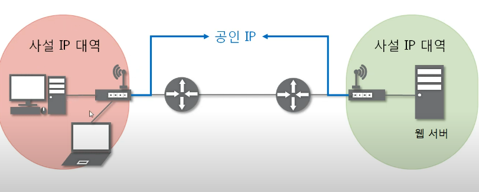
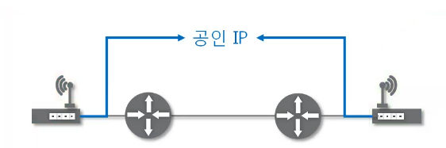
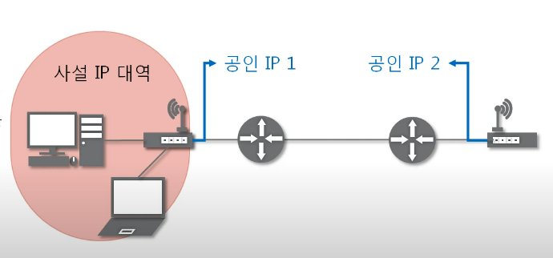

# 10. NAT와 포트포워딩
## NAT
- Network Address Translation
- IP 패킷의 TCP/UDP 포트 숫자와 소스 및 목적지의 IP 주소 등을 재기록하면서 라우터를 통해 네트워크 트래픽을 주고받는 기술
- 패킷에 변화가 생기기 때문에 IP나 TCL/UDP의 체크섬(checksum)도 다시 계산되어 재기록 해야한다.
- 이용하는 이유: 사설 네트워크에 속한 여러 개의 호스트가 하나의 공인 IP 주소를 사용하여 인터넷에 접속하기 위함
- 특정 IP 주소에 특정 포트 번호로 가는 패킷을 다른 IP 주소에 다른 포트 번호로 바꿔 주는 것
- 꼭 사설 IP를 공인 IP로 변환하는 것에만 사용하진 않음

- 실제 일반적인 네트워크의 모습 사설 IP와 공인 IP

- 인터넷 세상에서 바라본 모습

## 포트포워딩
- 포트 매팅(port mapping)
- 패킷이 라우터나 방화벽과 같은 네트워크 장비를 가로지르는 동안 특정 IP 주소와 포트 번호의 통신 요청을 특정 다른 IP와 포트 번호로 넘겨주는 네으퉈크 주소 변화(NAT)dml dmdyd
- 게이트워이(외부망)의 반대쪽에 위치한 사설 네트워크에 상주하는 호스트에 대한 서비스를 생성하기 위해 흔히 사용

- 특정 IP의 특정 포트로 온 요청을 포트 포워딩
  - 공인 IP 2의 특정 포트로 전송
    - IPv4으 주소를 공유기 주소로 설정
  - 특정 포트로 들어온 요청을 다른 특정 IP의 특정 포트로 전송