# 11. www(웹)을 이용할 때는 이렇게 데이터를 주고 받는다
## HTTP 프로토콜
### 웹을 만드는 기술들
- 웹을 만들기 위해 사용되는 다양한 기술들
  - 필수
    - HTTP (HTTPS -> SSL/TLS) : 웹 표준 데이터를 받아오는 것. HTTPS - 보안 요소 추가
    - HTML : 웹 페이지를 채울 내용, 웹 표준, 클라이언트 측에서 실행(프론트엔드)
    - Javascript : 웹 페이지에 들어갈 기능, 웹 표준, 클라이언트 측에서 실행(프론트엔드)
    - CSS : 웹페이지를 예쁘게 꾸밀 디자인, 웹 표준, 클라이언트 측에서 실행(프론트엔드)
    - ASP/ASP.NET : 서버 컴퓨터에서 실행(백엔드), 웹 서버 페이지를 만드는 기술들
    - JSP : 서버 컴퓨터에서 실행(백엔드), 웹 서버 페이지를 만드는 기술들
    - PHP : 서버 컴퓨터에서 실행(백엔드), 웹 서버 페이지를 만드는 기술들
    - DB
  - 선택
    - Python
    - Spring
    - Jquery
    - Ajax

### HTTP 프로토콜의 특징
- Hyper Text Transfer Protocol : 하이퍼 텍스트 전송 프로토콜
- www 에서 쓰이는 핵심 프로토콜. 문서의 전송을 위해 사용. 거의 모든 웹 어플리케이션에서 사용
  - 음성, 화상 특 여러 종류의 데이터를 MIME로 정의하여 전송 가능
- Request/Response(요청/응답) 동작에 기반하여 서비스 제공
- HTTP 1.0의 특징
  - 연결 수립, 동작, 연결 해제의 단순함이 특징 -> 하나의 URL은 하나의 TCP 연결
  - HTML 문서를 전송 받은 뒤 연결을 끊고 다시 연결하여 데이터 전송
  - 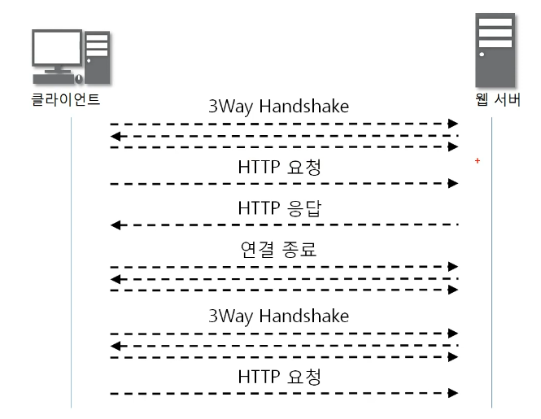
- HTTP 1.0의 문제점
  - 단순 동작 (연결 수립, 동작, 연결 해제) 반복되어 통신 부하 문제 발생
- HTTP 1.1의 특징
  - HTTP 1.0과 호환 가능
  - Multiple Request 처리가 가능하여 Client의 Request가 많을 경우 연속적인 응답 제공
    - Pipeline 방식의 Request/Response 진행
  - HTTP 1.0와 달리 Server가 갖는 하나의 IP Address와 다수의 Wec Site dusruf rksmd
- HTTP 1.1
  - 빠른 속도와 Internet Protocol 설계에 최적화 될수 있도록 Cache 사용
  - Data 압축해서 전달이 가능하도록 하여 Data 양이 감소
  - 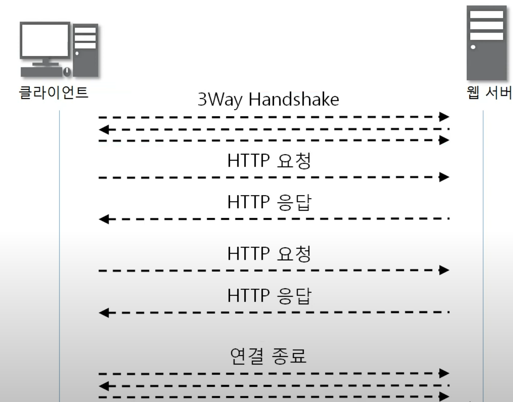

## HTTP 요청 프로토콜
### HTTP 요철 프로토콜의 구조
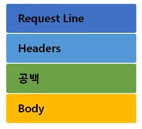
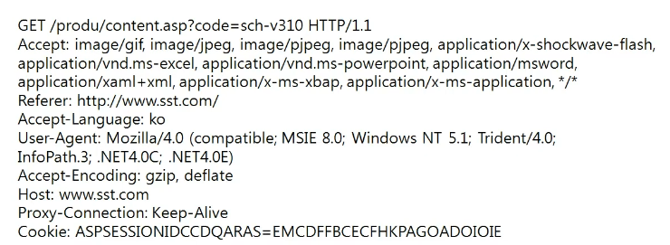

- 요청하는 방식을 정의하고 클라이언트의 정보를 담고 있는 요청 프로토콜 구조 

- HTTP 메소드 요청 방식

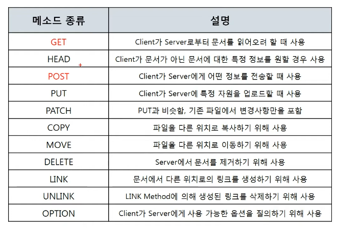

- GET 방식과 POST 방식의 차이점
  - GET : 주소창에 Client가 특정 페이지를 요청하면 Server로 보내는 데이터
  - POST : body에 담아서 보내는 데이터. 중요한 정보인 것

## URL, URI란?
### URI
- 인터넷 상에서 특정 자원(파일)을 나타내는 유일한 주소
- `scheme ://host[:port][/path][?query]`
  - ex) http ://IP주소 :포트 .폴더이름/파일이름/도메인주소

## HTTP 응답 프로토콜의 구조
- 사용자가 볼 웹 페이지를 담고 있음

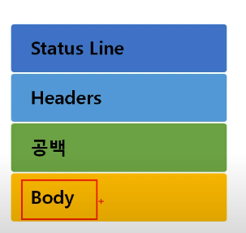

- 상태코드 : 서버가 알려주는 여러가지 정보

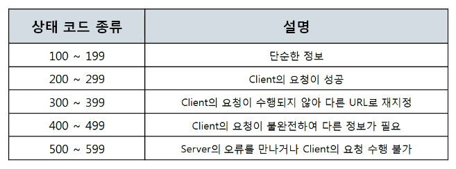

- 200 OK : 성공적인 통신
  - 상태 코드 종류 : 200
  - 상태 문구 : OK
  - 설명 : Client 요청이 성공했다는 것을 나타낸다.
- 400번대 : 클라이언트의 실수, 잘못, 오류
  - 상태 코드 종류 : 403
  - 상태 문구 : Forbidden
  - 설명 : Client가 권한이 없는 페이지를 요청했을 때
  - 상태 코드 종류 : 404
  - 상태 문구 : Not Found
  - 설명 : Client가 서버에 없는 페이지를 요청했을 때
- 500번대 : 서버의 실수, 잘못, 오류
  - 상태 코드 종류 : 500
  - 상태 문구 : Internet Server Error
  - 설명 : Server의 일부가 멈췄거나 설정 오류가 발생
  - 상태 코드 종류 : 503
  - 상태 문구 : Service Unavailable
  - 설명 : 최대 Session수를 초과했을 때

## HTTP 헤더
- HTTP 헤더 구조 : 수많은 정보를 담고 있음

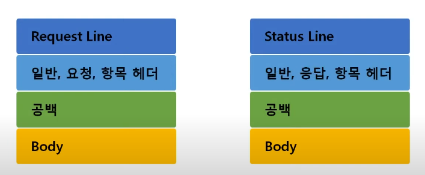

- 일반 헤더 : 일반적인 정보를 담고 있음

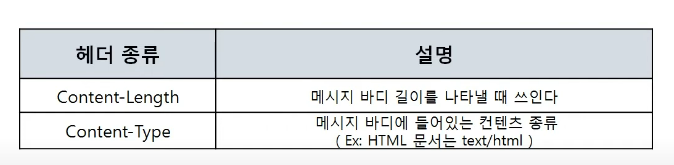

- 요청 헤더 : 클라이언트 정보를 담고 있음

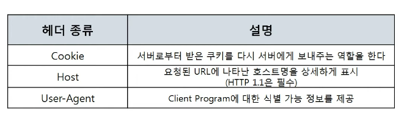

- 응답 헤더 : 서버 정보를 담고 있음

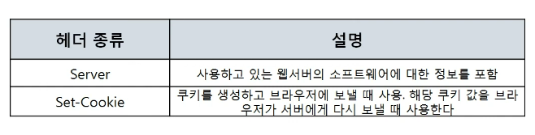