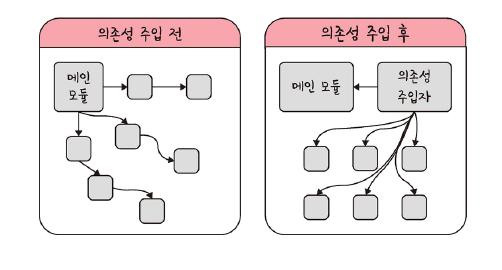
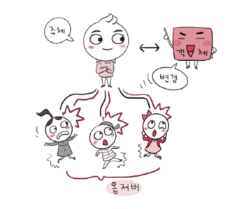
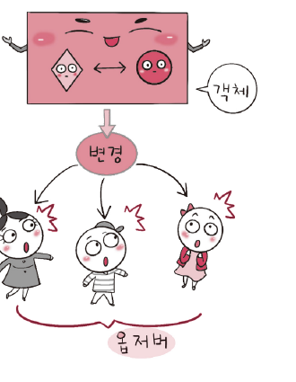
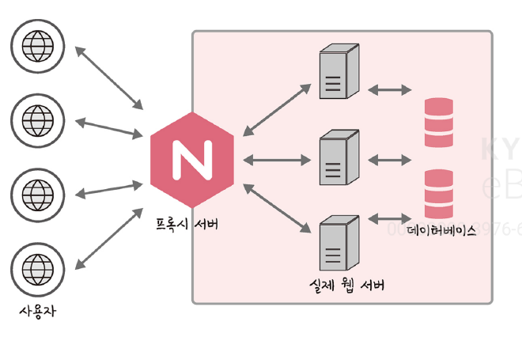
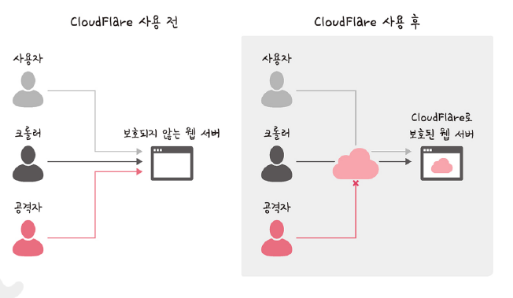

# Chapter 01. 디자인 패턴과 프로그래밍 패러다임
- 라이브러리 
  - 공통으로 사용될 수 있는 특정한 기능들을 모듈화 한 것
  - 폴더명, 파일명 등에 대한 규칙이 없고 프레임워크에 비해 자유로움
  - 내가 직접 컨트롤한다.
- 프레임워크
  - 공통으로 사용될 수 있는 특정한 기능등을 모듈화 한 것
  - 폴더명, 파일명 등에 대한 규칙이 있고 라이브러리에 비해 좀 더 엄격함
  - 내가 직접 컨트롤 하지 않음

# 1.1 디자인 패턴
- 프로그램을 설계할 때 발생했던 문제점들의 객체 간의 상호 관계 등을 이용하여 해결할 수 있도록 하나의 '규약' 형태로 만들어 놓은 것

# 1.1.1 싱글톤 패턴(singleton pattern)
- 하나의 클래스에 하나의 인스턴스만 가지는 패턴
- 단 하나의 인스턴스. 이를 기반으로 로직을 만드는 데 사용
- 데이터베이스 연결 모듈에 많이 사용
- 장점 : 해당 인스턴스를 다른 모듈들이 공유하며 사용 -> 인스턴스 생성 비용 절감
- 단점 : 의존성이 높아짐

## 자바에서의 싱글톤 패턴

```java
class Singleton {
  private static class singleInstanceHolder {
    private static final Singleton INSTANCE = new Singleton();
  }

  public static Singleton getInstance() {
    return Singleton.singleInstanceHolder.INSTANCE;
  }

}


```

```java
public class HelloWorld {
        public static void main(String[] args) {
            Singleton a = Singleton.getInstance();
            Singleton b = Singleton.getInstance();
            System.out.println(a.hashCode());
            System.out.println(b.hashCode());
            if (a == b) {
                System.out.println(true);
            }
        }
}
```

```java
1329552164
1329552164
true
```

## 싱글톤 패턴의 단점
- TDD(Test Driven Development)시 문제
  - 단위 테스트 실행의 어려움 -> 테스트가 서로 독립적이어야 하며, 테스트를 어떤 순서로든 실행할 수 있어야 함
  - 싱글톤 패턴 -> 미리 생성된 하나의 인스턴스 시반으로 구현하는 패턴 -> 독립 X

## 의존성 주입
- 싱글톤 패턴
  - 장점 : 사용하기 쉬움. 실용적
  - 단점 : 모듈 간의 결합을 강하게 만들 수 있음
- 의존성 주입(DI, Dependency Injection) : 모듈 간의 결합을 낮추어 위의 문제 해결할 수 있음
- 종속성이라고도 함. A가 B에 의존싱이 있다는 것 -> B의 변경 사항에 대해 A 또한 변해야하는 것




- 메인 몸듈이 직접 의존성 주입 X
- 의존성 주입자(dependency injector)을 통해 메인 모듈이 **간접**적으로 의존성 주입
- 메인 모듈(상위 모듈)의 하위 모듈에 대한 의존성 떨어짐 (디커플링 된다)

### 의존성 주입의 장정
- 모듈 쉽게 교체 가능 -> 테스팅 쉬움, 마이그레이션 수월
- 구현 시 추상황 레이어 넣고 이를 기반으로 구현체를 넣어 애플리케이션 의존성 방향이 일관. 쉽게 추론 가능. 도뮬 간의 관계들이 조금 더 명확해짐

### 의존성 주입의 단점
- 모듈이 늘어남에 따라 클래스 수가 증가 -> 복잡성 증가
- 약간의 런타임 페널디 생길 수 있음


### 의존성 주입 원칙
- 상위 모듈은 하위 모듈에서 어떠한 것도 가져오지 않아야 함
- 둘 다 추상화에 의존해야 함. 추상화는 세부 사항에 의존하지 말아야 함

# 1.1.2 팩토리 패턴(factory pattern)
- 객체를 사용하는 코드에서 객체 생성 부분을 때어내 추상화한 패턴
- 상속 관계에 있는 두 클래스에서 상위 클래스가 중요한 뼈대 결정. 하위 클래스에서 객체 생성에 관한 구체적인 내용을 결정하는 패턴
- 느슨한 결합 : 상위 클래스와 하위 클래스가 분리 되기 대문
- 더 많은 유연성 :  상위 클래스에서는 인스턴스 생성 방식에 대해 전혀 알 필요가 없기 때문
- 유지 보수성 증가 : 코드 리팩토링 시 고칠 수 있음


```java
package ch1.ex02;

abstract class Coffee {
    public abstract int getPrice();

    @Override
    public String toString() {
        return "Hi this coffee is " + this.getPrice();
    }
}

```

```java
package ch1.ex02;

class CoffeFactory {
    public static Coffee getCoffe(String  type, int price) {
        if ("Latte".equalsIgnoreCase(type)) return new Latte(price);
        else if ("Americano".equalsIgnoreCase(type)) return new Americano(price);
        else  {
            return new DefaultCoffee();
        }
    }
}

```

```java
package ch1.ex02;

class Americano extends Coffee {
  private int price;

  public Americano(int price) {
    this.price = price;
  }

  @Override
  public int getPrice() {
    return this.price;
  }
}

```

```java
package ch1.ex02;

class Latte extends Coffee {
    private int price;

    public Latte(int price) {
        this.price = price;
    }

    @Override
    public int getPrice() {
        return this.price;
    }
}

```

```java
package ch1.ex02;

public class Helloworld {
    public static void main(String[] args) {
        Coffee latte = CoffeFactory.getCoffe("Latte", 4000);
        Coffee ame = CoffeFactory.getCoffe("Americano", 3000);
        System.out.println("Factory Latte ::" + latte);
        System.out.println("Factory ame ::" + ame);

    }
}

```

# 1.1.3 전략 패턴 (strategy pattern)
- 정책 패턴 (policy pattern)
- 객체의 행위를 바꾸고 싶은 경우 직접 수정하지 않고 전략이라 부르는 **캡슐화한 알고리즘**을 컨텍스트 안에서 바꿔주면서 상호교체가 가능하게 만드는 패턴
- ex : 구매 시 결제 방식 -> 카카오 페이 결제 전략, 네이터 페이 결제 전략 두 가지 방식의 결제를 구현하는 것


컨텍스트

- 상황, 맥락, 문맥을 의미
- 개발자가 어떠한 작업을 완료하는데 필요한 모든 관련 정보

# 1.1.4 옵저버 패턴 (observance pattern)
- 어떤 객체의 상태 변화를 관찰하다가 상태 변화 있는 경우 메서드 등으로 통해 옵저버 목록에 있는 옵저버들에게 변화를 알려주는 디자인 패턴
- 이벤트 기반 시스템에 사용하며 MVC 패턴에도 사용
  - 모델(주체)에서 변경사항 발생
  - 옵저버인 뷰에게 update() 메서도르 알려주고
  - 이를 기반으로 컨트로러가 작동

1. 객체와 주체가 분리되어 있는 옵저버 패턴



- 주체 : 객체의 상태 변화를 보고 있는 관찰자
- 옵저버들 : 객체의 상태 변화에 따라 전달되는 메서드 등을 기반으로 **추가 변화 사항**이 생기는 객체들

2. 객체와 주체가 합쳐진 옵저버 패턴



- 주체와 객체를 따로 두지 않음
- 상태가 변경되는 객체를 기반으로 구축

```java
package ch1.ex03;


public interface Subject {
    public void register(Observer obj);
    public void unregister(Observer obj);
    public void notifyObservers();
    public Object getUpdate(Observer obj);
}

```

```java
package ch1.ex03;

public interface Observer {
    public void update();
}

```

```java
package ch1.ex03;

import java.util.ArrayList;
import java.util.List;

public class Topic implements Subject{
    private List<Observer> observers;
    private String message;

    public Topic() {
        this.observers = new ArrayList<>();
        this.message = "";
    }

    @Override
    public void register(Observer obj) {
        if (!observers.contains(obj)) observers.add(obj);
    }

    @Override
    public void unregister(Observer obj) {
        observers.remove(obj);
    }

    @Override
    public void notifyObservers() {
        this.observers.forEach(Observer::update);
    }

    @Override
    public Object getUpdate(Observer obj) {
        return this.message;
    }

    public void postMessage(String msg) {
        System.out.println("Message sended to Topic: " + msg);
        this.message = msg;
        notifyObservers();
    }
}

```

```java
package ch1.ex03;

import java.awt.image.RasterOp;

public class TopicSubscriber implements Observer{
    private String name;
    private Subject topic;

    public TopicSubscriber(String name, Subject topic) {
        this.name = name;
        this.topic = topic;
    }

    @Override
    public void update() {
        String msg = (String) topic.getUpdate(this);
        System.out.println(name + " :: got message >> " +msg);
    }
}

```

```java
package ch1.ex03;

public class HelloWorld {
    public static void main(String[] args) {
        Topic topic = new Topic();
        Observer a = new TopicSubscriber("a", topic);
        Observer b = new TopicSubscriber("b", topic);
        Observer c = new TopicSubscriber("c", topic);
        topic.register(a);
        topic.register(b);
        topic.register(c);

        topic.postMessage("삼성은 승리한다.");
    }
}

```

#### 자바 : 상속과 구현
- 상속
  - 자식 클래스가 메서드 등을 상속받아 사용
  - 자식클래스에서 추가 및 확장을 할 수 있는 것
  - 재사용성, 중복성의 최소화
- 구현
  - 부모 인터페이스를 자식 클래스에서 재정의하여 구현
  - 반드시 부모 클래스의 메서드를 재정의하여 구현
- 차이점
  - 상속 : 일반 클래스, abstract 클래스 기반으로 구현
  - 구현 : 인터페이스 기반으로 구현

# 1.1.5 프록시 패턴과 프록시 서버
## 프록시 패턴 (proxy pattern)
- 대상 객체(subject)에 접근하기 전 그 접근에 대한 흐름을 가로채 대상 객체 앞단의 인터페이스의 역할을 하는 디자인 패턴
- 객체의 속성, 변환 등을 보완
- 보안, 데이터 검증, 캐싱, 로깅에도 사용
- 프록시 서버에서의 캐싱
  - 캐시 안에 정보를 담아두고, 캐시 안에 있는 정보를 요구하는 요청에 대해 캐시 안에 있는 데이터를 활용하는 것
  - 불필요하게 외부와 연결하지 않아 트래픽을 줄일 수 있다

## 프록시 서버
- 서버와 클라이언트 사이에서 클라이언트가 자신을 통해 다른 네트워크 서비스에 간접적으로 접속할 수 있게 하는 컴퓨터 시스템이나 응요 프로그램

### 프록시 서버로 쓰는 nginz
- 비동기 이벤트 기반의 구조와 다수의 연결을 효과적으로 처리 가능한 웹 서버
- Node.js 서버 앞단의 프록시 서버로 활용
  - Node.js의 버퍼 오버 플로우 취약점을 예방하기 위함
  - 익명의 사용자의 직접적인 서버로의 접근을 차단
  - 간접적으로 한 단계 + =>  보안성 강화



- 실제 포트를 숨길 수 있음
- 정적 자원을 gzip 압축하거나, 메인 서버 앞단에서 로깅할 수 있음


버퍼 오버플로우

- 버퍼는 보동 데이터가 저장되는 메모리 공간
- 메모리 공간을 벗어나는 경우


### 프록시 서버로 쓰는 CloudFlare
- 전세계적으로 분산된 서버가 있음
- 어떠한 시스템의 콘텐츠 전달을 빠르게 할 수 있는 CDN 서비스
  - CDN(Content Delivery Network)
  - 각 사용자가 인터넷에 접속하는 곳과 가까운 곳에서 콘텐츠를 캐싱 또는 배포하는 서버 네트워크
  - 사용자가 웹 서버로 부터 콘텐츠를 다운로드 하는 시간을 줄일 수 있음
- DDOS 공격 방어
  - 의심스러운 트래픽, 사용자가 아닌 시스템을 통해 오는 트래픽을 자동으로 차단
  - 공격에 대한 방화벽 대시보드 제공
- HTTPS 구축 가능
  - 별도의 인증서 엎이 손쉽게 구축 가능



### CORS와 프론트 엔드의 프록시 서버
- CORS (Cross-Origin Resource Sharing)
- 서버가 웹 브라우저에서 리소르를 로드할 때 다른 오리진(프로토콜과 호스트 이름, 포드의 조합)을 통해 로드하지 못하게 하는 HTTP 헤더기반 메커니즘
- 프론트 개발 시 프론트 서버와 백 서버 통신시 줄 CORS 에러 마주칠 수 있음

# 1.1.6 이터레이터 패턴 (iterator)
- 이터레이터를 사용하여 컬렉션 요소들에 접근하는 디자인 패턴
- 순회할 수 있는 여러 가지 자료형이 구조와는 상관없이 이터레이터라는 하나의 인터페이스로 순회 가능


# 1.1.7 노출모듈 패턴 (revealing module pattern)
- 즉시 실행 함수를 통해 private public 같은 접근 제어자를 만드는 패턴
- 자바스크립트를 노출 모듈 패턴을 통해 접근 제어자를 구현하기도 함 (전역 범위에서 실행되기 때문에)


# 1.1.8 MVC 패턴
- 모델, 뷰, 컨트롤러로 이루어진 디자인 패턴
- 세 가지 역할로 구분하여 개발 프로세스에서 각각의 구성 요소에만 집중해서 개발할 수 있음
- 장점 : 재사용성과 확장성이 용이
- 단점 : 어플리케이션이 복잡해질수록 모델과 뷰의 관계가 복잡해지는 단점

## 모델
- 데이터인 데이터베이스, 상수, 변수 등을 뜻함
- 뷰에서 데이터를 생성하거나 수정하면 컨트롤러를 통해 모델을 생성하거나 갱신

## 뷰
- Inputbox, checkbox, textarea 등 사용자 인터페이스 요소
- 모델을 기반으로 사용자가 볼 수 있는 화면을 의미
- 모델이 가지고 있는 정보를 따로 저장하지 안항야 하며 단순히 화면에 표시하는 정보만 가지고 있어야 함
- 변경이 일어나면 컨트롤러에 이를 전달

## 컨트롤러
- 하나 이상의 모델과 하나 이상의 뷰를 잇는 다리 역할
- 이벤트 등 메인 로직을 담당
- 모델과 뷰의 생명주기 관리
- 모델이나 뷸의 변경 통지를 받으면 이를 해석하여 각가의 구성 요소에 해당 내용에 대해 알려준다

# 1.1.9 MVP 패턴
- 컨트롤러 -> 프레젠터
- 뷰와 프레젠터는 일대일 관계 이기 대문에 MVC 패턴보다 더 가안 결합을 지닌 디자인 패턴

# 1.1.10 MVVM 패턴
- 컨드롤러 -> 뷰 모델
- 뷰를 더 추상화한 계층
- 커맨드와 데이터 바인딩을 가지는 것이 특징
  - 커맨드: 여러 가지 요소에 대한 처리를 하나의 액션으로 처리할 수 있게 하는 기법
  - 데이터 바인딩 : 화면에 보이는 데이터와 웹 브라우저의 메모리 데이터를 일치시키는 기법. 뷰모델을 변경하면 뷰가 변경
- 뷰와 뷰모델 사이의 양방향 데이터 바인딩 지원
- UI를 별도로 코드 수정없이 재사용할 수 있도 단위 테스팅하기 쉬움