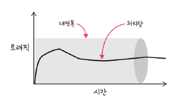
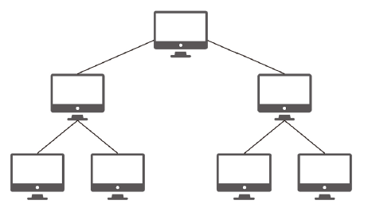
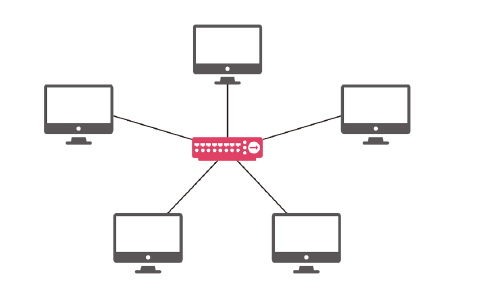
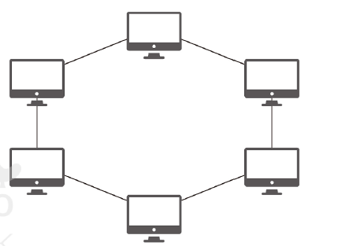
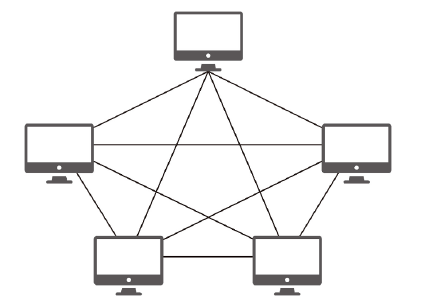

# Chapter2 네트워크
- 네트워크 : 컴퓨터 등의 장치들이 통신 기술을 이용하여 구축하는 연결망을 지칭하는 용어

# 2.1 네트워크의 기초
- 네트워크 : 노드(node)와 링크(link)가 서로 연결되어 있거나 리소스를 공유하는 집합
  - 노드 : 서버, 라우터, 스위치 등 네트워크 장치
  - 링크 : 유선 또는 무선

# 2.1.1 처리량과 지연 시간
- 좋은 네트워크
  - 많은 처리량 처리 
  - 짧은 지연 시간
  - 적은 장애 빈도
  - 좋은 보안


## 처리량(throughput)


- 링크를 통해 전달되는 단위 시간당 데이터양
- 단위 : bps(bits per secoind), 초당 전송 또는 수신되는 비트 수
- 처리량은 사용자들이 많이 접속할 때마다 커지는 트래픽, 네트워크 장치 간의 대역폭, 네트워크 중가에 발생하는 에러, 장치의 하드웨어 스펙에 영향

> 대역폭  
주어진 시간 동안 네트워크 연결을 통해 흐를 수 있는 최대 비트 수


## 지연 시간(latency)
- 요청이 처리되는 시간
- 어떤 메시지가 두 장치 상를 왕복하는데 걸린 시간
- 매체 타입(무선, 유선), 패킷 크기, 라우터의 패킷 처리 시간에 영 받음


# 2.1.2 네트워크 토포로지와 병목 현상
## 네트워크 토폴로지 (network topology)
- 노드와 링크가 어떻게 배치되어 있는지에 대한 방식이자 연결 형태를 의미

### 트리 토폴로지


- 계층형 토폴로지. 트리 형태로 배치한 네트워크 구성
- 노드의 추가, 삭제가 쉬움
- 특정 노트에 트래픽이 집중되면 하위 노드에 영향을 끼칠 수 있음

### 버스 토폴로지!
[img_2.png](imgs/img_2.png)

- 중앙 통신 회선 하나에 여러 개의 노트가 연결되어 공유하는 네트워크 구성
- 근거리 통신망(LAN)에서 사용
- 설치 비용이 적고, 신뢰성이 우수
- 중앙 통신 회선에 노드를 추가하거나 삭제하기 쉬움
- 스푸핑 문제
  - LAN상에서 송신부의 패킷을 송신과 관련 없는 다른 호스트에 가지 않도록 하는 스위치 기능을 마비시키거나 속여서 특정 노드에 해당 패킷이 오도록 처리하는 것
  - 올바르세 수신부로 가지 못하고 악의적인 노드에 전달될 수 있음

### 스타 토폴로지


- 중앙에 있는 노드에 모두 연결된 네트워크 구성
- 노드를 추가, 에러 탐지 쉬움
- 패킷의 충돌 발생 가능성이 적음
- 어떠한 노드에 장애가 발생해도 쉽게 에러를 발견할 수 있음
- 장애 노드가 중앙 노드가 아닐 경우 다른 노드에 영향을 끼치는 것이 적음
- 중앙 노드 장애 발생 시 전체 네트워크 사용 X. 고가의 설치 비용

### 릴형 토플리지


- 각각의 노드가 양 옆의 두 노드와 연결하여 전체적으로 고리처럼 하나의 연속된 길을 통해 통신을 하는 망 구성 방식
- 데이터 : 노드에서 노드로 이동. 각각의 노드는 고리 모양의 길을 통해 패킷 처리
- 노드 수 증가되어도 네트워크 상 손실 거의 X, 충돌 발생 가능성 적음. 노드 고장 발견 쉽게 찾을 수 O
- 네트워크 구성 변경이 어렵고 회선에 장애가 발생하면 전테 네트워크에 영향을 끄게 끼침


### 메시 토플로지


- 망형 토폴로지. 그물망처럼 연결되어 있는 구조
- 한 단말 장치에 장애 발생해도 여러 개의 경로가 존재해 네트워크 계속 사용 가능
- 트래픽 분산 처리 가능
- 노드의 추가 어려움. 구축 비용과 운용 비용이 고가

## 병목 현상 (bottleneck)
- 전체 시스템의 성능이나 용량이 하나으 구성 요소로 인해 제한을 받는 현상
- 서비스에서 이벤트를 열었을 때 트래픽 증가 -> 잘 관리하지 못하면 병목 현상 발생 -> 사용자는 웹 사이트에 들어갈 수 없음
- 어떤 토플로지를 갖는지, 어떠한 경로로 이루어져 있는지 알아야 병목 현상을 올바르게 해결할 수 있음

# 2.1.3 네트워크 분류
- 규모를 기반으로 분류
- LAN < MAN < WAN

## LAN
- 근거리 통신망
- 같은 건물이나 캠퍼스 등 좁은 공간
- 전송 속도가 빠르고 혼잡하지 않음

## MAN
- 대도시 지역 네트워크
- 도시 같은 넓은 지역
- 전송 속도 평균. LAN보다 혼잡

## WAN
- 광역 네트워크 의미
- 국가 또는 대륙 같은 더 넓은 지역
- 전송 속도 낮음. MAN 보다 혼잡


# 2.1.4 네트워크 성능 분석 명령어
- 코드상 문제 X. 사용자가 서비스로부터 데이터를 가져오지 못하는 상황 발생 -> 네트워크 병목 현상
- 네트워크 병목 현상의 주 원인
  - 네트워크 대역폭
  - 네트워크 토폴로지
  - 서버 CPU, 메모리 사용량
  - 비효율적인 네트워크 구성
- 네트워크 관련 테스트와 네트워크와 무관한 테스트 진행 -> 네트워크 문제인지 확인 후 네트워크 성능 분석

## ping(Packer INternet Groper)
- 네트워크 상태를 확인하려는 대상 노드를 향해 일정 크기의 패킷을 전송하는 명령어
- 해당 노드의 패킷 수신 상태와 도달하기까지 시간 등을 알 수 있음
- 해당 노드까지 네트워크가 잘 연결되어 있는지 확인할 수 있음
- TCP/IP 프로토콜 중 ICMP 프로토콜을 통해 동작 -> ICMP 프로토콜 지원 X인 기기 대상으로는 실행할 수 없음
- ICMP나 traceroute 차단 대상인 경우 테스트 불가능

```java
ping [IP 주소 또는 도메인 주소] -n [패킷 번호]
```

## netstat
- 접속되어 있는 서비스들의 네트워크 상태를 표시하는 데 사용
- 네트워크 접속, 라우팅 테이블, 네으퉈크 프로토콜 등 리스트 보여줌
- 서비스의 포트가 열려 있는지 확인할 때 사용

## nslookup
- DNS에 관련된 내용을 확인하기 위해 쓰는 명령어
- 특정 도메인에 매핑된 IP를 확인하기 위해 사용

## tracert
- 윈도우 - tracert / 라눅스 - tracerout
- 목적지 노드까지 네트워크 경로를 확인할 때 사용하는 명령어
- 목적지 노드까지 구간들 중 어느 구간에서 응답 시간이 느려지는지 확인할 수 잇음

# 2.1.5 네트워크 프로토콜 표준화
- 네트쿼으 프로토컬 : 다른 장치들끼리 데이터를 주고 받기 위해 설정된 공통된 인터페이스
- 프로토콜은 기업이나 개인이 발표해서 정하는 것이 아니라 IEEE 또는 IETF라는 표준화 잔체가 이를 정함
- IEE802.3 : 유선 LAN 프로토콜, 유선으로 LAN 구축 시 사용하는 프로토콜
- 만든 기업이 다른 장치라도 서로 데이터 수신 가능 !