# 2.2 TCP/IP 4계층 모델
- 인터넷 프로토콜 스위트 (internet protocol suite)
  - 인터넷에서 컴퓨터들이 서로 정보를 주고받는 데 쓰이는 프로콜의 집합
  - 이를 TCP/IP 4계측 혹은 OSI 7계층 모델로 설명
  - TCP/IP 모델 중심으로 설명할 예정. 
  - 네트워크에서 사용되는 통신 프로토콜의 집합으로 계층들은 프로토콜의 네워트킹 범위에 따라 네 개의 추상화 계층으로 구성

# 2.2.1 계층 구조
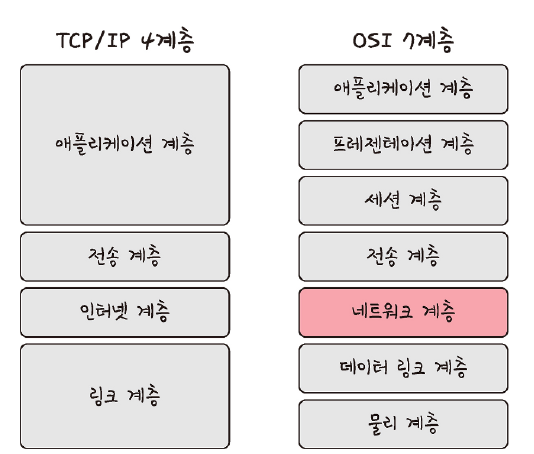

- TCP/IP는 4개의 계층을 가짐
- OSI 7계층과의 차이점
  - 애플리케이션 계층을 3개로 쪼갬
  - 링크 계층을 데이터 링크 계층, 물리 계층으로 나눔
  - 인터넷 계층을 네트워크 계층이라고 부른다
- 각 계층들은 특정 계층이 변경되어도 다른 계층이 영향을 받지 않음

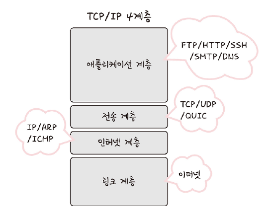

## 애플리케이션 계층 (application)
- FTP, HTTP, SSH, SMTP, DNS 등 응용 프로그램이 사용되는 프로토콜 계층
- 웹 서비스, 이메일 등 서비스를 실질적으로 사람들에게 제공하하는 계층

> **FTP**  
> 장치와 장치 간의 파일을 전송하는 데 사용되는 표준 통신 프로토콜
> 
> **SSH**  
> 보안되지 않은 네트워크에서 네트워크 서비스를 안전하게 운영하기 위한 암호화 네트워크 프로토콜  
> 
> **HTTP**
> World Wide Web을 위한 데이터 통신의 기초이자 웹 사이트를 이용하는데 쓰는 프로토콜
> 
> **SMTP**
> 전자 메일 전송을 위한 인터넷 표준 통신 프로토콜
> 
> **DNS**
> 도메인 이름과 IP 주소를 매핑해주는 서버
> [Root DNS] -> [.com DNS] -> [.naver DNS] -> [www DNS] 과정을 거쳐 완변한 주소를 찾아 IP 주소를 매핑
> IP 주소가 바뀌어도 사용자들에게 똑같은 도메인 주소로 서비스할 수 있음

## 전송 계층 (transport)
- 송신자와 수신자를 연결하는 통신 서비스를 제공
- 연결 지향 데이터 스트림 지원, 신뢰성, 흐름 제어 제공 가능
- 애플리케이션과 인터넷 계층 사이 데이터 전달될 때 중계 역할
- TCP
  - 패킷 사이의 순서를 보장
  - 연결 지향 프로토콜을 사용하여 연결
  - 신뢰성을 구축해 수신여부 확인
  - 가상회선 패킷 교환 방식 사용
- UDP
  - 순서 보장 X
  - 수신 여부 확인 X
  - 단순히 데이터만 주는 데이터그램 패킷 교환 방식

### 가상회선 패킷 교환 방식
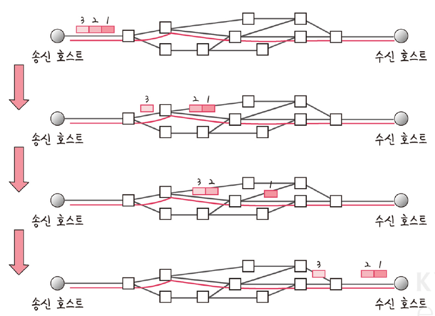

- 각 패킷에는 가상회선 식별자가 포함
- 모든 패킷을 전송하면 가상회선 해제되고 패킷들은 전송된 순서대로 도착하는 방식

### 데이터그램 패킷 교환 방식
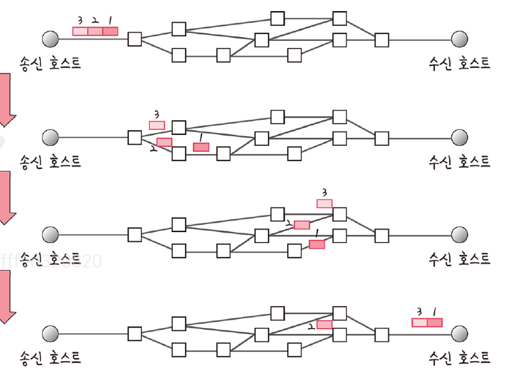

- 패킷이 독립적으로 이동하며 최적의 경로를 선택하며 감
- 하나의 메시지에서 분할된 여러 패킷은 서로 다른 경로로 전송될 수 있음
- 도착한 순서가 다를 수 있는 방식

### TCP 연결 성립 과정

- TCP 신뢰성 확보 작업 : 3-way handshake
- 클라이언트와 서버가 통신할 때 세 간뎨 과정을 거침

1. SYN(Synchronization, 연결 요청 플래그) 단계
  - 클라이언트는 서버에 클라이언크의 ISN을 담아 SYN을 보냄
  - ISN(initial Sequence Numbers): 새로운 TCP 연결의 첫 번째 패킷에 할당된 임의의 시퀀스 번호. 장치마다 다를 수 있음
  - 초기 네트워크 연결 시 할당된 32비트 고유 시퀀스 번호
2. SYN 단계 + ACK 단계
  - 서버는 클라이언트의 SYN을 수신하고 서버의 ISN을 보내며 승인번호로 클라이언트의 ISN + 1을 보냄
3. ACK(Acknowledgement, 응답 플래그) 단계
  - 클라이언트는 서버의 ISN + 1한 값인 승인번호를 담아 ACK 서버에 보냄

- 이 과정을 통해 신뢰성 구축하고 데이터 전송을 시작
- TCP -> 해당 과정이 있어 신뢰성이 있는 계층
- UDP -> 해당 과정이 없어 신뢰성이 없는 계층

### TCP 연결 해제 과정
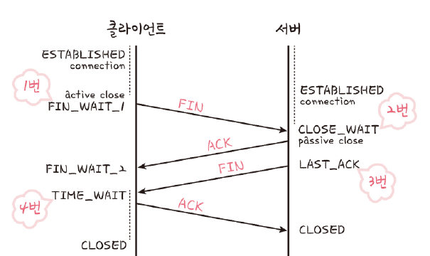

- 4-way handshake

1. 먼저 클라이언트가 연결을 닫으려고 할 때 FIN으로 설정된 세크먼트를 보냄. 클라이언트는 FIN_WAIT_1 상태로 들어가고 서버의 응답 기다림
2. 서버는 클라이언트로 ACK라는 승인 세그먼트 전송. CLOSE_WAIT 상태 진입. 클라이언트가 세그먼트를 받으면 FIN_WAIT_2 상태 진입
3. 서버는 ACK를 보내고 일정 시간 이후에 클라이언트에 FIN 세그먼트 전송
4. 클라이언트는 TIME_WAIT 상태가 되고 다시 서버로 ACK를 보내서 서버는 CLOSED 상태. 이후 클라이언트는 어느 정도의 시간을 대기한 후 연결이 닫히고 클라이언트와 서버의 모든 자원과 연결 해제

- TIME_WAIT로 일정 시간 뒤에 연결 닫는 이유
  - 지연 패킷이 발생할 경우를 대비. 패킷이 뒤늦게 도달하고 이를 처리하지 못하다면 데이터 무결숭 문제 발생
  - 두 장치가 연결이 닫혔는지 확인하기 위함. LAST_ACK 상태에서 닫히는 경우 다시 새로운 연결 시도 시 장치가 LAST_ACK로 되어 있어 접속 오류 발생

> **TIME_WAIT**  
> 소켓이 바로 소멸되지 않고 일정 시간 유지되는 상태를 말함.  
> 지연 패킷 등의 문제점을 해결하는데 쓰임.  
> Cent)#6, 우분투에서는 60초로, 윈도우에서는 4분으로 설정, OS 마다 차이가 있음  
> 
> **데이터 무결성(data integrity)**  
> 데이터의 정확성과 일관성을 유지하고 보증하는 것

## 인터넷 계층 (Internet)
- 장치로 부터 받은 네트워크 패킷을 IP 주소로 지정된 목적지로 전송하기 위해 사용되는 계층
- IP, ARP, ICMP등이 있음
- 패킷을 수신해야 하는 상대의 주서를 지정하여 데이터 전달
- 상대방이 제대로 받았는지에 대해 보장하지 않는 비연결형적인 특징

## 링크 계층
- 전선, 광섬유, 무선 등으로 실질적으로 데이터를 전달함
- 장치 간에 신호를 주고받는 규칙을 정하는 계층
- 네트워크 접근 계층이라고도 함
- 물리 계층과 데이터 링크 계층으로 나누기도 함
  - 물리 계층 : 무선 LAN, 유선 LAN을 통해 0과 1로 이루어진 데이터를 보내는 계층
  - 데이터 링크 계층 : 이더넷 프레임을 통해 에러 확인 흐름 제어, 접근 제어를 담당하는 계층

### 유선 LAN(IEEE802.3)
- 유선 LAN을 이루는 이더넷은 IEEE802.3이라는 프로토콜을 따르며 전이 중화 통신을 사용
- 전이중화 동신(fill duplex)
  - 양쪽 장치가 동시에 송수신할 수 있는 방식
  - 송신로와 수신로로 나눠서 데이터를 주고 받음
  - 현대의 고속 이더넷은 이 방식을 기반으로 통신
  - 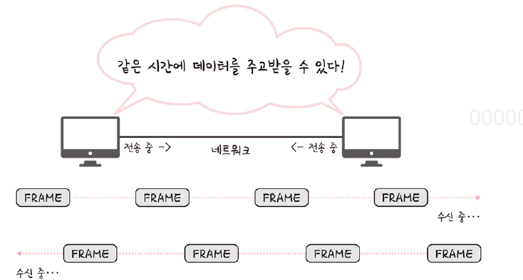
- CSMA/CD (Carrier Sense Multiple Access with Collision Detection)
  - 유선 LAN에 반이중화 통신 중 하나
  - 데이터를 보낸 이후 충돌이 발생하면 이정 시간 이후 재전송 하는 방식
  - 수신로와 송신로를 각각 둔 것이 아니고 한 경로를 기반으로 데이터를 보내기 때문에 데이터를 보낼 때 충돌에 대비 해야했기 때문

### 유선 LAN을 이루는 케이블
- TP 케이블이라고도 하는 트위스트 페어 케이블과 광섬유 케이블이 대표적
- 트위스트 페어 케이블 (twisted pari cable)
  - 여덟 개의 구리선을 두개씩 꼬아서 묶은 케이블
  - 
  - 구리선을 실드 처리 하지 하고 덮은 UDP와 실드 처리 하고 덮은 STP로 나눠짐
  - 우리가 많이볼 수 있는 케이블은 UTP 케이블로 흔이 LAN 케이블이라고도 함
  - 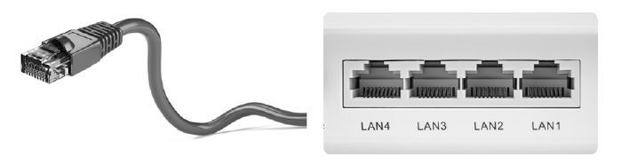
- 광섬유 케이블
  - 광섬유로 만들 케이블
  - 레이저를 이용해 통신하기 때문에 구리선과는 비교할 수 없을 만큼 장서리 및 고속 통신 가능
  - 보통 100Gbps의 데이터를 전송하며
  - 광섬유 내부와 외부를 다른 미도를 가지는 유리나 플라스틱 섬유로 제정해서 한번 들어간 빝이 내부에서 계속 반사하며 전진하여 반대편 끝까지 가는 원리를 이용
  - 빛의 굴절 률이 높은 부분을 코어(core), 낮은 부분을 클래딩(cladding)이라고 함
  - 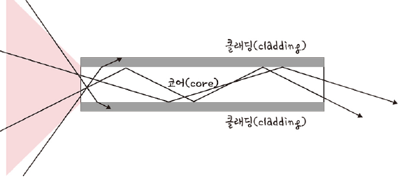

### 무선 LAN(IEEE802.11)
- 수신과 송신에 같은 채널 사용
- 반이중화 통신을 사용
- 반이중화 통신(half duplex)
  - 양쪽 장치는 서로 통신할 수 있지만 동시에는 통신할 수 없음
  - 한 번에 한 방향만 통신할 수 있는 방식
  - 장치가 신호를 수신하기 시작하면 응다하기전에 전송이 완료될 때까지 기다려야 함
  - 둘 이상의 장치가 동시에 전송하면 충돌이 발생하여 메시지가 손실되거나 왜곡될 수 있기 때문에 충돌 방지 시스템 필요
  - 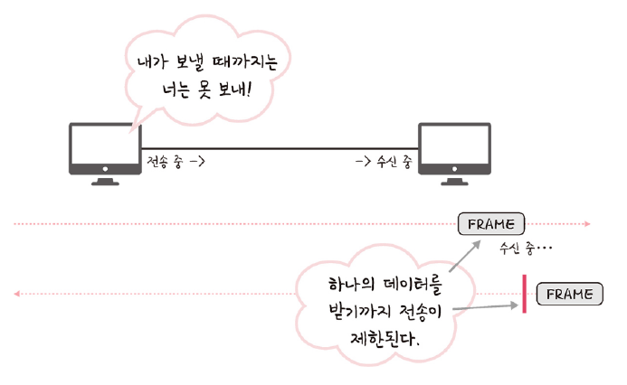
- CSMA/CD
  - 반이중화 통신 중 하나로 장치에서 데이터를 보내기 전에 캐리어 감지 등으로 사전에 가능한 충돌을 방지하는 방식 사용
  1. 데이터를 송싱하기 전에 무선 매체를 살핌
  2. 캐리어 감지 : 회선이 비어 있는지 판단
  3. IFS(Inter FrameSpace) : 랜덤 값을 기반으로 정해진 시간만큼 기다리며, 만얀 무선 매체가 사용 중이면 점차 그 간격을 늘려가며 기다림
  4. 이후에 데이터 송신
- 전이중화 동신은 양방향 통신이 가능해 충돌 가능성이 없어 위와 같은 매커니즘이 필요하지 않음

### 무선 LAN을 이루는 주파수
- 무선 신호 전달 방식을 이용하여 2대 이상의 장치를 연결하는 기술
- 비유도 매체인 공기에 주파수를 쏘아 무선 통신망 구축
- 주파수 대역은 2.4GHz 대역 또는 5GHz 대역 중 하나를 써 구축
  - 2.4GHz 대역
    - 장애물에 강한 특성
    - 전자레인지, 무선 등 전파 간섭이 일어나는 경우가 많음
  - 5GHz 대역
    - 사용할 수 있는 채널 수도 많고 동시에 사용할 수 있음
    - 상대적으로 깨끗한 전파 환경을 구축할 수 있음
    - 해당 대역 사용하는 것이 좋음
- 와이파이(wifi)
  - 전자기기들이 무선 LAN 신호에 연결할 수 있게 하는 기술
  - 무선 접속 장치(AP, Access Point)가 있어야 사용할 수 있음. 공유기
  - 유선 LAN에 흐르는 신호를 무선 LAN 신호로 바꿔주어 신호가 닿는 점위 내에서 무선 인터넷을 사용할 수 있음
  - 지그비, 블루투스등이 무선 LAN을 이요함
- BSS(Basic Service Set)
  - 기본 서비스 집합
  - 단순 공유기를 통해 네으쿼으 접속 X. 동일 BSS 내에 있는 AP들과 장치들이 서로 통신이 가능한 구조를 말함
  - 근거리 무선 통신을 제공하고 하나의 AP만을 기반으로 구축되어 있음
  - 사용자가 한 곳에서 다른 곳으로 자유롭게 이동하며 네트워크에 접속하는 것은 불가능
- ESS(Extended Service Set)
  - 하나 이상의 연결된 BSS 그룹
  - 장거리 무선 통신을 제고하며 BSS보다 더 많은 기용성과 이동성을 지원
  - 사용자는 한 장소에서 다른 장소로 이동하며 중단 없이 네트워크에 계속 연결 가능
  - 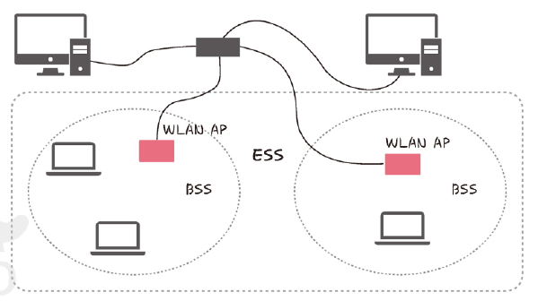

### 이더넷 프레임
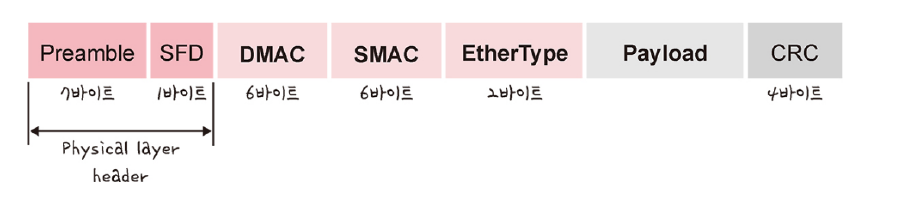

- 데이터 링크 계층은 이더넷 프레임을 통해 전달받은 데이터의 에러를 검출하고 캡슐화하며 위와 같은 구조를 가짐
- Preamble : 이더넷 프레임이 시작임을 알림
- SFD(Start Frame Delimiter) : 다음 바이트로부터 MAC 주소 필드가 시작됨을 알림
- DMAC, SAMC : 수신, 송신 MAC 주소를 말함
- Ether Type: 데이터 계층 위의 계층인 IP프로토콜을 정의. IPv4, IPv6
- Payload : 전달받은 데이터
- CRC: 에러 확인 비트

> **MAC 주소**  
> 컴퓨터나 노트북 등 각 장치에는 네트워크에 연결하기 위한 장치(LAN 카드)가 있음  
> 이를 구별하기 위한 시별 번호, 6바이트로 구성

## 계층 간 데이터 송수신 과정
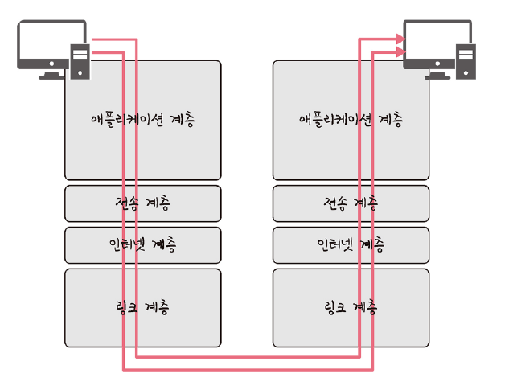

- HTTP를 통해 웹 서버에 있는 데이터를 요청하멸 발생하는 과정
- 애플리케이션 계층에서 전송 계층으로 요청(request) 값들이 캡슐화 과정을 거쳐 전달
- 다시 링크 계층을 통해 해당 서버와 통신을 하고
- 해당 서버의 링크 계층으로 부터 애플리케이션까지 비캡휼화 과정을 거쳐 데이터가 전송

### 캡슐화 과정
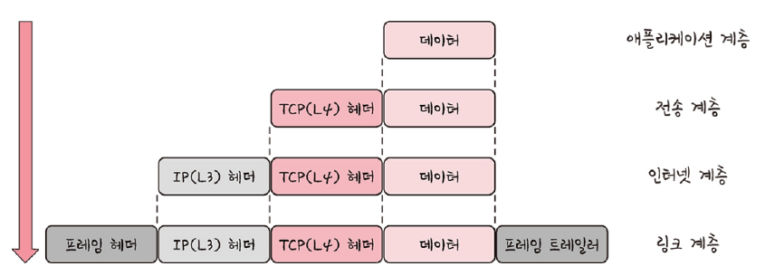

- 상위 계층의 헤더와 데이터를 하위 계층의 데이터 부분에 포함시키고 해당 계층의 헤더를 삽입하는 과정
- 애플리케이션 계층의 데이터가 전송 계층으로 던달되면서 세그먼트 또는 데이터그램화 되면 TCP(L4) gpejrk qnxduwlrp ehla
- 인터넷 계층으로 가면서 IP(L3) 붙여지게 되며 패킷화가 됨
- 링크 계층으로 전달되면서 프레임 헤더와 프레임 트레일러가 붙어 프레임화가 됨

### 비캡슐화 과정
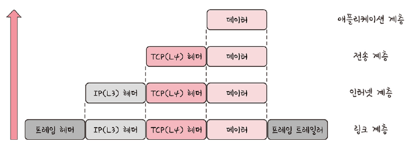

- 하위 계층에서 상위 계층으로 가며 각 게층의 헤더 부분을 제거하는 과정
- 캡슐화된 데이터를 받게 되면 링크 계층애서부터 타고 올라오면서 프레임화된 데이터는 패킷화를 거쳐 세그먼트, 데이터그램화를 거쳐 메시지화가 되는 비캡슈롸 과정 발생
- 최종적으로 사용자에세 애플리케이션의 PDU인 메시지로 전달

# 2.2.2 PDU(Protocol Data Unit)
- 네트워크의 어떠한 계층에서 계층올 데이터가 전달될 때 한 덩어리의 단위
- 제어 관련 정보들이 포함됨 헤더, 데이터를 의마하는 페이로드로 구성
- 계층마다 부르는 명칭이 다름
  - 애플리케이션 계층 : 메시지
  - 전송 계층 : 세그먼트(TCP), 데이터크래(UDP)
  - 인터넷 계층 : 패킷
  - 링크 계층 : 프레임(데이터 링크 계층), 비트(물리 계층)