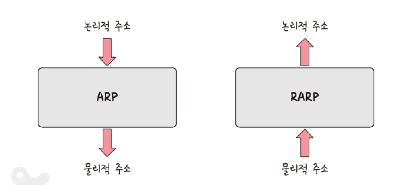
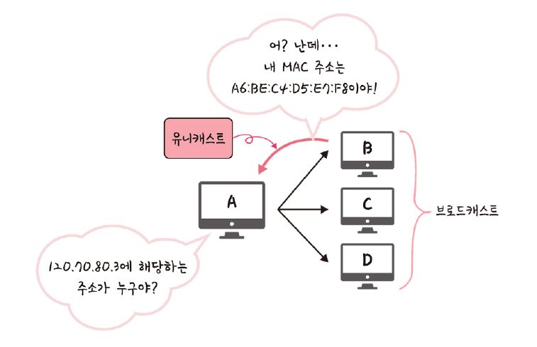
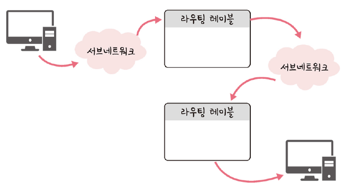
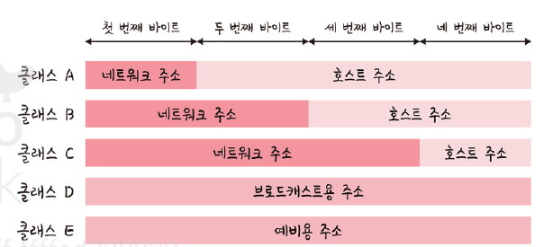
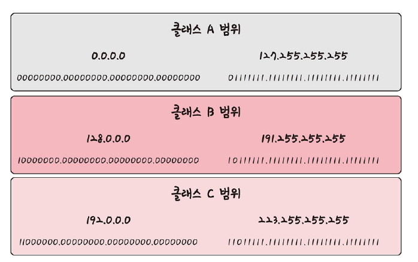

# 2.4 IP 주소
# 2.4.1 ARP
- 컴퓨터와 컴퓨터간의 통신
  - IP 주소 기반으로 통신
  - IP 주소에서 ARP를 통해 MAC 주소를 찾아 MAC 주소를 기반으로 통신
- ARP(Address Resolution Protocol)
  - IP 주소로부터 MAC 주소를 구하는 IP와 MAC 주소의 다리 역할을 하는 프로토콜
  - ARP를 통해 가상 주소인 IP주소를 실제 주소인 MAC 주소로 변환
  - RARP를 통해 실제 수소인 MAC 주소를 가상 주소인 IP 주소로 변환하기도 함

---

- 위의 그림 처럼 장치 A가 ARP Request 브로드캐스츠를 보내 IP 주소에 해당하는 MAC 주소를 찾음
- 해당 주소에 맞는 장치 B가 ARP reply 유니 캐스르를 통해 MAC 주소를 반환하는 과정을 거쳐 Iㅖ 주소에 맞는 MAC 주소를 찾음

> 브로드캐스트  
> 송신 호스트가 전송한 데이터가 네트워크에 연결된 모든 호스트에 전송되는 방식  
> 
> 유니캐스트  
> 고유 주소로 식별된 하나의 네트워크 목적지에 1:1로 데이터를 전송하는 방식

# 2.4.2 홉바이홉 통신
- IP 주소를 통해 통신한 과정을 홉바이홉(hop by hop) 통신이라고 함
- 홉: 건너뛰는 모습을 의미
- 통신망에서 각 패킷이 여러 개의 라우터를 건너가는 모습을 비유
- 수많은 서브네트워크 안에 있는 라우터의 라우팅 테이블 IP를 기반으로 패킷을 전달하고 또 전달해나가며 라우팅 수행하며 최종 목적지까지 패킷 전달
- 통신 장치에 있는 라우팅 테이블의 IP를 통해 시작 주소부터 시작하여 다음 IP로 계속해서 이동하는 라우팅 과정을 거쳐 패킷이 최종 목적지까지 도달하는 통신

> 라우팅   
> IP 주소를 찾아가는 과정

## 라우팅 테이블 (routing table)
- 송신지에서 수신지까지 도달하기 위해 사용
- 라우터에 들어가 있는 목적지 정보들과 그 목적지로 가기 위한 방법이 들어 있는 리스트
- 라우팅 테이블에는 게이트웨이와 모든 목적지에 대해 해당 목적지에 도달하기 위해 거쳐야할 다음 라우터의 정보를 가지고 있음

## 게이트웨이(gateway)
- 서로 다른 통신망, 프로토콜을 사용하는 네트워크 간의 통신을 가능하게 하는 관문 역할을 하는 컴퓨터나 소프트 웨어
- 사용자는 인터넷에 접속하기 위해 수많은 톨게이트인 게이트워이를 거쳐야함
- 게이트웨이는 서로 다른 네트워크 상의 통신 프로토콜을 변환해주는 역할
- 게이트웨이를 확인하는 방법은 라우팅 테이블을 통해 볼수 있음
- 라우팅 테이블은 윈도우 명령 프로프트에서 `netstat -r` 실행시 확인 가능

# 2.4.3 IP 주소 체계
- IP 주소는 IPv4와 IPv6로 나뉨
- IPv4
  - 32비트를 8비트 단위로 점을 찍어 표기
  - 123.45.67.89와 같은 방식으로 IP주소 나타냄
- IPv6
  - 64비트를 16비트 단위로 점을 찍어 표기
  - 2001:db8::ff00:42:8329 같은 방식으로 IP 주소 나타냄
- 추세는 IPv6 / 현재 가장 많이 쓰이는 추조 체계는 IPv4

## 클래스 기반 할당 방식

- 초기에는 A, B, C, D, E 다섯 개의 클래스로 구분하는 클래스 기반 할당 방식(classful network addressing) 사용
- 앞에 있는 부분을 네트워크 주소, 그 뒤에 있는 부분을 컴퓨터에 부여하는 주소인 호스트 주소로 놓아 사용
- 클래스 A,B,C는 일대일 통신 / 클래스 D는 멀티 캐스트 통신 / 클래스 E는 앞으로 사용할 예비용

- 맨 왼쪽 비트 : 구분 비트
  - 클래스 A의 경우 0
  - 클래스 B의 경우 10
  - 클래스 C의 경우 110
- 네트워크의 첫 번째 주소는 네트워크 주소로 사용되고 가장 마지막 주소는 브로드캐스트용 주소로 네으퉈크에 속해 있는 모든 컴퓨터에 보낼때 사용
- 사욯하는 주소보다 버리는 주소가 많다는 담점 -> DHCP, IPv6, NAT

## DHCP (Dynamic Host Congifuration Protocol)
- IP 주소 및 기타 통신 매개변수를 자동으로 할당하기 위한 네트워크 관리 프로토콜
- 인터넷에 접속할 때마다 자동으로 IP 주소를 할당할 수 있음
- 많은 라우터와 게이트웨이 장비에 DHCP 기능이 있음
- 이를 통해 대부분의 가정요 네트워크에서 IP 주소를 할당

## NAT(Network Address Translation)
- 패킷이 라우팅 장치를 통해 전송되는 동안 패킷의 IP 주소 정보를 수정하여 IP 주소를 다른 주소로 매핑하는 방법
- IPv4 주소 체계만으로는 많은 주소들을 모두 강당하지 X
- 이를 해결하기 위해 NAT로 공인 IP와 사설 IP를 나눠서 많은 주소를 처리
- NAT을 가능하게 하는 소프트웨어는 ICS, RRAS, Netfilter 등이 있음
- 사설 IP를 공인 IP로 변환하거나 그 반대의 경우에 사용

### 공유기와 NAT
- 주로 여러 대의 호스트가 하나의 공인 IP 주소를 사용하여 인터넷에 접속하기 위함
- 인터넷 회선 하나 개통 -> 공유기를 달아 여러 PC 연결하여 사용하는 것이 가능하게 함

### NAT을 이용한 보안
- 내부 네트워크에서 사용하는 IP 주소와 외부에 드라는 IP 주소를 다르게 유지 가능
- 내부 네트워크에 대한 어느 정도의 보안이 가능

### NAT의 단점
- 여러명 동시에 인터넷 접속하게 되므로 실제로 접속하는 호스트의 숫자에 따라 접속 속도가 느려질 수 있다는 단점

# 2.4.4 IP 주소를 이용한 위치 정보
- IP 주소는 인터넷에서 사용하는 네트워크 주소
- 이를 통해 동 또는 구까지 위치 추적 가능
