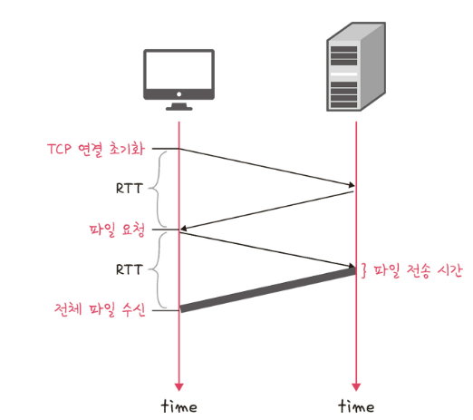
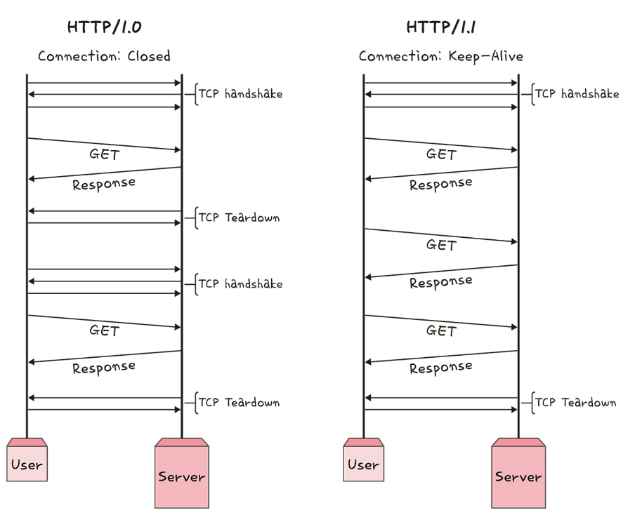
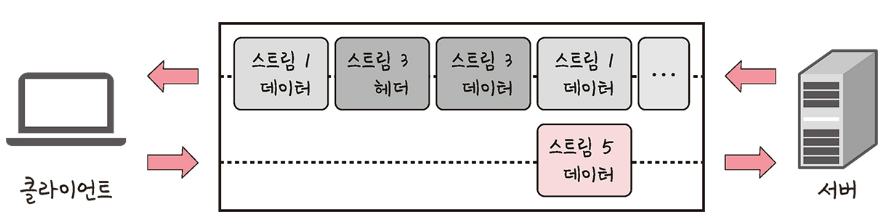
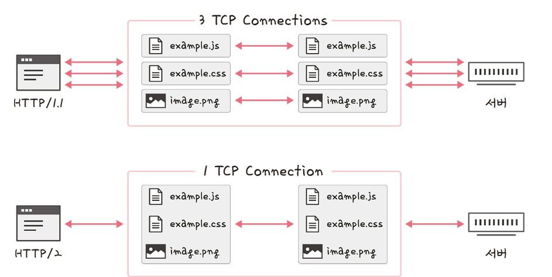
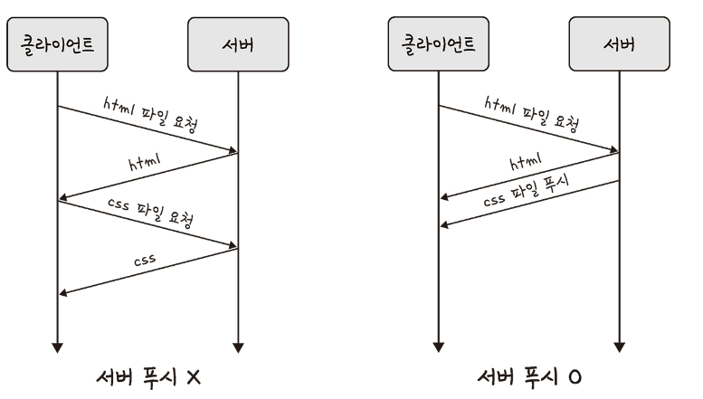
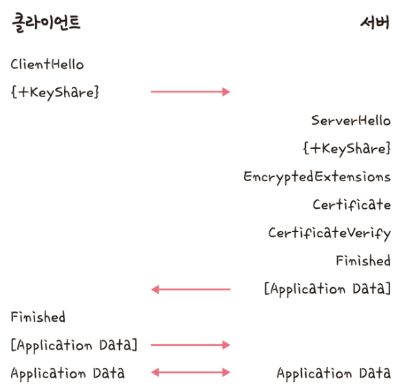
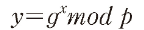
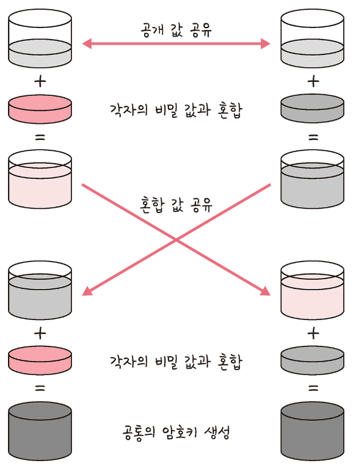

# 2.5 HTTP
- HTTP : 앺프리케이션 계층으로 웹서비스 통신에 사용
- HTTP/1.0 부터 HTTP/3까지 존재

# 2.5.1 HTTP/1.0
- 기본적으로 한 연결당 하나의 요청을 처리하도록 설계 -> RTT의 증가

## RTT 증가

- 서버로부터 파일을 가져올 때마다 TCP의 3-웨이 핸드셰이크를 열어야 함 -> RTT의 wmdrk
- RTT : 패킷이 목적지에 도달하고 나서 다시 출발지로 돌아오기까지 걸리는 시간. 패킷 왕복 시간

## RTT의 증가를 해결하기 위한 방법
- 매 연결마다 RTT 증가 -> 서버에 부담 늘어나고 사용자 응답시간 길어짐
- 이미지 스플리팅, 코드 압축, 이미지 Base64 인코딩 사용
  - 이미지 스프리팅
    - 많은 이미지를 다운 받는 경우 과부하 발생
    - 많은 이미지가 합쳐 있는 하나의 이미지를 다운로드 받음
    - 이를 기반으로 background-image의 position을 이용하여 이미지 표기하는 방법
  - 코드 압축
    - 코드를 압축해서 개행문자, 빈칸을 없애서 코드의 크기를 최소화하는 방법
    - 개행 문자, 띄어 쓰기 등이 사라져 코드 압축 -> 코드 용량이 줄어듦
  - 이미지 Base64 인코딩
    - 이미지 파일을 64진법으로 이루어진 문자열로 인코딩 하는 방법
    - 서버와의 연결을 열고 이미지에 대해 서버에 HTTP 요청을 할 필요가 없음
    - Base64 문자열로 변환할 경우 37% 정도 크기가 더 커진다는 단점 O

> 인코딩  
> 정보의 형태나 형식을 표준화, 보안, 처리 속도 향상, 저장 공간 정략 등을 위해 다른 형태나 형식으로 변환하는 처리 방식

# 2.5.2 HTTP/1.1
- HTTP/1.0에서 발전한 것. 매번 TCP 연결하지 X
- 한 번  TCP 초기화를 한 이후에 keep-alive라는 옵션으로 여러개의 파일을 송수신할 수 있음
-  HTTP/1.0에도 keep-alive가 있었지만 표준화 X
- HTTP/1.1부터 표준화되어 기본 옵션으로 설정

- TCP 3-웨이 핸드셰이큭 한 번 발생하면 그 다음부터 발생 X
- 문서 안에 포함된 다수의 리소스(이미지, 동영상, css 파일, js 파일 등) 처리하려면 요청할 리소스 개수에 비례해서 대시 시간이 길어지는 단점

## HOL Blocking(Head Of Line Blocking)
- 네트워크에서 같은 큐에 있는 패킷이 그 첫 번째 패킷에 의해 지연될 때 발생하는 성능 저하 현상
- 순차적으로 다운 받을 때 앞선 것이 느리게 받아진다면 뒷 순서에 대기 발생하여 다운로드가 지연되는 것

## 무거운 헤더 구조
- 쿠키 등 많은 메타 데이터가 들어 있고 압축이 되자 안아 무거웠음

# 2.5.3 HTTP/2
- SPDY 프로토콜에서 파생된 HTTP/1.x 보다 지연 시간을 줄이고 응답 시간을 더 빠르게 할 수 있음
- 멀티플렉싱, 헤더 압축, 서버 푸시, 요청의 우선순위 처리를 지원하는 프로토콜

## 멀티플렉싱
- 여러 개의 스트림을 사용하여 송수신함
- 특정 스트림의 패킷이 손실되었다고 하더라도 해당 스트림에만 영향을 미침. 나머지 스트림은 멀쩡히 동작 가능
- 스트림(stream) : 시간이 지남에 따라 사용할 수 있게 되는 일련의 데이터 요소를 가리키는 데이터 흐름

- 하나의 연결 내 열 스트림을 나타낸 그림
- 병렬적인 스트림들을 통해 데이터를 서빙, 스트림 내의 데이터들도 쪼개져 있음
- 애플리케이션에서 받아온 메시지를 독립된 프레임으로 조각내어 서로 송수신한 이후 다시 조립하여 데이터를 주고 받음
- 단일 연결을 사용하여 병렬로 여러 요청을 받을 수 있고 응답을 줄 수 있므 -> HOL Blocking 해결 가능

## 헤더 압축
- 허프만 코딩 압축 알고리즘을 사용하는 HPACK 압축 형식
- 허프만 코딩(huffman coding)
  - 문자열을 문자 단위로 쪼개 빈도 수를 세어 빈도가 높은 정보는 적은 빈도수를 세어 
  - 빈도가 높은 정보는 적은 비트 수를 사용하여 표현
  - 빈도가 낮은 정보는 비트 수를 많이 사용하여 표현
  - 전체 데이터의 표현에 필요한 비트양을 줄이는 원리

## 서버 푸시
- HTTP/1.1에서는 클라이언트가 서버에 요청을 해야 파일을 다운로드 받을 수 잇음
- HTTP/2는 클라이언트 요청 없이 서버가 바로 리소스 푸시 가능
- html에 포함된 css나 js파일을 html을 읽으면서 서버에 푸시하여 클라이언트에게 먼저 줄 수 있음

# 2.5.4 HTTPS
- HTTP/2는 HTTPs 위에서 동작
- HTTPS는 애플리케이션 계층과 전송 계층 사이에서 신뢰 계층인 SSL/TLS 계층을 넣은 신뢰할 수 있는 HTTP 요청
- 통신을 암호화함

## SSL/TLS
- SSL(Secure Socket Layer)은 SSL 1.0/SSL 2.0/SSL 3.0/TLS(Transport Layer Security Protoc0l) 1.0/ TLS 1.3 / TLS (최종)
- 전송 계층에서 보안을 제공하는 프로토콜
- 클라이언트와 서버가 통신할 때 SSL/TLS를 통해 제 3자가 에미시를 조텅하거나 변조하지 못하도록 함
- 인터셉터(공격자가 서버인 척 사용자 정보를 가로채는 것)를 방지할 수 있므
- 보안 세션을 기반으로 데이터를 암호화
- 보안 세션이 만들어질대 인증 메커니즘, 키 교환 암호화 알고리즘, 해싱 살고리즘이 사용
- 보안 세션
  - 보안이 시작되고 끝나는 동안 유지되는 세션
  - SSL/TLS는 핸드셰이크를 통해 보안 세션을 생성하고 이를 기반으로 상태정보 등을 공유

> 세션  
> 운영체제가 어떠한 사용자로부터 자신의 자산 이용을 허락하는 일정한 기간  
> 사용자는 일정 시간동안 응용 프로그램, 자원 등을 사용할 수 있음

- 클라이언트와 서버와 키를 공유하고 이를 기반으로 인증, 인증 확인 등의 작업이 일어나는 단 한 번의 1-RTT가 생긴 후 데이터를 송수신
- 클라이언트에서 사이퍼 슈트(cypher suites)를 서버에 전달하면 서버는 받은 사이퍼 슈트이ㅡ 암호화 알고리즘 리스트를 제공할 수 있는 ㅈ 확인
- 제공할 수 있다면 서버에 클라이언트로 인증서를 보내는 인증 메커니즘 시작
- 이후 해싱 알고리즘 등으로 데이터의 송수신 시작

### 사이퍼 슈트
- 프로토콜, AEAD 사이퍼 모드, 해싱 알고리즘이 나열된 규약. 5개가 있음
  - TLS_AES_128_GCM_SHA256
  - TLS_AES_256_GCM_SHA384
  - TLS_CHACHA20_POLY1305_GCM_SHA256
  - TLS_AES_128_CCM_SHA256
  - TLS_AES_128_CCM_8_SHA256
- 인증 메커니즘
  - CA(Certificate Authorities)에서 발급한 인증서 기반
  - 인증서는 안전한 연결을 시작하는 데 있어 필용하 공개키를 클라이언트에게 제공
  - 사용자가 접속한 서버가 신뢰할 수 있는 서버임을 보장
  - 인증서는 서비스 정보, 공개키, 지문, 디지털 서명 등으로 이루어져 있음
  - CA는 신뢰성이 엄격하게 공인되 기업달만 참여 가능. Comodo, GoDaddy, GlobalSign. 아마존

### CA 발급 과정
- 자신의 서비스가 CA 인증서를 발급 받으려면 자신의 사이트 정보와 공개키를 CA에 제출해야함
- CA는 공개키를 해시한 값인 지문(finger print)로 사용하는 CA의 비밀키 등을 기반으로 CA 인증서를 발급

### 암호화 알고리즘
- 키 교환 알고리즘으로는 대수곡선 기반의 ECDHE 또는 모듈식 시반의 DHE
- 둘 다 디피-헬만 방식을 근간으로 만들어짐

#### 디피-헬만 키 교화 알고리즘
- 암호키를 교환하는 하나의 방법
- g와 x와 p를 안다면 y는 구하기 쉬움
- g와 y와 p만 안다면 x는 구하기 어려움
- 처음에 공개 값을 공유하고 각자의 비밀 값과 혼합한 후 혼합 값을 공유
- 각자의 비밀 값과 또 혼합
- 그 이후 공통 암호키인 PSK 생성
- 클라이언트와 서보 모두 개인키와 공개키를 생성하고, 서로에게 공개키를 보내고 공개키와 개인키를 결합하여 PSK가 생성된다면
- 악의적인 공격자가 개인키 또는 공개키를 가지고도 PSK가 없기 때문에 아무것도 할 수 없음

### 해싱 알고리즘
- 데이터를 추정하기 힘든 더 작고 섞여 있는 조각으로 만드는 알고르짐
- SSL/TLS는 해싱 알고리즘으로 SHA-256 알고리즘과 SHA0384 알고리즘 설명

#### SHA-256 (많이 사용)
- 해시 함수의 결고사값이 256비트인 알고리즘
- 비트코인을 비롯한 많은 블록체인 시스템에서도 사용
- 해싱을 해야할 메세지에 1을 추가하는 등 전처리를 하고 전처리된 메시지를 기반으로 해시를 반환

> 해시  
> 다양한 길이를 가진 데이터를 고정된 길이를 가진 데이터로 매핑한 값  
> 
> 해싱  
> 임의의 데이터를 해시로 바꿔주는 일이며 해시 함수가 이를 담당  
> 
> 해시함수  
> 임의의 데이터를 입력으로 받아 일정한 길이의 데이터로 바꿔즈주는 함수

## SEO에도 도움이 되는 HTTPS
- HTTPS 서비스를 하는 사이트가 SEO 순위가 높을 것
- SEO(Search Engine Optimization) : 검색엔진 최적화
  - 사용자들이 구글, 네이버 같은 검색엔진으로 웹 사이트를 검색했을 때 그 결과를 페이지 상단에 노출시켜 많은 사람이 볼수 있도록 최적화하는 방법
- SEO 관리
  - 캐노니컬 설정, 메타 설정, 페이지 속도 개선, 사이트맵 관리 등

### 메타 설정
- html 파일의 가장 윗부분인 메타를 잘성정해야함

### 페이지 속도 계선
- 사이트의 속도가 빨라야함
- 구글의 PageSpeedInsights로 가서 자신의 서비스에 대한 리포팅을 주시적으로 받으며 관리해야함

### 사이트앱 관리
- 정시적으로 관리해야함
- 사이트맵 제너레이터를 사용하거나 직접 코드를 만들어 구축
- 사이트맵은 xml 형식

## HTTPS 구축 방법
1. 직접 CA에서 구매한 인증키를 기반으로 구축
2. 서버 앞단의 HTTPS를 제공하는 로드밸런서를 두어 구축
3. 서버 앞단에 HTTPS를 제공하는 CDN을 둬 구축

# 2.5.5 HTTP/3
- World Wide Web에서 정보를 교환하는데 사용되는 HTTP 세 번째 버전
- QUIC라는 계층위에서 돌아가면 UDP 기반으로 돌아감
- 멀티플렉싱을 가지며 초기 연결 설정 시 지연 시간 감소

## 초기 연결 설정 시 지연 시간 감소
- QUIC는 TCP 사용하지 않기 때문에 3-웨이 핸드셰이크 과정 X
- 첫 연결 설정에 1-RTT만 소요
- 클라이언트가 서버에 어떠한 신호를 한 번 주고, 서버도 거기에 응답하기만 하면 바로 본 통신 시작
- 순방향 오류 수정 메커니즘이 적용
  - 전송한 패킷이 손실되었다면 수신 측에서 에러를 검출하고 수정하는 방식
  - 열악한 네트워크 환경에서도 낮은 패킷 손실률