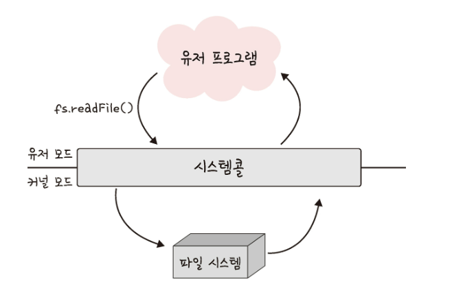
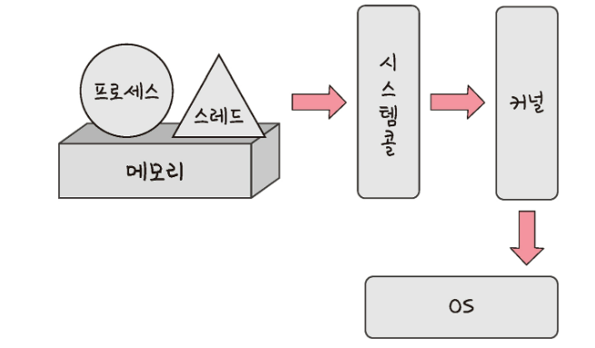
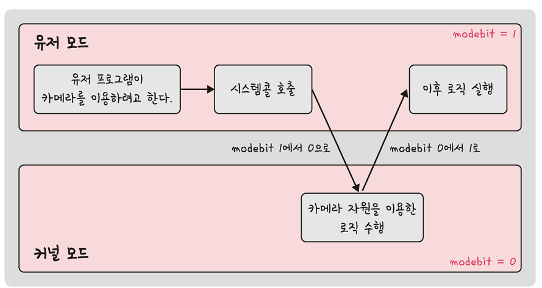
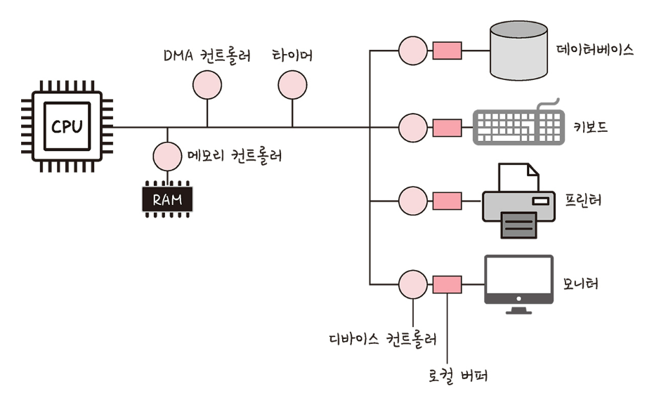
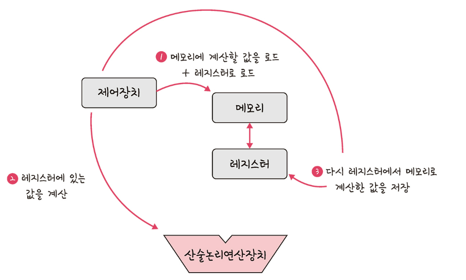

# 3. 운영체제
- 운영체제(OS, Operating System)
- 사용자가 컴퓨터를 쉽게 다루게 해주는 인터페이스
- 한정된 메모리나 시스템 자원을 효율적으로 분배
- 운영체제와 유사하지만 추가로 설치할 수 없는 것을 펌웨어(firmware)라고 함

# 3.1 운영체제와 컴퓨터
- 하드웨어와 소프트웨어를 관리하는 운영체제와 CPU, 메모리 등으로만 이루어진 컴퓨터를 알아볼 것

# 3.1.1 운영체제의 역할과 구조
## 운영체제의 역할
1. CPU 스케줄링과 프로세스 관리 : CPU 소유권을 어떤 프로세스에 할당할지, 프로세스의 생성과 삭제, 자원 할당 및 반환을 관리
2. 메모리 관리 : 한정된 메모리를 어떤 프로세스에 얼만큼 할당해야 하는지 관리
3. 디스크 파일 관리 : 디스크 파일을 어떠한 방법으로 보관할지 관리
4. I/O 디바이스 관리 : I/O 디바이스들인 마우스, 키보드와 컴퓨터 간에 데이터를 주고받는 것을 관리

## 운영체제의 구조

- 유저 프로그램이 맨 위에 있고 그 다음으로 GUI, 시스템콜, 커널, 드라이버가 있으며 가장 밑에 하드웨어가 있는 구조
- GUI, 시스템콜, 커널, 드라이버 부분이 운영체제를 지칭
- 리눅스는 CUI만 있음(GUI 없음)
  - GUI
    - 사용자가 전자장치와 상호작용할 수 있도록 하는 사용자 인터페이스의 한 형태
    - 단순 명령어 창이 아닌 아이콘을 마우스로 클릭하는 단순한 동작으로 컴퓨터와 상호 작용할 수 있도록 함
  - 드라이버
    - 하드웨어를 제어하기 위한 소프트웨어
  - CUI
    - 그래픽이 아닌 명령어로 처리하는 인터페이스

### 시스템콜

- 운영체제가 커널에 접근하기 위한 인터페이스
- 유저 프로그램이 운영체제의 서비스를 받기 위해 커널 함수를 호출할 때 사용
- 유저 프로그램이 I/O 요청으로 트랩(trap)을 발동하면 올바른 I/O 요청인지 확인 후 유저 모드가 시스템 콜을 통해 커널 모드로 변환되어 실행
  - I/O 요청 : 입출력 함수, 데이터베이스, 네트워크, 파일 접근 등에 관한 일
- 유저 모드로 명령어를 수행하지 않고 커널 모드로 명령을 수행 후 유저 모드로 돌아가 유저 프로그램 로직 수행
- 컴퓨터 자원에 대한 직접 접근을 차단, 프로그램을 다른 프로그램으로부터 보호할 수 있음

- 프로세스나 스레드에서 운영체제로 어떠한 요청을 할 때 시스템 콜이라는 인터페이스와 커널을 거쳐 운영체제에 전달
- 시스템콜은 하나의 추상화 계층 -> 네트워크 통신이나 데이터베이스 같은 낮은 단계의 영역 처리에 대한 부분을 신경 쓰지 않고 프로그램 구현 가능

#### modebit
- 시스템 콜이 작동될 때 modebit을 참고해서 유저 모드와 커널 모드를 구분
- 1 또는 0의 값을 가지는 플래그 변수
  - 1 : 커널모드
  - 0 : 유저 모드
- 카메라, 키보드 등 I/O 디바이스는 운영체제를 통해서만 작동해야 함
- 공격자에 의해 사용자가 의도하지 않은 작동을 막기 쉽게 함

- 유저 프로그램이 카메라를 이용하려고 할 때 시스템콜을 호출해 modebit을 1에서 0으로 변경해 커널모드로 변경한 후 로직 수행하고 다시 1로 변경
- 유저 모드 : 유저가 접그낳ㄹ 수 있는 영역을 제한적으로두며 컴퓨터 자원에 함부로 침범하지 못하는 모드
- 커널 모드 : 모든 컴퓨터 자원에 접근할 수 있는 모든
- 커널 : 운영체제의 핵심 부분이자 시스템콜 인터페이스를 제공하며 보안, 메모리, 프로세스, 파일 시스템, I/O 디바이스, I/O 요청 관리 등 운영 체제의 중추적인 역할

# 3.1.2 컴퓨터의 요소
- 컴퓨터는 CPU, DMA 컨트롤러, 메모리, 타이머, 디바이스 컨트롤러 등으로 이루어짐

## CPU(Central Processing Unit)
- 산술 논리연상장치, 제어장치, 레지스터로 구성되어 있는 컴퓨터 장치
- 인터럽트에 의해 단순히 메모리에 존재하는 명령어를 해석해서 실행하는 일꾼
- 운영체제의 커널이 프로그램을 메모리에 올려 프로세스를 만들면 CPU가 이를 처리

### 제어장치(CU, Control Unit)
- 프로세스 조작을 지시하는 CPU의 한 부품
- 입출력장치 간 통신을 제정하고 명령어들을 읽고 해석하며 데이터 처리를 위한 순서를 결정

### 레지스터
- CPU 안에 있는 매우 빠른 임시기억장치
- CPU와 직접 연결되어 있으므로 연산 속도가 메모리보다 수십 배에서 수백 배까지 빠름
- CPU는 자체적으로 데이터를 저장할 방법이 없어 레지스터를 거쳐 데이터를 전달함

### 산술논리연산장치(ALU, Arithmetic Login Unit)
- 덧셈, 뺄셈 같은 두 숫자의 산술 연산과 배타적 논리합, 논리곱 같은 논리 연산을 계산하는 디지털 회로

#### CPU의 연산 처리
- CPU에서 제저장치, 레지스터, 산술논리연산장치를 통해 연산하는 과정

1. 제어자잋가 메모리에 계산할 값을 로드, 레지스터에도 로드
2. 제어장치가 레지스터에 있는 값을 계산하라고 산술논리연상장치에 명령
3. 제어장치가 계산된 값을 다시 레지스터에서 메소리로 계산한 값을 저장

### 인터럽트
- 어떤 신호가 들어왔을때 CPU를 잠깐 정지시키는 것
- 키보드, 마우스등 IO디바이스로 인한 인터럽트, 0을 숫자로 나누는 산술 연산에서의 인터럽트, 프로세스 오류 등으로 발생
- 인터럽트가 발생되면 인터럽트 햄들러 함수가 모여 있는 인터럽트 벡터로 가서 인터럽트 핸들러 함수가 실행
- 인터럽트 간에는 우선순위가 있고 우선순위에 따라 실행되며 인터럽트는 하드웨어 인터럽트, 소프트웨어 인터럽트 두 가지로 나뉨
- 인터럽트 핸들러 함수
  - 인터럽트가 발생했을 때 이를 핸들링하기 위한 함수
  - 커널 내부의 IRQ를 통해 호출되면 request_irq()를 통해 인터럽트 핸들러 함수를 등록할 수 있음

#### 하드웨어 인터럽트
- IO 디바이스에서 발생하는 인터럽트(키보드, 마우스 연결 등)
- 인터럽트 라인이 설계된 이후 순차적인 인터럽트 실행을 중지하고 운영체제 시스템콜을 요청해 원하는 디바이스로 향해 디바이스에 있는 작은 로컬 버버에 접근하여 일을 수행

#### 소프트웨어 인터럽트
- 트랩(trap)이라고도 함
- 프로세스 오류 등으로 프로세스가 시스템콜을 호출할 때 발동

## DMA 컨프롤러
- I/O 디바이스가 메모리에 직접 접근할 수 있도록 하는 하드웨어 장치
- CPU에만 너무 많은 인터럽트 요청이 들어오기 때문에 CPU 부하를 막아줌
- CPU의 일을 부담하는 보조 일꾼
- 하나의 작업을 CPU와 DMA 컨트롤러가 동시에 하는 것을 방지함

## 메모리
- 전자회로에서 데이터나 상태, 명령어 등을 기록하는 장치
- 보통 RAM(Random Access Memory)을 일컬어 메모리라고도 함
- CPU는 계산, 매모리는 기억을 담당
- 메모리가 크면 클 수록 많은 일을 동시에 할 수 있음

## 타이머
- 몇 초 안에는 작업이 끝나야 한다는 것을 정하고 특정 프로그램에 시간 제한을 다는 역할
- 시간이 많이 걸리는 프로그램이 작동할 때 제한을 걸기 위해 존재

## 디바이스 컨트롤러
- 컴퓨터와 연결되어 있는 IO 디바이스들의 작은 CPU를 말하고 옆에 붙어 있는 로컬 버퍼는 각 디바이스에서 데이터를 임시로 저장하기 위한 작은 메모리