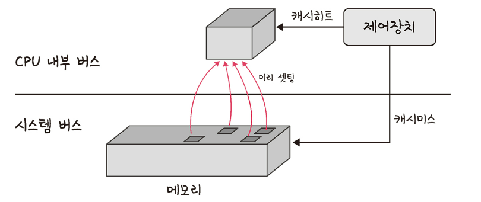

# 3.2 메모리
# 3.2.1 메모리 계층

- 메모리 계층은 레지스터, 캐시, 메몰, 저장장치로 구성
- 레지스터
  - CPU 안에 있는 작은 메모리, 휘발성, 속도 가장 빠름, 기억 용량이 가장 적음
- 캐시
  - L1, L2 캐시를 지칭
  - 휘발성, 속도 빠름, 기억 용량이 적음
  - L3 캐시도 있음
- 주기억장치
  - RAM을 가리킴
  - 휘발성, 속도 보통, 기억 용량이 보통
- 보조기억장치
  - HDD, SSD를 일컬으며 비휘발성, 속도 낮음, 기억 용량이 많음
- 램은 하드디스크로부터 일정량의 데이터를 복사해 임시저장하고 이를 피료 시마다 CPU에 빠르게 전달하는 역할
- 계층 위로 올라갈수록 가격은 비싸지고, 용량은 작아지고 속도는 빨라짐
- 계층의 이유 : 경제성과 캐시

## 캐시 (cache)
- 데이터를 미리 복사해놓는 임시 저장소
- 빠른 장치와 느린 장치에서 속도 차이에 다른 병목 현상을 줄이기 위한 메모리
- 데이터를 접근하는 시간이 오래 걸리는 경우를 해결. 다시 계산하는 시간 절약.
- 메모리-CPU 사이 속도가 매우 큼 -> 중간에 레지스터 계층을 두어 속도 차이를 해결
- 캐싱 계층 속도 차이르 해결하기 위해 계층과 계층 사이에 존재하는 계층
  - 캐시 메모리와 보조기억장치 사이의 주기억 장치 -> 보조기억장치의 캐싱 계층

### 지역성의 원리
- 캐시를 직접 선택할 때는 어떻게?!
- 자주 사용하는 데이터를 기반으로 설정
- 근거 : 지역성(시간 지역성(temporal locality), 공간 지역성(spatial locality))
  - 시간 지역성 : 최근 사용한 데이터에 다시 접근하려는 특성
  - 공간 지역성 : 최근 접근한 데이터를 이루고 있는 공간이나 그 가까운 공간에 접근하는 특성

## 캐시히트와 캐시미트

- 캐시 히트 : 캐시에서 원하는 데이터를 찾은 경우
  - 위치도 가깝고, CPU 내부 버스를 기반으로 작동하기 때문에 빠름
- 캐시 미트 : 캐시에 없어 주 메모리로 가서 데이터를 찾아오는 것
  - 시스템 서브를 기반으로 작동하기 때문에 느림

### 캐시매핑

- 캐시매핑: 캐시가 히트되기 위해 매핑하는 방법
- CPU의 레지스터와 주 메모리(RAM)간에 데이터를 주고받을 대 기반으로 설명
- 캐시 계층으로써의 역할을 잘해주려면 매핑 방법이 중요

### 웹 브라우저의 캐시
- 소프트웨어적인 대표적인 캐시 : 웹 브라우저의 작은 저장소 쿠키, 로컬 스토리지, 세션 스토리지
- 사용자의 커스텀한 정보나 인증 모듈 관련 사항들을 웹 브라우저에 저장해서 추후 서버에 요청할 때 자신을 나타내는 아이덴티티나 중복 요청 방지를 위해 쓰이며 오리진(origin)에 종속
- 쿠키
  - 만료기한이 있는 키-값 저장소
  - same site 옵션을 strict로 설정하지 않은 경우 다른 도메인에서 요청했을 때 자동 전송
  - 4KB까지 저장 가능, 만료기한을 정할 수 있음
  - 쿠키 설정시 document.cookie로 쿠키를 볼 수 업세 httponly 옵션 거는 것이 중요
  - 클라이언트 또는 서버네서 만료기한 등을 정할 수 있는데 보통 서버에서 만료 기간을 정함
- 로컬 스토리지
  - 만료기간이 없는 키-값 저장소
  - 5MB까지 저장 가능
  - 웹 브라우저를 닫아도 유지
  - HTML5를 지원하지 않는 웹 브라우저에서는 사용할 수 없음
  - 클라이언트에서만 수정 가능
- 세션 스토리지
  - 만료기한이 없는 키-값 저장소
  - 탭 단위로 세션 스토리지를 생성
  - 탭을 닫을 때 해당 데이터가 삭제
  - 5MB까지 저장 가능
  - HTML5를 지원하지 않는 웹 브라우저에서는 사용할 수 없음
  - 클라이온트에서만 수정 가능

### 데이터베이스의 캐싱 계층
- 데이터베이스 시스템에서도 redis 데이터베이스 계층을 캐싱 계층으로 두어 성능을 향상 시킴

# 3.2.2 메모리 관리
- 운영체제의 대표적인 할 일 줄 하나가 메모리 관리
- 컴퓨터 내의 한정된 메모리를 극한으로 활용해야 함

## 가상 메모리(virtual memory)
- 메모리 관리 기법의 하나
- 컴퓨터가 실제로 이용 가능한 메모리 자원을 추상화하여 이를 사용하는 사용자들에거 매우 큰 메모리로 보이게 만드는 것

- 가상 주소(logical address) : 가상적으로 주어진 주소
- 실제 주소(physical address) : 실제 메모리상에 있는 주소
- 가상 주소는 메모리관리장치(MMU)에 의해 실제 주소로 변환
- 사요자는 실제 주소를 의식할 필요 없이 프로그램을 구축할 수 있음
- 가상 메모리는 가상 주소와 실제 주소가 매핑 되어 있고 프로세스의 주소 정브가 들어있는 페이지 테이블로 관리
- TLB로 관리해 속도 향상
  - 메모리와 CPU 사이에 있는 주소 변환을 위한 캐시
  - 페이지 테이블에 잇는 리스트를 보관
  - CPU가 페이지 테이블까지 가지 않도록 해 속도를 향상시킬 수 있는 캐시 계층

### 스와핑
- 가상 메모리에는 존재하지만 실제 메모리인 RAM에 현재 없는 데이터나 코드에 접근할 경우 페이지 폴트 발생
- 메모리에서 당장 사용하지 않는 영역을 하드디크스로 옮기고 하드디스크의 일부분을 마치 메모리처럼 불러와 쓰는 것
- 페이지 폴트가 일어나지 않은 것처럼 만듦

### 페이지 폴드
- 프로세스의 주소 공간에는 존재하지만 지금 이 텀퓨터의 RAM에는 없는 데이터에 접근했을 경우 발생

1. 어떤 명령어가 유효한 가상 주소에 접근했으나 해당 페이지가 없다면 트랩일 발생되어 운영체에 알림
2. 운영 체제는 실제 디스크로부터 사용하지 않은 프레임을 찾음
3. 해당 프로엠을 실제 메모리에 가져와서 페이지 교체 알고리즘을 기반으로 특정 페이지와 교체 (스와핑 발셍)
4. 페이지 테이블 생긴시킨 후 명령어를 시작

> 페이지  
> 가상 메모리를 사용하는 최소 크기 단위  
> 
> 프레임  
> 실제 메모리를 사용하는 최소 크기 단위

## 스레싱 (thrashing)
- 메모리의 페이지 폴트율이 높은 것을 의미
- 컴퓨터의 심각한 성능 저하를 초래
- 메모리에 너무 많은 프로세스가 동시에 올라가게 되면 스와핑이 만이 일어나 발생하는 것
- 페이지 폴트가 일어나면 CPU 이용률이 낮아짐 -> CPU 이용률이 낮아지면 운영체제는 가용성을 높이기 위하 더 많은 프로세스를 메모리에 올림 => 스레싱 발생
- 해결 방안 : 메모리를 늘리거나, HDD 사용 시 HDD를 SSD로 바꾸는 방법
- 운영체제에서 해결 방안 : 작업 세트, PFF
  - 작업 세트 (working set)
    - 과거 사용 이력인 지역성을 통해 결정된 페이지 집합을 만들어 미리 메모리에 로드
    - 미리 레모리에로드하면 탐색에 드는 비용을 주일 수 있고, 스와핑 줄일 수 있음
  - PFF (Page Fault Frequency)
    - 페이지 폴트 빈도를 조절하는 방법으로 상한선과 하한선을 만드는 방법
    - 상한선에 도달하면 프레임을 늘리고 하하선에 도달하면 프레임을 줄임

## 메모리 할당
- 메모리에 프로그램  할당 기준 : 메모리 위치, 메모리이 할당 크기를 기반
- 연속 할당과 불연속 할당

### 연속 할당
- 메모리에 연속적으로 공간을 할당하는 것
- 메모리를 미리 나누어 관리하는 고정 분할 방식, 매 시점 프로그램의 크키에 맞게 메모릴 분할하여 사용하는 가변 분할 방식
- 고정 분할 방식 (fixed partition allocation)
  - 메모리를 미리 나누어 관리하는 방식
  - 메모리가 미리 나뉘어 있기 때문에 용통성이 없음
  - 내부 단편화 발생
- 가변 분할 방식 (variable partition allocation)
  - 매 시점 프로그램의 크기에 맞게 동적으로 메모리를 나눠서 사용
  - 내부 단편봐=화는 발새하지 않고 외부 단변화는 발생할 수 있음
  - 

### 불연속 할당
- 메모리를 연속적으로 할당하지 않는 불연속 할당
- 현대 운영체제가 쓰는 방법
- 메모리를 동일한 크기의 페이지(보통 4kb)로 나누고 프로그램마다 페이지 테이블을 두어 메모리에 프로그램을 할당
- 페이징 기법, 세그멘테이션, 페이지드 세그멘테이션
- 페이징
  - 동일한 크기의 페이지 단위로 나누어 메모리의 서로 다른 위치에 프로세스를 할당
  - 홀의 크기가 균인하지 않는 문제가 없어짐
  - 주소 변환이 복잡
- 세그멘테이션
  - 페이지 단위가 아닌 의미 단위인 세그먼트로 나누는 방식
  - 프로세스를 이루는 메모리는 코드 영역, 데이터 영역, 스택 여역, 힙 영역으로 이루어짐
  - 코드와 데이터로 나누거나 코드 내의 작은 함수를 세그먼트로 놓고 나눌 수 있음
  - 공유봐 조안 측면에서 장접을가지지만 홀 크기가 균일하지 않다는 단점
- 페이지드 세그멘테이션
  - 프로그램을 읨 단위인 세크먼트로 나눠 공유나 보안 측면에 강점을 두고 임의의 길이가 아닌 동일한 페이지 단위로 나누는 것

## 페이지 교체 알고리즘
- 메모리는 한정되어 있기 때문에 스와핑 많이 발생
- 스와핑을 많이 일어나지 않도록 설게되어야 함
- 페이지 교체 알고리즘을 기반으로 스와핑 발생

### 오프라인 알고리즘
- 먼미래에 참조되는 페이지와 혀재 할당하는 페이지를 바꾸는 알고리즘
- 가장 좋은 방법이지만 사용할 수 없음
- 가장 좋은 알고리즘이라 다른 알고리즘과의 성능 비교에 대한 상한 기준을 제공

### FIFO
- 가장 먼저 온 페이지를 교체 영역에서 가장 먼저 놓는 방법

### LRU
- 참조가 가장 오래된 페이지를 바꿈
- 오래된 것을 파악하기 위해 각 페이지마다 계수기, 스택을 두어야 하는 문제점
- 두 개의 자료 구조로 구현
- 해시 테이블과 이중 연결 리스트
- 해시 테이블은 이중 연결 리스트에서 빠르게 찾을 수 있도록 사용
- 이중 연결 리스트는 한정된 메모리를 나타냄

### NUR (Not Used Recently)
- LRU에서 발전. 일명 clock 일고리즘
- 1은 최근 참조 0은 참고되지 않음을 의미
- 시계방향으로 돌면서 0을 찾고 0을 찾은 순간 해당 프로세스를 교체하고 해당 부분을 1로 바꾸는 알고리즘

### LFU
- 가장 참조 횟수가 적은 페이지를 교체. 많이 사용되지 않는 것을 교체