# 3.3 프로세스와 스레드
- 프로세스(Process) : 컴퓨터에서 실행되고 있느 프로그램
- CPU 스케쥴링의 대상이 되는 작업(task)이라는 용어와 거의 같은 의미로 쓰임
- 스레드 : 프로세스 내 작업의 흐름

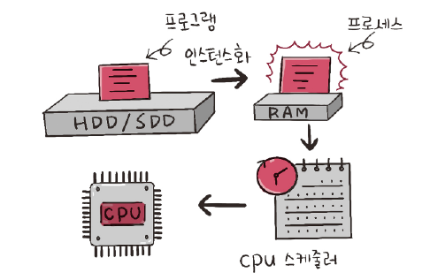

- 인스턴스화 : 프로그램이 메모리에 올라가면 프로세스가 된다!
- 이후 운영체제의 CPU 스케줄러에 따라 CPU가 프로세스를 실행

# 3.3.1 프로세스와 컴파일 과정
- 프로세스 : 프로그램으부터 인스턴스화된 것
  - 프로그램 : 구글 크롬 프로그램(chrome.exe)와 같은 실행 파일
  - 프로세스 : 이를 두번 클릭하면 구글 크롬 프로세스가 시작됨
- 프로그램 : 컴파일러가 컴파일 과정을 거쳐 컴퓨터가 이해할 수 있는 기계어로 번역되어 실행될 수 있는 파일이 되는 것을 의미
  - C언어 기반의 프로그램을 의미. 인터프리터 언어로된 프로그램과 다름
- 컴파일 과정
  - 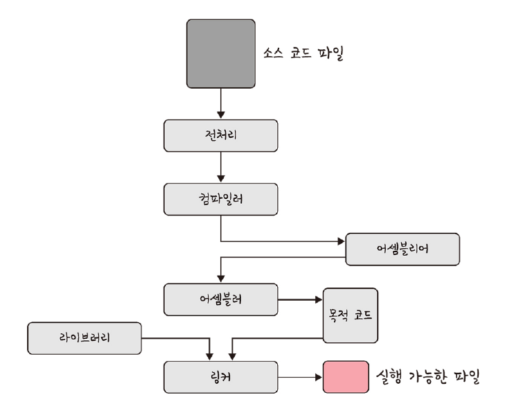

## 전처리
- 소스 코드의 주석을 제거하고 `#include`등 헤더 파일을 병합하여 매크로를 치환

## 컴파일러
- 오류 처리, 코드 최적화 작업을 하며 어셈블리어로 변환

## 어셈블러
- 목적 코드(object code) 변환
- 확장자는 운영체제마다 다름 리눅스에서는 .o

## 링커
- 프로그램 내에 있는 라이븝리 함수 또는 다른 팡리들고 목적 코드를 결합하여 실햏 파일을 만듦
- 실행 파이의 확장자는 .exe 또는 .out 이라는 확장자를 가짐

### 정적 라이브러리와 동적 라이브러리
- 정적 라이브러리
  - 프로그램 빌드 시 라이브러리가 제공하는 모든 코드를 실행 파일에 넣는 방식
  - 시스템 환경 등 외부 의존도가 낮고 코드 중복 등 메모리 효율석이 떨어지는 단점
- 동적 라이브러리
  - 프로그램 실행 시에 필요할 때만 DLL이라는 함수 정보를 통해 참조하는 방식
  - 메모리 효율성에서 장점과 외부 의존도가 높아진다는 단점

# 3.2.2 프로세스의 상태
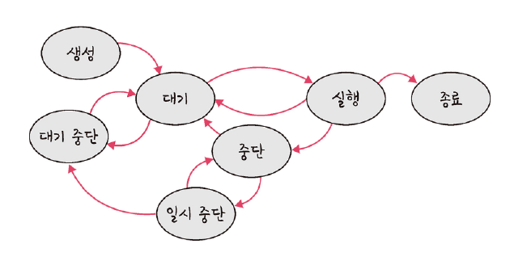

## 생성 상태
- 생성 상태(create)는 프롯슥 생성된 상태를 의미하며 `fork()` 또는 `exec()` 함수를 통해 생성
- 이때 PCB 가 할당된다

### fork()
- 부모 프로세스의 주소 공간을 그대로 복사하며 새로운 자식 프로세스를 생성하는 함수
- 주소 공간만 복사할 뿐 부모 프로세스의 비동기 작업 등을 상속하지는 않음

### exec()
- 새롭게 프로세스를 생성하는 함수

## 대기 상태(ready)
- 메모리 공간이 충분하면 메모리를 할당받고 아니면 아닌 상태로 대기하고 있으며 CPU 스케줄러로부터 CPU 소유권이 넘어오기를 기다리는 상태

## 대기 중단 상태 (ready suspended)
- 메모리 부족으로 일시 중단된 상태

## 실행 상태(running)
- CPU 소유권과 메모리를 할당받고 인스트럭션을 수행 중인 상태를 의미
- CPU burst가 일어났다고도 표현

## 중단 상태(blocked)
- 어떤 이벤트가 발생한 이후 기다리며 프로세스가 차다된 상태
- I/O 디바이스에 의한 인터럽트로 이런 현상이 많이 발생하기도 함

## 일시 중단 상태 (blocked suspended)
- 대기 중단과 유사
- 중단된 상태에서 프로세스가 실행되려고 했지만 메모리 부족으로 일시 중단된 상태

## 종료 상태 (terminated)
- 메모리와 CPU 소유권을 모두 높고가는 상태
- 종류는 자연스럽게 종료되는 것도 있지만 부모 프로세스가 자식 스포레스를 강제시키는 비자발적 종료(abort)로 종료되는 것도 있음
- 자식 프로세스에 할당된 자원의 한계치를 넘어서거나 부모 프로세스가 종료되거나 사용자가 process.kill 등 여러 명령어로 프로세스를 종료할 때 발생

# 3.3.3 프로세스의 메모리 구조
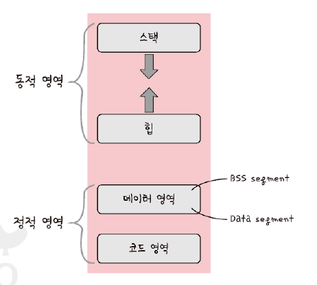

- 운영체제는 프로세스에 적정한 메모리를 할당함
- 스택(stack), 힙(heap), 데이터 영역(BSS segment, Data segment), 코드 영역(code segment)fh sksnldjwla

## 스택
- 지역변수, 매개변수, 함수가 저장되고 컴파일 시에 크기가 결정되며 동적인 특징
- 함수가 함수를 재귀적으로 호출하면서 동적으로 크키가 늘어날 수 있음
- 힙과 스택의 메모리 영역이 겹치면 안 되기 때문에 힙과 스택 사이의 공간을 비워 놓음

## 힙
- 동적 할당할 때 사용되며 런타임 시 크기가 결정
- 동적인 특징을 가딤

## 데이터 영역
- 전역변수 정적변수가 저장
- 정적인 특징을 갖는 프로그램이 종료되면 사라지는 변수가 들어 있는 영역
- BSS 영역과 Data 영역을 나뉨
- BSS 영역 : 초기화 되지 않은 변수가 0으로 초기화되어 저장
- Data 영역 : 0이 아닌 다른 값으로 할당된 변수들이 저장

## 코드 영역
- 프로그램에 내장되어 있는 소스 코드가 들어가는 영역
- 수정 불가능한 기계어로 저장되어 있으며 정적인 특징을 가짐

# 3.3.4 PCB (Process Control Block)
- 운영체제에서 프로세스에 대한 메타 데이터를 저장한 데이터
- 프로세스 제어 블록이라고도 함
- 프로세스가 생성되면 운영체제는 해당 PCB를 생성
- 프로그램이 실행되면 프로세스가 생성되고 프로세스 주소값들에 스택, 힙 등의 구조를 기반으로 메모리가 할당
- 프로세스의 메ㅌ데이터들이 PCB에 저장되어 관리된다
- 프로세스의 중요한 정보를 포함하고 있기 때문에 일반 사용자가 접근하지 못하도록 커널 스택의 가장 앞부분에서 관리

> 메타데이터  
> 데이터에 관한 구조화된 데이터  
> 에티어를 설명하는 작은 데이터  
> 대량의 정보 가운데에서 찾고 있는 정보를 효율적으로 찾아내서 이용하기 위해 일정한 규칙에 따라 콘텐츠에 대해 부여되는 데이터

## PCB 구조
- 프로세스 스케줄링 상태: 준비, 일시중단 등 프로세스가 cPU에 대한 소유권을 얻은 이후의 상태
- 프로세스 ID : 프로세스 ID, 해당 프로세스의 자식 프로세스 ID
- 프로세스 권한 : 컴퓨터 자언 또는 I/O 디바이스에 대한 권한 정보
- 프로그램 카운터 : 프로세스에서 실행해야 할 다음 명령어의 주소에 대한 포인터
- CPU 레지스터 : 프로세스를 실행하기 위해 저장해야 할 레지스터에 대한 정보
- CPU 스케줄링 정보 : CPU 스케줄러에 의해 중단된 시간 등에 대한 정보
- 계정 정보 : 프로세스 실행헤 사용된 CPU 사용량, 실행한 유저의 정보
- I/O 상태 정보 : 프로세스에 할당된 I/O 디바이스 목록

## 컨텐스트 스위칭(context switching)
- PCB를 교환하는 과정
- 한 프로세스에 할당된 시간이 끝나거나 인터럽트에 의해 발생
- 컴퓨터는 많은 프로그램을 동시에 실행하는 것처럼 보이지만 어떠한 시점에 실행되고 있는 프로세스는 단 한개
- 많은 프로세스가 동시에 구동되는 것처럼 보이는 것은 다른 프로세스와의 컨텍스트 스위칭이 아주 빠른 속도로 실행되기 때문(싱글코어 기준)

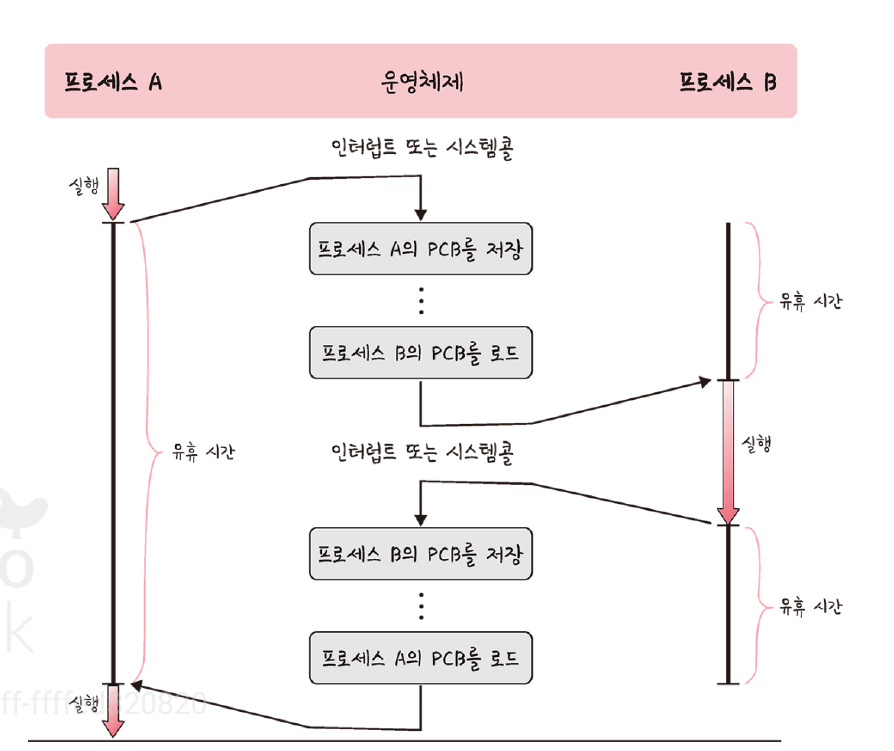

- 프로세스 여러 개를 실행하다 멈추며 번갈아가며 실행
- 컨텍스트 스위칭 일어날 때 유휴 시간(idle time)이 발생함

### 비용 : 캐시미스
- 컨텍스트 스위칭이 일어날 때 프로세스가 가지고 있는 메모리 주소가 그대로 있으면 잘못된 주소 변환이 생기므로 캐시 클리어 과정 겼음
- 이 때문에 캐시미스 발생

### 스레드에서의 컨텍스트 스위칭
- 스레드에서도 발생
- 스레드는 스택 영역을 제외한 모든 메모리를 공유하기 때문에 비용이 더 적고 시간도 더 적게 걸림

# 3.3.5 멀티프로세싱
- 여러 개의 프로세스, 멀티프로세스를 통해 동시에 두 가지 이상의 일을 수행할 수 있는 것을 말함
- 하나 이상의 일을 병렬로 처리할 수 잇음
- 특정 프로세서의 메모리, 프로세스 중 일부에 문제가 발생되더라도 다른 프로세스를 이용해서 처리할 수 있음 -> 신뢰성이 높음
- 하드웨어 관점에서 봤을 때 여러 개의 프로세서로 작업을 처리하는 것을 의미

## 엡 브라우저
- 멀티 프로세스 구조를 가지고 있음
- 브라우저 프로세스 : 주소 표시줄, 북마크 막대, 뒤로 가기 버튼, 앞으로 가기 버튼 등을 담당하며 네트워크 요청이나 파일 접근 같은 권한을 담당
- 렌더러 프로세스 : 웹 사이트가 보이는 부분의 모든 것을 제어
- 플러그인 프로세스 : 웹 사이트에서 사용하는 플러그인을 제어
- GPU 프로세스 : GPU를 이용해서 화면을 그리는 부분을 제어

## IPC(Inter Process Communication)
- 프로세스 끼리 데이터를 주고받고 공유 데이터를 관리하는 메커니즘을 의미. 멀티 프로세스에서 가능
- 공유 메모리, 파일, 소켓, 익명 파이프, 명명 파이프, 메시지 큐가 있음
- 모두 메모리가 완전히 공유되는 스레도보다는 속도가 떨어짐

### 공유 메모리(shared memory)
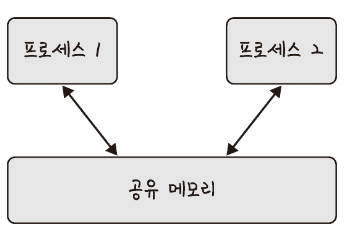

- 여러 프로세스에 동일한 메모리 블록에 대한 접근 권한이 부여되어 프로세스가 서로 통신할 수 있도록 공유 메모리를 생성해서 통신하는 것
- 기본적으로 각 프로세스의 메모리를 다른 프로세스가 접근할 수 없음
- 공유 메모리를 통해 여러 프로세스가 하나의 메모리를 공유할 수 있음
- IPC 방식 중 어떠한 매개체를 통해 데이터를 주고받는 것이 아닌 메모리 자체를 공유하기 때문에 불필효한 데이터 복사의 오버헤드가 발생 X. 가장 빠름
- 같은 메모리 영역을 여러 프로세스가 공유해 동기화가 필요
- 하드웨어 관점에서 공유메모리는 RAM을 가르키키도 함

### 파일
- 디스크에 저장된 데이터 또는 파일 서버에서 제공한 데이터
- 이를 기반으로 프로세스 간 통신을 함

### 소켓
- 동일한 컴퓨터의 다른 프로세스나 네트워크의 다른 컴퓨터로 네트워크 인터페이스를 통해 전송하는 데이터를 의미
- TCP, UDP가 있음

### 익명 파이프 (unnamed pipe)
- 프로세스 간에 FIFO 방식으로 읽히는 임시 공간인 파이프를 기반으로 데이터를 주고 받음
- 단방향 방식의 일기 전용, 쓰기 전용 파이프를 만들어서 작동하는 방식
- 부모, 자식 프로세스 간에만 사용할 수 있음. 다른 네트워크 상에서는 사용 불가

### 명명된 파이프 (named pipe)
- 파이프 서버와 하나 이상의 파이프 클라이언트 간의 통신을 위한 명명된 단방향 또는 양방햔 파이프
- 클라리언트/서버 통신을 위한 별도의 파이프를 제공
- 여러 파이프를 동시에 사용할 수 있음
- 컴퓨터의 프로세스끼리 또는 다른 네트워크상의 컴퓨터와도 통신 가능

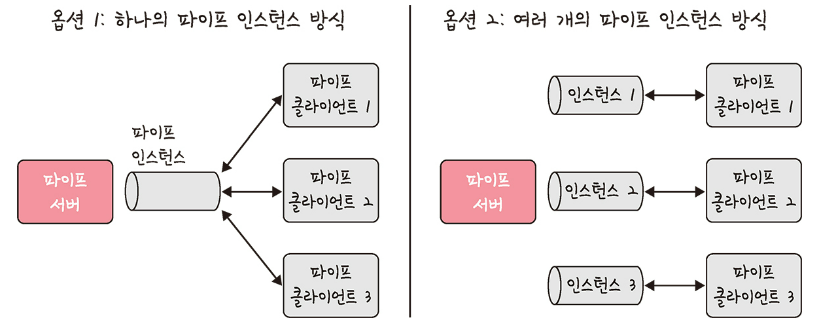

- 보통 서버용 파이프와 클라이언트용 파이프로 구분해서 작동
- 하나의 인스턴스를 열거나 여러 개의 인스턴스를 기반으로 통신

### 메시지 큐
- 큘 데이터 구조 형태로 관리하는 것을 의미
- 커널의 전역변수 형태 등 커널에서 전역적으로 관리되며 다른 IPC 방식에 비해서 사용 방법이 매우 직관적이고 간단
- 다른 코드의 수정 없이 단지 몇 줄의 코드를 추가시켜 간단하게 메시지 큐에 접근할 수 있다는 장젖
- 공유 메모리 통해 IPC를 구현할 때 쓰기 및 읽기 빈도가 높으면 동시화 때문에 기능을 구현하는 것이 매우 복잡 -> 대안으로 메시지 큐 사용

# 3.3.6 스레드와 멀티 스레딩
## 스레드
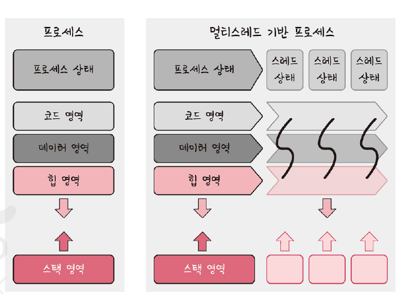

- 프로세스의 실행 가능한 가장 작은 단위
- 프로세스는 여러 스레드를 가질 수 있음
- 코드, 데이터, 스택, 힙을 각각 생성하는 프로세스와는 달리 스레드는 코드, 데이터, 힙은 스레드 끼리 서로 공유
- 그 외의 영역은 각각 생성

## 멀티스레딩
- 프로세스 내 작업을 여러 개의 스레드, 멀티스레드로 처리하는 기법
- 스레드끼리 서로 자원을 공유하기 때문에 효율성이 높음
- 훨씬 작은 리소스 소비
- 한 스레드가 중단되어도 다른 스레드는 실행 -> 중단죄지 않는 빠른 처리 가능
- 동시성에도 큰 장점
- 한 스레드에 문제가 생기면 다른 스레드에 영향을 끼쳐 스레드로 이루어져 있는 프로세스에 영향을 줄 수 있다는 단점

> 동시성  
> 서로 독립적인 작업들을 작은 단위로 나누고 동시에 실행되는 것처럼 보여주는 것

# 3.3.7 공유 자원과 임계 영역
## 공유 자원(shared resource)
- 시스템 안에서 각 프로세스, 스레드가 함께 접근할 수 있는 모니터, 프린터, 메모리, 파일, 데이터 등의 자원이나 변수 등을 의미
- 경쟁상태(race condition) : 두 개 이상의 프로세스가 동시에 읽거나 쓰는 상황
- 동시에 접근을 시도할 때 접근의 타이밍이나 순서 등이 결괏값에 영향을 줄 수 있는 상태

## 임계 영역(critical section)
- 둘 이상의 프로세스, 스레드가 공유 자원에 접근할 때 순서 등의 이우로 달라지는 코드 영역
- 임계 영역을 해결하기 위한 방법 : 뮤텍스, 세마포어, 모니터
- 모두 상호 배제, 한정 대기, 용총성이라 조건을 만족행 함

> 상포 배제(mutual exclusion)  
> 한 프로세스가 임계 영역에 들어갔을 때 다른 프로세스는 들어갈 수 없음  
> 
> 한정 대기(bounded waiting)  
> 특정 프로세스가 영원히 임계 영역에 들어가지 못하면 안된다  
> 
> 용통성(progress)  
> 어떠한 프로세스도 임계 영역을 사용하지 않는다면 임계 영역의 외부의 어떠한 프로세스도 들어갈 수 있으며 이때 프로세스끼리 서로 방해하지 않음

## 뮤텍스(mutex)
- 프로세스나 스레드가 공유자원을 `lock()`를 통해 잠금 설정하고 사용한 후에는 `unlock()`을 통해 잠금 해제하는 객체
- 잠금이 설정되면 다른 프로세스나 스레드는 잠긴 코드 영역에 접근할 숭 ㅓㅄ고 해제는 그와 반대
- 뮤텍스는 잠금 또는 잠금 해제라는 상태만을 가짐

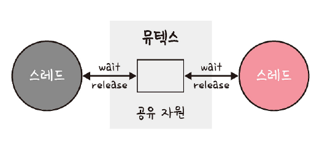

## 세마포어(semaphore)
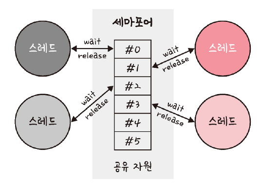

- 일반화된 뮤텍스
- 간단한 정수 값과 두 가지 함수 wait(P 함수라고도 함) 및 signal(V 함수라고도 함)로 공유 자원에 대한 접근을 처리
- `wait()`는 자신의 차례가 올 떄까지 기다리는 함수
- `signal()`은 다른 프로세스로 순서를 넘겨주는 함수
- 프로세스나 스레드가 공유 자우너에 접근하면 세마포어에서 wait() 작업을 수행
- 프로세스나 스레드가 공자원을 해제하면 세마포어에서 signal() 작업을 수행
- 조건 변수가 없고 프로세스나 스레드가 세마포어 값을 수정할 때 다른 프로세스나 스레드는 동시에 세마포어 값을 수정할 수 없음

#### 바이너리 세마포어
- 0과 1의 두 가지 값만 가질 수 있는 세마포어
- 구현의 유사성으로 인해 뮤텍스는 바이너리 세마포어로 할 수 있음
  - 뮤텍스 : 잠금을 기반으로 상호배제가 일어나는 잠금 메커니즘
  - 세마포어 : 신호를 기반으로 상호배제가 일어나는 신호 메커니즘

#### 카운팅 세마포어
- 여러 개의 값을 가질 수 있는 세마포어
- 여러 자원에 대한 접근을 제어하는 데 사용

### 모니터
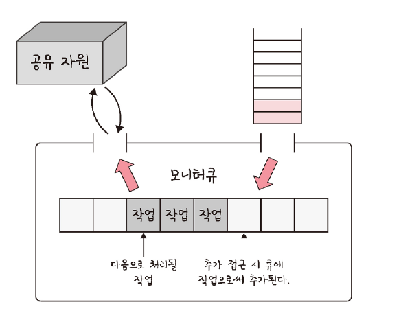

- 둘 이상의 스레드나 프로세스가 공유자원에 안전하게 접근할 수 있또록 공유 자원을 숨기고 해당 접근에 대한 인터페이스만 제공
- 모니터는 모니터큐를 통해 공유자원에 대한 작업들을 순차적으로 처리
- 세마포어보다 구현하기 쉬우머 모니터에서 상포 배제는 자동!

# 3.3.8 교착 생채(deadlock)
- 두 개 이상의 프로세스들이 서로가 가진 자원을 기다리며 중단된 상태

## 교착 상태의 원인
- 상호 배제 : 한 프로세스가 자원을 독점하고 있으며 다른 프로세스들은 접근이 불가능
- 점유 대기 : 특정 프로세스가 점유한 자원을 다른 프로세스가 요청하는 상태
- 비선점 : 다른 프로세스의 자원을 강제적으로 가져올 수 없음
- 환형 대기 : 프로세스 A는 프로세스 B의 자원을 요구, 프로세스 B는 프로세스 A의 자원을 요구하는 상황

## 교착 상태의 해결 방법
1. 자원을 할당할 때 애초에 조건이 성립되지 않도록 설계
2. 교착 상태 가능성이 없을 때만 자원 할당되며, 프로세스당 요청할 자원들의 최대치를 통해 자원 할당 가능 여부를 파악하는 은행원 알고리즘 사용
   - 총 자원의 양과 현재 할당한 자원의 양을 기준으로 안정 또는 불안정 상태로 나누고 안정 산태로 가도록 자원을 할당하는 알고리즘
3. 교착 상태가 발생하면 사이클이 있는지 찾아보고 이에 관련된 프로세스를 한 개씩 지움
4. 교착 생태 매우 드물게 발생 -> 이를 처리하는 비용이 더 큼. 교착 상태 발생 시 사용자가 작업 종료 (현대 운영 체제 채택 방식. 응답없음)