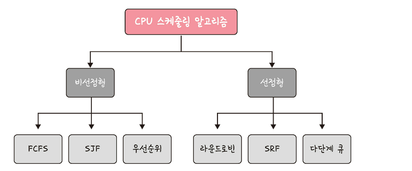
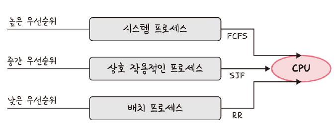

# 3.4 CPU 스케줄링 알고리즘

- CPU 스케줄러 : CPU 스케줄링 알고리즘에 따라 프로세스에서 해야 하는 일을 스레드 단위로 CPU에 할당
- 프로그램이 실행될 떄는 CPU 스케줄링 알고리즘이 어떤 프로그램에 CPU 소유권을 줄 것인지 결정
- CPU 이용률은 높게, 주어진 시간에 많은 일을 하게, 준비 큐에 있는 프로세스는 적게, 응답 시간은 짧세 설정이 목표

# 3.4.1 비선점형 방식 (non-preemptive)
- 프로세스가 스스로 CPU 소유권을 포기하는 방식
- 강제로 프로세스를 중지 하지 ㅇ낳음
- 컨텍스트 스위칭으로 인한 부하가 적음

## FCFS (First Come, First Served)
- 가장 먼저 온 것을 가장 먼저 처리하는 알고리즘
- 길게 수행되는 프로세스 때문에 준비큐에서 오래 기다리는 현상(convoy effect)이 발생하는 단점

## SJF(Shortest Job First)
- 실행 시간이 가장 짧은 프로세스를 가장 먼저 실행하는 알고리즘
- 긴 시간을 가진 프로세스가 실행되지 않는 현상(starvation)이 발생
- 평균 대기 시간이 가장 짧은
- 실제로 실행 시간을 알 수 없기 때문에 과거의 실행했던 시간을 토대로 추축해서 사용

## 우선순위
- 오래된 작업일수록 우선순위를 높이는 방법(aging)을 사용해 보완한 알고리즘
- 선점형, 비선점형 우선순위 스케줄링을 말하기도 함

# 3.4.2 선점형 방식(preemptive)
- 현대 운영체제가 쓰는 방식
- 지금 사용하고 있는 프로세스를 알고리즘에 의해 중단기켜 버리고 강제로 다른 프로세스에 CPU 소유권을 할당하는 방식

## 라운드 로빈(RR. Round Robin)
- 현대 컴퓨터가 쓰는 선점형 알고리즘 스케줄링 방식
- 각 프로세스는 동일한 할당 시간을 주고 그 시간 안에 끝나지 않으면 다시 준비 큐의 뒤로가는 알고리즘
- 할당시간이 너무 크면 FCFS가 되고 짧으면 컨텍스트 스위칭이 잦아져서 오버헤드 -< 비용이 커짐
- 일반적으로 전체 작업 시간을 길어지지만 평균 응답 시간은 짧아진다는 특징
- 로드밸러서에서 트래픽 분산 알고리즘으로도 쓰임

## SRF (Shortest Remaining Time First)
- 중간에 더 짧은 작업이 들어오면 수행하던 프로세스를 중지하고 해당 프로세스를 수행하는 알고리즘

## 다단계 큐
- 우선순위에 따른 준비 큐를 여러개 사용
- 큐마다 라운드 로빈이나 FCFS 등 다른 스케줄링 알고리즘을 적용한 것
- 큐 간의 프로세스 이동이 안되므로 스케줄링 부담이 적지만 유연성이 떨어지는 특징

