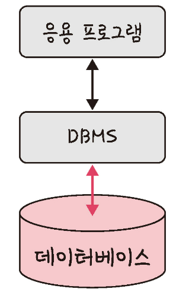
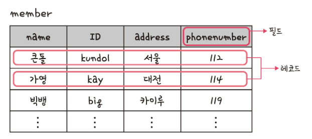
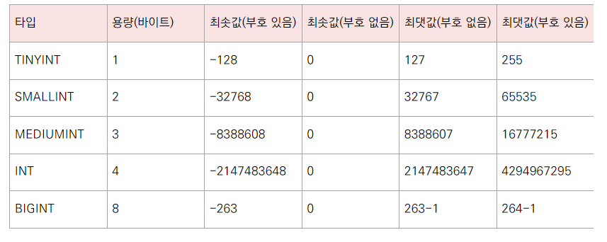
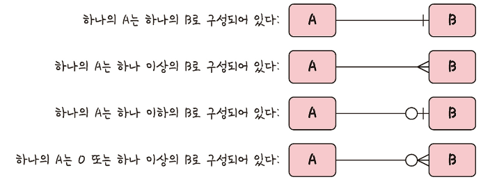
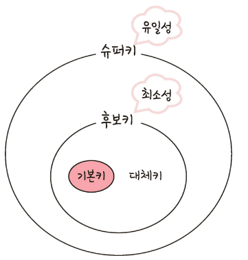

# CHAPTER 4. 데이터 베이스
# 4.1 데이터베이스의 기본

- 데이터베이스(DB) : 일정한 규칙, 혹은 규약을 통해 구조화되어 저장되는 데이터의 모음
- DBMS : 데이터베이스를 제어, 관리하는 통합 시스템
  - 특정 DBMS 마다 정의된 쿼리 언어를 통해 삽입, 삭제, 수정, 수정, 조회등 수행 가능
  - 실시간 접근과 동시 공유가 가능
- 데이터베이스 위에 DBMS, 그 위에 응용 프로그램
  - MySQL(DBMS)-응용프로그램(Node.js)

# 4.1.1 엔터티(entity)
- 사람, 장소, 물건, 사건, 개념 등 여러 개의 속성을 지닌 명사를 의미
- 서비스 요구사항에 맞춰 속성이 정해짐

## 약한 엔터티와 강한 엔터티
- 약한 엔터티 : 혼자 존재하지 못하고 다른 엔터티의 존재 여부에 따라 종속적
- 강한 엔터티 : 혼재 존재할 수 있음. 종속적이지 X

# 4.1.2 릴레이션 (relation)
- 데이터베이스에서 정보를 구분하여 저장하는 기본 단위
- 엔터티에 관한 데이터를 릴레이션 하나에 담아서 관리
- 관계형 데이터베이스에서는 테이블 / NoSQL 데이터베이스에서는 컬렉션

## 데이블과 컬렉션
- 관계형 데이터베이스
  - MySQL 구조 : 레코드-테이블-데이터베이스
- NoSQL 데이터베이스
  - MongoDB 구조 : 도큐먼트-컬렉션-데이터베이스

# 4.1.3 속성 (attribute)
- 릴레이션에서 관리하는 구체적이며 고유한 이름을 갖는 정보
- 서비스의 요구사항을 기반으로 관리해야 할 필교아 있는 속성들만 엔터티의 속성이 됨

# 4.1.3 도메인 (domain)
- 릴레이션에 포함된 각각의 속성들이 가질 수 있는 값의 집합
- 성별 -> (남, 여)

# 4.1.5 필드와 레코드

- 회원 엔티티 -> member 테이블 -> 이름, 아이디 속성 -> name, id 필드 -> 레코드
- 레코드 : 행 단위의 데이터. 튜플이라고도 함

## 필드 타입
### 숫자 타입
- TINYINT, SMALLINT, MEDIUMINT, BIGINT

## 날짜 타입
- DATE 
  - 날짜 O 시간 X
  - 지원 범위 : 1000-01-01~9999-12-31
  - 3바이트
- DATETIME
  - 날찌 및 시간 모두 포함
  - 지원 범위 : 1000-01-01 00:00:00 ~9999-12-31 23:59:59
  - 8바이트
- TIMESTAMP
  - 날짜 및 시간 부분 모두 포함
  - 1970-01-01 00:00:01 ~ 2038-01-19 03:14:07
  - 4바이트

## 문자 타입
- CHAR와 VARCHAR
  - 수를 입력하여 몇자까지 입력할지 저함
  - CHAR : 고정 길이 문자열. 0에서 255값 가짐. 레코드 저장시 무조건 건언한 길이 값으로 고정해서 저장
  - VARCHAR : 가변 길이 문자열. 0에서 65535 값 지정. 입력된 데이터에 따라 용용령의 가변시켜 저장. 바이트 + 길이 기록용 1바이트
  - CHAR 유동적이지 않은 길이의 데이터에 효율적. VARCHAR 유동적인 길이의 데이터에 효율적
- TEXT와 BLOB
  - 큰 데이터를 저장할 때 사용
  - TEXT : 큰 문자열 저장에 쓰며 주로 게시판의 본문을 저장할 때 사용
  - BLOB : 이미지. 동영상 등 큰 데이터 저장에 사용. BUT 보통 S3 이용하는 등 서버에 파일을 올리고 경로를 VARCHAR로  저장
- ENUM과 SET
  - 문자열을 여거한 타입
  - ENUM : 리스트에 없는 잘못딘 값 삽이시 빈 문자열 삽입. 62535개의 요소 입력 가능
  - SET : 여러 개의 데이터를 선택할 수 있음. 비트 단위의 션산 가능 64개의 요소 가능
  - 공각적으로 이점. 애플리케이션의 수정에 따라 데이터베이스의 ENUM이나 SET에서 정리한 목록을 수정해야 한다는 단점

# 4.1.6 관계
- 여러 테이블 간의 관계를 관계 화살표로 나타냄

## 1:1 관계
- 두 개의 테이블로 나눠 테이블의 구조를 더 이해하기 쉽게 만들어줌

## 1:N 관게
- 한 개체가 다른 많은 개체를 포함하는 관계

## N:M 관계
- 두 개의 테이블을 직접적으로 연결하지 않음
- 1:N 1:M관계를 갖는 테이블 두 개로 나눠 설정

# 4.1.7 키
- 테이블 간의 관계를 더 명확학 하고 테이블 자체의 인덱스를 위해 설정된 장치
- 유일성 : 중복되는 값이 없으
- 최소성 : 필드를 조합하지 않고 최소 필드만 써서 키를 형성할 수 있는 것

## 기본키(Primary Key)
- 유일성과 최소성을 만조하는 키
- 테이블의 데이터 중 고유하게 존재하는 속성
- 자연키 또는 인조키 중 골라서 설정
  - 자연키 : 주민등록번호화 같이 중복된 값 들을 제외하여 중복되지 않은 것을 자연스럽게 얻는 키. 언젠가는 변함
  - 인조키 : 인위적으로 생성한 키. 변하지 않음. 보통 인조키 사용

## 외래키
- 다른 테이블의 기본키를 그대로 참조하는 값
- 개체와의 관계를 식별하는 데 사용
- 중복 괜춘

## 후보키
- 기본키다 될 수 있는 후보
- 유일성과 최소성을 동시에 만족하는 키

## 대체키
- 후보키가 두 개 이상일 경우 어느 하나를 기본키로 지정하고 남은 후보키

## 슈퍼키
- 각 레크드를 유일하게 식별할 수 있는 유일성을 갖춘 키