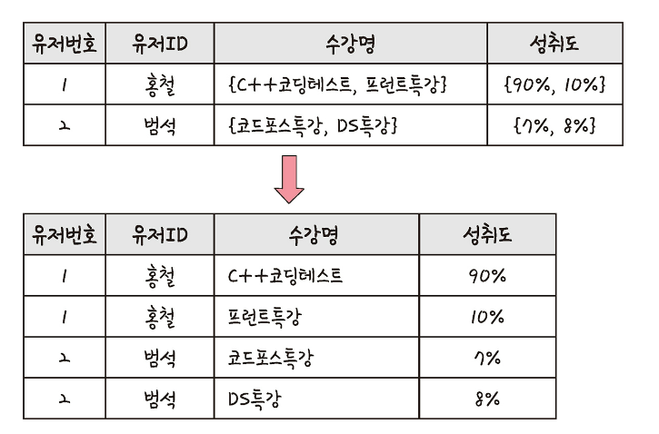
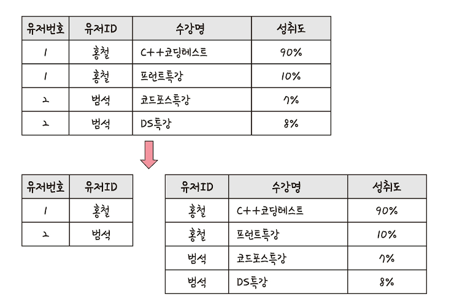
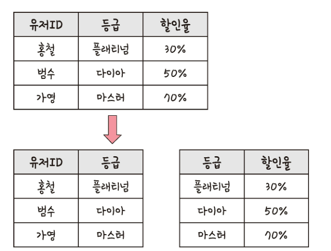

# 4.2 ERD와 정규화 과정
- ERD(Entity Relationship Diagram) : 데이터베이스를 구축할 때 가장 기초적인 뼈대 역할. 릴레이션 간의 관계들을 정의한 것

# 4.2.1 ERD의 중요성
- ERD는 시스템의 요구 사항을 기반으로 작성
- ERD를 기반으로 데이터베이스를 구축
- 데이터베이스 구축 후에도 디버깅 또는 비즈니스 프로세스 재설계가 필요한 경우에도 설계도 역할 담당
- 장점 : 관계형 구조로 표현할 수 있는 데이터를 구성하는 데 유용
- 단점 : 비정형 데이터를 충분히 표현할 수 없음
  - 비정형 데이터 : 비구조화 데이터. 미리 정의된 데이터 모델이 없거나 미리 정의된 방식으로 정리되지 않은 정보

# 4.2.3 정규화 과정
- 정규화 과정 : 릴레이션 간의 잘못된 종속 관계로 인해 데이터베이스 이상 현상이 일어나서 
- 이를 해결하거나 저장 공간을 효율적으로 사용하기 위해 릴레이션을 여러 개로 분리하는 과정
- 정규형 원칙을 기반으로 정규형을 만들어가는 과정
- 기본 정규형 : 제1정규형, 제2정규형, 제3정규형, 보이스/코드 정규형
- 고급 정규형 : 제4정규형, 제5정규형

## 정규형 원칙
- 같은 의므를 표현하는 릴레이션이지만 좀 더 좋은 구조로 만들어야 함
- 자료의 중복성 감소
- 독립적인 관계는 별개의 릴레이션으로 표현
- 각각의 릴레이션은 독립적인 표현이 가능해야 하는 것

## 제1정규형

- 릴레이션의 모든 도메인이 더 이상 분해될 수 없는 원자 값으로 구성
- 릴레이션의 속성 값 중 한 개의 기본 키에 대해 두 개 이상의 값을 가지는 반복 집합 있으면 제거

## 제2정규형

- 제1정규형이며 부분 함수의 종속성을 제거한 상태
- 부분 함수의 종속성 제거 : 기본키가 아닌 모든 속성이 기본키에 완전 함수 종속적인 것
- 릴레이션 분해시 동등한 릴레이션으로 분해해야 함
- 정보 손실이 발생하지 않는 무손실 분해로 분해되어야 한다는 것

## 제3정규형
- 제2정규형이고 기본키가 아닌 모든 속성이 이행적 함수 종속(transitive FD)을 만족하지 않는 상태

### 이행적 함수 종속
- A -> B와 B -> C가 존재하면 논리적으로 A -> C가 성립 : C가 A에 이행적으로 함수 종속된 것

## 보이스/코드 정규형 (BCNF)
- 제3정규형이고 결정자가 후보키가 아닌 함수 종속 관계를 제거하여 릴레이션의 함수 종속 관계에서 모든 결정자가 후보키인 상태
  - 결정자 : 함주 종속 관계에서 특정 종속자를 경정짓는 요소
  - X -> Y일 때 X는 결정자 Y는 종속자
- 정규화가 늘 성능이 좋아지는 것은 아님
  - 조인을 해야하는 경우 발생으로 느려질 수 잇음
  - 서비스에 따라 정규화 또는 비정규화 과정을 진행해야 함