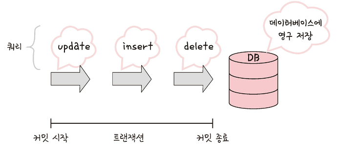
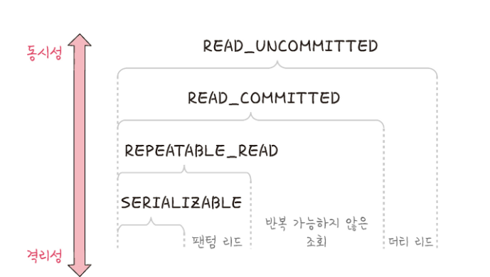

# 4.3 트랜잭션과 무결성
# 4.3.1 트랜잭션
- 트랜잭션 
  - 데이터베이스에서 하나의 논리적 기능을 수행하기 위한 작업의 단위.
  - 쿼리 : 데이터베이스에 접근하는 방법
  - 여러 개의 쿼리들을 하나로 묶는 단위
  - 원자성, 일관성, 독립성, 지속성
  - ACID 특징

## 원자성 (atomicity)
- 트랜잭션과 관련된 일이 모두 수행되었거나 되지 않았거나를 보장하는 특징
- all or noting
- 트랜잭션 단위로 여러 로직들을 묶을 때 이부 API를 호출하는 것이 있으면 안됨
- 있는 경우 롤백 시 어떻게 해야할 것인지에 대한 해결 방법 필요
- 트랙잰션 전파를 신경 써서 관리해야 함

### 커밋과 롤백
- 커밋(commit)
  - 여러 쿼리가 성공적으로 처리되었다고 확정하는 명령어
  - 트랜잭션 단위로 수행되며 변경된 내용이 모두 영구적으로 저장되는 것
  - 커밋 수행 = 하나의 트랜잭션이 성공적으로 수행되었다.
  - 
- 롤백(rollback)
  - 트랜잭션으로 처리한 하나의 묶음 과정을 일어나기 전으로 돌리는 일(취소)
  - 
- 커밋과 롤백 덕에 데이터의 무결성이 보장 된다
- 데이터 변경 전에 변경 사항을 쉽게 확인할 수 있음
- 해당 작업을 그룹화할 수 잇음

### 트랜잭션 전파
- 트랜잭션 수행 시 커넥션 단위로 수행하기 때문에 커넷견 객체를 넘겨서 수행
- 트랜잭션 전파 : 여러 트랜잭션 관련 메소드의 호출을 하나의 트랜잭션에 묶이도록 하는 것
- `@Transactional` 어노테이션 통해 여러 쿼리 관련 코드들을 하나의 트랜잭션으로 처리

## 일관성 (consistency)
- 허용된 방식으로만 데이터를 변경해야하는 것
- 데이터베이스에 기록된 모든 데이터는 여러 가지 조건, 규칙에 따라 유요함을 가져야 함

## 격리성(isolation)
- 트랜잭션 수행 시 서로 끼어들지 못하는 것을 말함
- 복수의 병렬 트랜잭션을 서로 격리되어 마치 순차적으로 실행되는 것처럼 작동되어야 함
- 데이터베이스는 여러 사용자가 같은 데이터에 접근할 수 잇어야 함
- 여러 개의 격리 수준으로 나뉘어 격리성을 보장
  - 
  - 위로 갈 수록 동시성이 강해지지만 격리성은 약해짐
  - 아래로 갈수록 도시성은 약해지고 격리성을 각해짐
  - REPEATABLE_READ : 팬텀 리드 발생
  - READ_COMMITTED : 팬텀 리드, 반복 가능하지 않은 조회 발생
  - READ_UNCOMMITTED : 팬텀 리드, 반복가능하지 않은 조회, 더티 리드 발생
- 격리 수준에 따라 팬텀리드, 반복 가능하지 않은 조회, 더티 리드 현상이 발생할 수 있음
  - 팬텀 리드(phantom read)
    - 한 트랜잭션 내에서 동일한 쿼리를 보냈을 때 해당 조회 결과가 다른 경우
  - 반복 가능하지 않은 조회 (non-repeated read)
    - 한 트랜잭션 내의 같은 행에 두 번 이상 조회가 발생했는데, 그 값이 다른 경우
    - 팬텀 리드와의 다른점 : 반복 가능하지 않은 조회는 행값이 달라질 수 있음. 팬텀 리드는 다른 행이 선택될 수도 있음
  - 더티 리드 (dirty read)
    - 반복 가능하지 않은 조회와 유사하며 한 트랜잭션이 실행 중일 때 다른 트랜잭션에 의해 수정되었지만 아직 커밋됮 않은 행의 데이터를 읽을 수 있을 때 발생
- 격리 수준
  - SERIALIZABLE
    - 트랜잭션을 순차적으로 진행시키는 것
    - 여러 트랝잭션이 동시에 같은 행에 접근할 수 없음
    - 매우 엄격한 수준
    - 해당 행에 대헤 격리시키고, 이후 트랜잭션이 이 행에 대해 일어난다면 기다려야 함
    - 교착 상태가 일어날 확률이 높음
    - 가장 성능이 떨어지는 격리 수준
  - REPEATABLE_READ
    - 하나의 트랜잭션이 수정한 행을 다른 트랜잭션이 수정할 수 없도록 막아주지만 새로운 행을 추가하는 것느 맞지 않음
    - 이후에 추가된 행이 발견될 수도 있음
    - MySQL8.0의 innoDB 기본값
- READ_COMMITTED
  - 가장 많이 사용되는 격리 수준
  - PostgreSQL, SQL Server, 오라클레서 기본값으로 설정되어 있음
  - 다른 트랜잭션이 커밋하지 않은 정보는 읽을 수 없음
  - 커밋 완료된 데이터에 대해서만 조회 허용
  - 어떤 트랜잭션이 접근한 행을 다른 트랜잭션이 수정할 수 있음
- READ_UNCOMMITTED
  - 가장 낮은 격리 수준
  - 하나의 트랜잭션이 커밋되기 이전에 다른 트랜잭션에 노출되는 문제아 있음
  - 가장 빠름
  - 데이터 무결성을 위해 되도록이면 사요하지 않는 것이 이성적
  - 몇몇 행이 제대로 조회되지 않더라도 괜찮은 거대한 양의 데이터를 어림잡아 집계하는 데 사용하면 좋음

## 지속성 (durability)
- 성공적으로 수행된 트랜잭션은 영웒 반영되어야 하는 것
- 데이터베이스에 시스템 장애가 발생해도 원래 상태로 볶구하는 회복 기능이 있어야 함을 뜻함
- 데이터에이스는 이를 위해 체크섬, 저널링, 롤백 등의 기능 제공
  - 체크섬 : 중복 섬사의 한 형태. 오류 정정을 통해 송싱된 자료의 무결성을 보호하는 단순한 방법
  - 저널링 : 파일 시스템 또는 데이터베이스 시스템에 변경 사항을 반영하기 전에 로깅하는 것. 로그를 남김

# 4.3.2 무결성
- 데이터의 정확성, 일관성, 유요성을 유지하는 것
- 무결성이 유지되어야 데이터베이스에 저장된 데이터 값과 그 값에 해당하는 현신 세례의 실제 값이 일치하는 지에 대한 신뢰가 생김
  - 개체 무결성 : 기본키로 선택한 필드는 빈값을 허요하지 않음
  - 참조 무결성 : 서로 참조 관계에 엤는 두 테이블의 데이터는 항상 일관된 값을 유지해야 함
  - 고유 무결성 : 특정 속성에 대해 고유한 값을 가지도록 조건이 주어진 경우 그 속성 값은 모두 고유한 값을 가짐
  - NULL 무결성 : 특정 속성 값에 NULL이 올 숭 ㅓㅂㅅ다는 조건이 주어진 경우 그 속성 값은 NULL이 될수 없다는 제약 조건