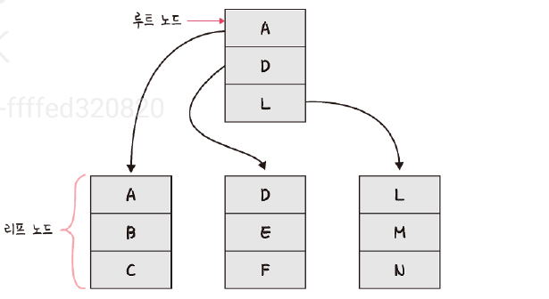

# 4.5 인덱스
# 4.5.1 인덱스의 필요성
- 인덱스: 데이터를 빠르게 찾을 수 있는 하나의 장치
- 인덱스를 설정하면 테이블 안에 애가 찾고자 하는 데이터를 빠르게 찾을 수 잇음

# 4.5.2 B-트리
- 인덱스는 보통 B-트리라는 자료 구조로 이루어져있음
- 루트 노드, 리프 노드, 루트 노드와 리프 노드 사이에 있는 브랜치 노드로 나뉨
- create index.. 명령어 기반으로 만들면 세컨더리 인덱스를 만들 수 있음
- 하나의 인덱스만 생성할 것이라면 클러스터형 인덱스를 만드는 것이 성능이 좋음
- 세컨더리 인덱스 : 보조 인덱스, 여러 개의 필드 값을 기반으로 쿼리를 많이 보낼 때 생성해야 하는 인덱스
  - age라는 하나의 필드만 쿼리를 보내는 경우 -> 클러스터형 인덱스
  - age, name, mail 등 다양한 필드를 기반으로 쿼리를 보내는 경우 세컨더리 인덱스 사용해야함

## MongoDB
- 도큐먼트를 만들면 자동으로 ObjectID가 형성, 해당 키가 기본키로 설정
- 세컨더리키도 부가적으로 설정해서 기보키+세컨더리 같이 쓰는 복합 인덱스 설정 가능

# 4.5.4 인덱스 최적화 기법
- 데이터베이스마다 다르지만 기본적인 골조는 동일

## 1. 인덱스는 비용
- 인덱스는 두 번 탐색하도록 강요 : 인덱스 리스트, 컬렉션 순으로 탐색 -> 읽기 비용
- 컬렉션 수정시 인덱스도 주성되어야 함 -> B-트리 높이를 균형있게 조절하는 비용, 데이터 조회를 위한 분산 비용
- 인덱스 무작정 설정은 답이 X
- 컬렉션에서 가져와야 하는 양이 많을 수록 인덱스 사용은 비효율적

## 2. 항상 테스팅하라
- 서비스의 특징마다 인덱스 최적화 기법은 달라짐
- 서비스에서 사용하는 객체의 깊이, 테이블의 양이 다르기 때문
- 항상 테스팅하고 걸리는 시간 최소화 해야 함

## 3. 복합 인덱스는 같음, 정렬, 다중 값, 카디널리티 순
- 어려 필드를 기반으로 조회할 때 복합 인덱스 생성
- 인덱스 생성시에는 순서가 있고 생성 순서에 따라 인덱스 성능이 달라짐
- 같음, 정령, 다중 값, 카디널리티 순으로 생성해야함

1. 어떠한 값과 같음을 비교하는 ==이나 equal  퀄지 존재 -> 제일 먼저 인덱스 설정
2. 정렬 쓰는 필드 그다음 인덱스로 설정
3. 다중 값을 출력해야 하는 필드, 쿼리 자체가 > < 등 많은 값 출력하는 쿼라애 쓰는 필드 인덱스로 설정
4. 유니크한 값의 정도를 카디널리티라고 함. 카디널리티가 높은 순서를 기반으로 인덱스 생성 -> email 다음 age