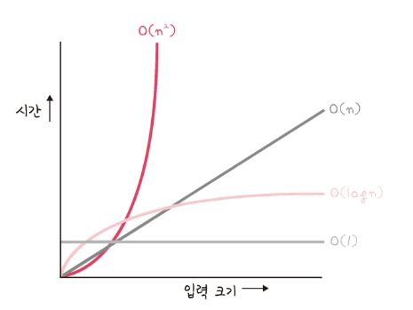
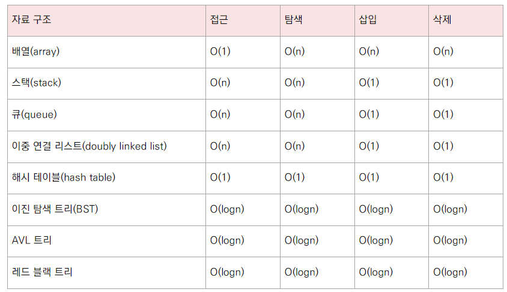
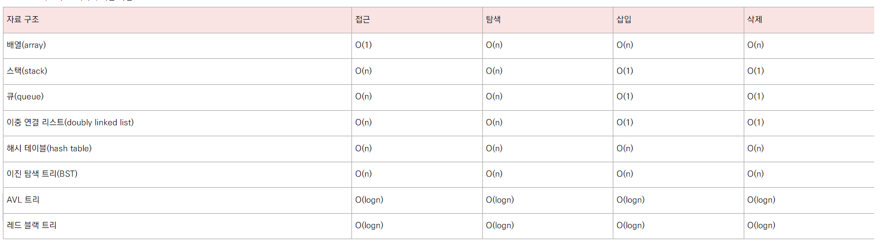

# CHAPTER 5 자료 구조
- 자료 구조(data structure)는 효율적으로 데이터를 관리하고 수정, 삭제, 탐색, 저장할 수 있는 데이터 집합

# 5.1 복잡도
- 시간 복잡도와 공간 복잡도

## 5.1.1 시간 복잡도
## 빅오 포기법
- 시간 복잡도 : 입력 크기(n)에 대해 어떠한 알고리즘이 실행되는 데 걸리는 시간
- 주요 로직의 반복 횟수를 중점으로 측정됨
- 보통 빅오 표기법으로 나타soa
- 빅오 표기법 : 입력 범위 n을 기준으로 해서 로직이 몇 번 반복되는지 나타내는 것
  - 가장 영향을 만이 끼티는 항의 상수 인자를 빼고 나머지 항을 없앰
  - 연산량이 가장 많은 항만 고려

## 시간 복잡도의 존재 이유
- 효율적인 코드로 개선하는 데 쓰이는 척도
- O(1)을 지향해야 함

# 5.1.2 공간 복집도
- 프로그램을 실행시켰을 때 필요로 하는 자원의 공간의 양
- 정적 변수로 선언된 것 말고도 동적으로 재귀적인 함수로 인해 공간을 계속해서 필요할 경우도 포함

# 5.1.3 자료 구조에서의 시간 복잡도
- 자료 구조 사용시 시간 복잡도를 잘 생각해야함
- 평균, 최악의 시간 복잡도를 고려하며 사용

