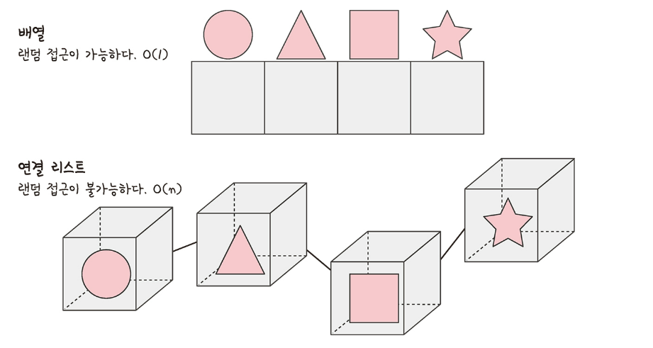

# 5.2 선형 자료 구조
- 요소가 일렬로 나열되어 있는 자료 구조

# 5.2.1 연결 리스트
- 데이터를 감싼 노드를 포인터로 연결해서 공간적인 효율성을 극대화시킨 자료 구조
- 삽입과 삭제 O(1), 탐색 O(n)

- 연결 리스트 : prev 포인터와 next 포인터로 앞과 뒤의 노드를 연결시킨 것
  - 헤드(head) : 맨 앞에 있는 노드
  - 싱글 연결 리스트 : next 포인터만 가짐
  - 이중 연결 리스트: next 포인터와 prev 포인터를 가짐
  - 원형 이중 연결 리스트 : 이중 연결 리스트와 같지만 마지막 노드의 next 포인터가 헤드 노드를 가리키는 것
- 이중 연결 리스트 함수
  - push_front : 앞에서부터 요소를 넣음
  - push_back : 뒤에서부터 요소를 넣음
  - insert : 중간에 요소를 넣음

# 5.2.2 배열(array)
- 같은 타입의 변수들로 이루어져 있고, 크기가 정해져 있으며, 인접한 메모리 위치에 있는 데이터를 모아놓은 집합
- 중복을 허용하고 순서가 있음
- 정적 배열 기준 !!
- 접근 O(1), 랜덤 접근 가능
- 삽입 및 삭제 O(n) -> 데이터 추가와 삭제 많이 하는 것은 연결 리스트, 접근을 많이 하는 것은 배열!

## 랜덤 접근과 순차적 접근
- 직접 접근  =  랜점 접근 : 동일한 시간에 배열과 같은 순차적인 데이터가 있을 때 임의의 인덱스에 해당하는 데이터에 접근할 수 있는 기능
- 데이터를 저장된 순서대로 검색해야 하는 순차적 접근과는 반대

## 배열과 연결 리스트 비교
- 배열 : 상자를 순서대로 나열한 데이터 구조, 몇 번째 상자인지만 알면 해당 상자의 요소 끄집어낼 수 있음
- 연결 리스트 : 상자를 선으로 연결한 형태의 데이터 구조, 상자 안의 요소를 알기 위해서는 하나씩 상자 내부를 확인해봐야 함

# 5.2.3 벡터 (vector)
- 동적으로 요소를 할당할 수 있는 동적 배열
- 컴파일 시점에 개수를 모른다면 벡터를 사용해야 함
- 중복을 허용하고 순서가 있고 랜덤 접근이 가능
- 탐색과 맨 뒤의 요소를 삭제하거나 삽입하는데 O(1)
- 맨 뒤나 맨 앞이 아닌 요소를 삭제하고 삽입 O(n)

# 5.2.4 스택
- 가장 마지막으로 들어간 데이터가 가장 첫 번째로 나오는 성징을 가진 자료 구조
- 재귀적인 함수, 알고리즘에 사용
- 웹 브라우저 방문 기록 등에 사용
- 삽입 및 삭제 O(1), 탐색에 O(n)

# 5.2.5 큐(queue)
- 먼저 삽인한 데이터가 먼저 나오는 성질을 지닌 자료 구조
- 스택과 반대되는 개념 
- 삽입 및 삭제 O(1), 탐색에 O(n)
- CPU 작업을 기다리는 프로세스, 스레드 행렬, 네트워크 접속을 기다리는 행력, 너비 우선 탐색, 캐시 등에 사용