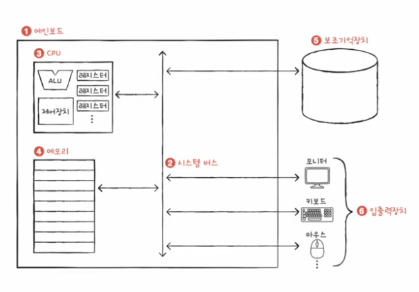
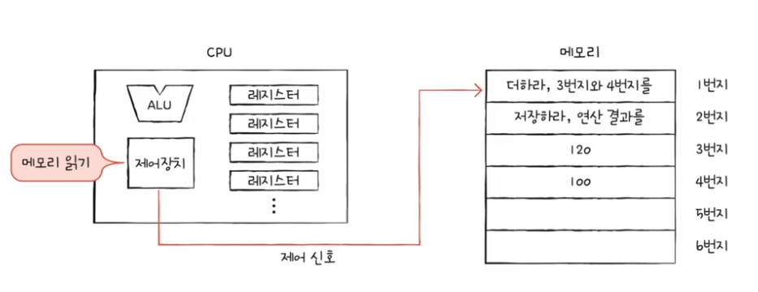
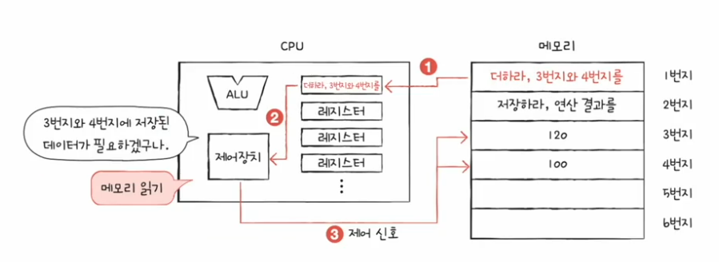
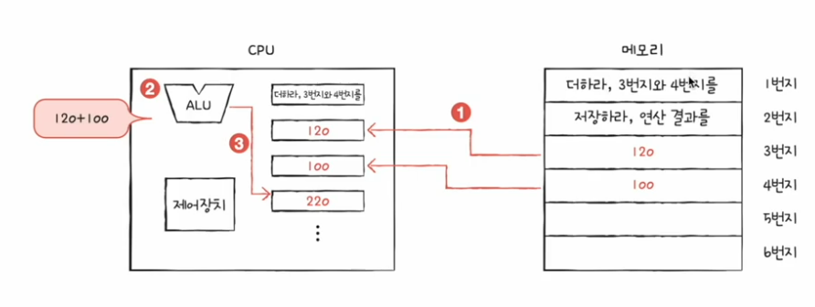
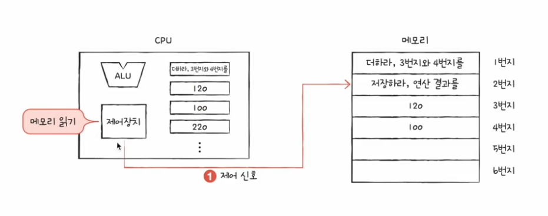
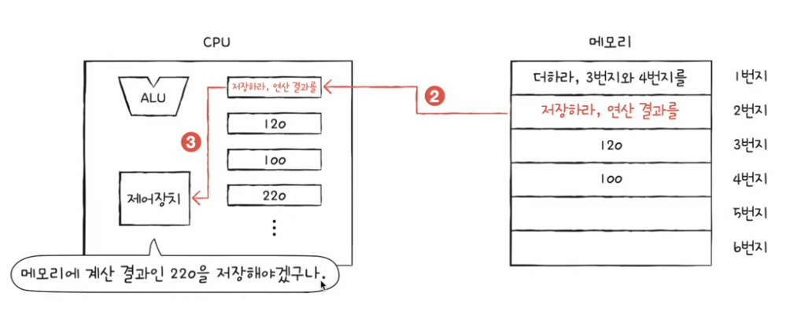
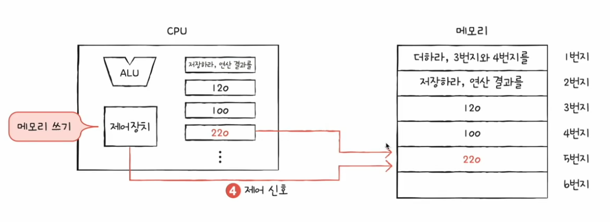
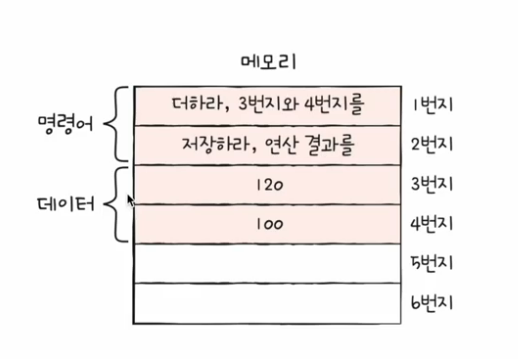
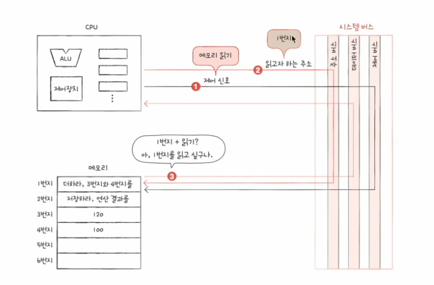

# 01. 컴퓨터 구조를 알아야 하는 이유
1. 문제 해결 능력 향상 : 컴퓨터를 분석의 대상으로!
    - 컴퓨터를 내려다보며 문제를 해결할 수 있는 개발자
2. 성능, 용량, 비용을 고려한 개발 가능
    - 내가 지금 개발한 코드 실행하기 위해 성능, 용량, 비용을 갖고 있는 컴퓨터가 필요한지를 개발자 스스로 판단할 수 있어야 함
    - 컴퓨터 구조 : 성능, 용량, 비용에 관한 이야기
    - 프로그래밍 언어의 문법만으로는 해결하기 어려운 문제들

# 02. 컴퓨터 구조의 큰 그림
## 컴퓨터 구조
### 컴퓨터가 이해하는 정보
1. 데이터
- 숫자, 문자, 이미지, 동영상과 같은 정적인 정보
- 컴퓨터와 주고 받는/내부에 저장된 정보를 데이터라 통칭하기도 함
- 0과 1로 숫자를 표현하는 방법
- 0과 1로 문자를 표현하는 방법

2. 명령어
- 컴퓨터 : 명령어를 처리하는 기계
- 컴퓨터를 실질적으로 움직이는 정보
- 데이터는 명령어를 위한 일종의 잸
- 명령어의 생김새와 동장 방식
    - 1과 2를 더하라 : 명령어
    - 1, 2 : 데이터

### 컴퓨터의 네 가지 핵심 부품
- 컴퓨터의 핵심 부품은 컴퓨터의 종류 상관없이 동일

1. CPU
- 메모리에 저장된 명령어를 읽어 드리고, 해석하고, 실행하는 부품
- 핵심 내부 구성 부품
    - ALU(산술 논리 연산 장치) : 계산기
    - 레지스터 : CPU 내부의 작은 저장장치
    - 제어징치(컨트롤유닛) : 제어 신호를 내보내고, 명령어를 해석하는 장치
        - 제어신호 : 컴퓨터 부품들을 관리하고 작동시키기 위한 전기 신호
        - 메모리 읽기 신호 : CPU가 메모리에 저장된 값을 읽고 싶은 경우 메모리로 보내는 제어 신호
        - 메모리 쓰기 신호 : CPU가 메모리에 어떤 값을 저장하고 싶을 경우 메모리로 보내는 제어 신호

    - 동작 방식
        - 제어장치가 메모리를 향해 메모리 읽기 신호 전송
        

        - CPU 레지스터로 명령어 전달, 제어장치에서 해석하여 메모리 읽기 신호 전송
        

        - ALU해서 명령어 실행하여 레지스터에 저장
        

        - 두번째 명령어 읽기 및 가져오기
        
        

        - 메모리 쓰기 신호 전송하여 데이터 저장
        

2. 메모리 (메인메모리:주기억장치, RAM)
- **현재 실행되는 프로그램(프로세스)**의 명령어와 데이터를 처리하는 부품
    - 어떤 프로그램이 실행되기 위해서는 메모리에 저장되어 있어야 함
    - 프로그램을 이루는 명령어와 데이터가 저장되어 있음
- 주소 : 명령어와 데이터가 저장되어 있는 위치를 특정하기 위해 사용하는 개념
    - 메모리에 저장된 값의 위치 
    

3. 보조기억장치
    - USB, SD카드, 하드디크스, SSD
    - 전원이 꺼져도 보관돌 프로그램을 저장하는 부품
    - 실행되지 않은 프로그램이 저장되어 있는 곳
    - 메모리는 **실행할 정보**를 저장하고 보조기억장치는 **보관할 정보**를 저장한다.
    - 메모리를 보조하는 특별한 입출력 장치
4. 입출력장치
    - 컴퓨터 외부에서 연결되어 컴퓨터 내부와 정보를 주고 받을 수 있는 장치
    - 주변 장치 : 보조기억장치 + 입출력 장치

**메인보드**
- 마더보드
- 컴퓨터의 4가지 핵심 부품들을 연결하는 판
- 버스 : 정보를 주고받을 수 있는 통로, 다양한 종류가 있음
- 시스템버스 : 컴퓨터의 4가지 핵심 부품들끼리 정보를 주고 받을 수 있는 통로
    - 주소 버스 : 주소를 주고 받는 통로
    - 데이터 버스 : 명령어와 데이터를 주고받는 통로
    - 제어 버스 : 제어 신호를 주고받는 통로
    