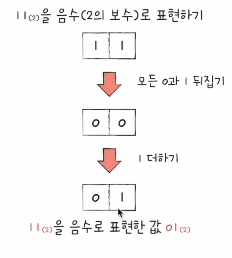
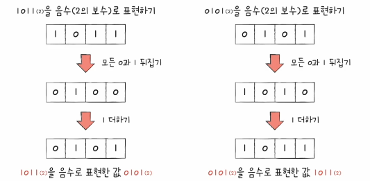
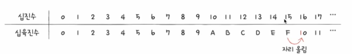
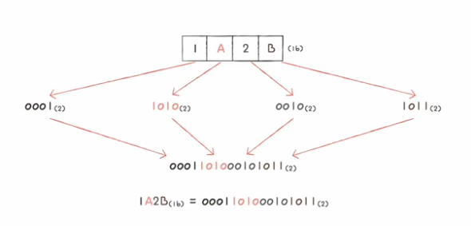
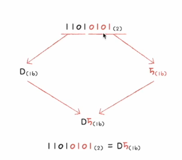

# 01. 0과 1로 숫자를 표현하는 방법
## 정보 단위
비트(bit) : 0과 1을 표현하는 가장 작은 정보 단위  

- n비트로 `2^n`가지의 정보 표현 가능
- 프로그램은 수많은 비트로 이루어져 있음
- 비트, 바이트, 킬로바이트, 메가바이트 등 다양한 단위가 존재

|    작은 단위    |      큰 단위       |
|:-----------:|:---------------:|
| 1바이트(1byte) |    8비트(8bit)    |
| 1킬로바이트(1kB) |   1,000바이트(1,000byte)   |
| 1메가바이트(1MB) |   1,000킬로바이트(1,000kB)   |
| 1기가바이트(1GB) |   1,000메가바이트(1,000MB)   |
| 1테라바이트(1TB) | 1,000기가바이트(1,000GB) |

+) 이전 단위를 1024개씩 묶은 단위는 kiB, MiB, GiB,...

워드(word)  
- CPU가 한 번에 처리할 수 있는 정보의 크기 단위
- 하프 워드 (half word) : 워드의 절반 크기
- 풀 워드 (full word) : 워드 크기
- 더블 워드 (double word) : 워드의 두 배 크기

## 이진법 : 0과 1로 숫자 표현하기
이진접 (binary)  
- 0과 1로 수를 표현하는 방법
- 숫자가 1을 넘어가는 시점에 자리 올림
- 표기 방법 : 1000(2) / 0b1000

### 0과 1로 음수 표현하기 : 2의 보수
- 어떤 수를 그보다 큰 2^n에서 뺀 값
- **모든 0과 1을 뒤집고 1을 더한 값**  

플래그(flag)  
- CPU 내부에 플래그 레지스터!
- 모든 숫자가 플래그를 들고 다녀서 음수 양수 헷갈릴 일은 없다.

## 십육진법
- 수가 15를 넘어가는 시점에 자리올림
- 이진법으로 인한 숫자의 길이 길어짐 => 십육진수 사용
  - 십진수 32 == 이진수 100000
- 15(16) : 수학적 표기 방식
- 0x15 : 코드상 표기 방식

- 십육진수 to 이진수  

- 이진수 to 십육진수  

