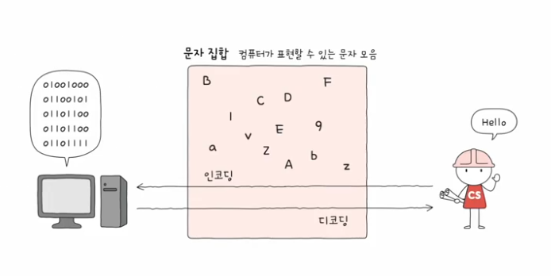

# 02. 0과 1로 문자를 표현하는 방법
## 문자 집합과 인코딩
- 문자 집합 (character set)
  - 컴퓨터가 이해할 수 있는 문자의 모음
- 인코딩 (encoding)
  - 코드화하는 과정
  - 문자를 0과 1로 이루어진 문자 코드로 변환하는 과정
- 디코딩 (decoding)
  - 코드를 해석하는 과정
  - 0과 1로 표현된 문자 코드를 문자로 변환하는 과정

## 아스키 코드 : ASCII CODE
- 초창기 문자 집합 중 하나
- 알파벳, 아라비아 숫자, 일부 특수 문자 및 제어 문자
- 7비트로 하나의 문자 표현 : 128개의 문자 표현 가능
  - 8비트 중 1비트는 오류 검출을 위해 사용되는 패리티 비트 (parity bit)
- A : 65 / a : 97 => 코드 포인트 (code point) == 문자에 부여된 값
- 간단한 인코딩
- 다른 언어 문자, 다양한 특수 문자 표현 불가
  - 한정된 개수 : 7비트
  - 8비트 확장 아스키 (extended ASCII)의 등장했지만 여전히 부족!!

### 한글 인코딩 : 완성형 vs 조합형 인코딩
- 한글 -> 초성, 중성, 종성의 조합으로 이루어진 한글
- 완성형 인코딩 방식과 조합형 인코딩 방식 존재
  - 완성형 인코딩 : 초성, 중성, 종성의 조합으로 이루어진 단어 하나 자체에 고유한 코드 부여
  - 조합형 인코딩 : 초성, 중성, 종성에 해당하는 자음 모음에다가 고유한 코드를 부여하는 방식

**EUC-KR**  
- KS X 1001 KS X 1003 문자집합 기반의 한글 인코딩 방식
- 완성형 인코딩
- 글자 하나 하나에 2바이트 크기의 코드 부여 : 2바잍 == 16비트 == 4자리 십육진수로 표현
- 2300여개의 한글 표현, 한글 표현하기에 부족함
- 언어별 인코딩 방식을 모두 이해해야 함

### 유니코드 문자 집합과 utf-8
- 유니코드
  - 통일된 문자 집합
  - 한글, 영어, 화살표와 같은 특수 문자, 이모티콘
  - 현대 문자 표현에 있어 매우 중요한 위치
- 유니코드의 인코딩 방식
  - utf-8, utf-16, utf-32
- 유니코드 문자 하나하나에 부여된 값을 어떻게 인코딩 디코딩 하느냐?로 방식이 나뉜다

**utf-8인코딩**  
- UTF(Unicode Transformation Format) == 유니코드 인코딩 방법
- 가변 길이 인코딩 : 인코딩 결과가 1바이트 ~ 4바이트
- 인코딩 결과가 몇 바이트가 될지는 유니코드에 부여된 값에 따라 다름

