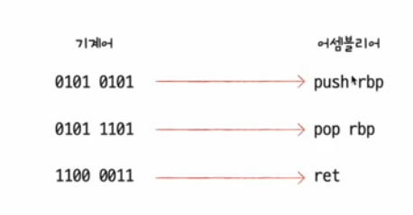
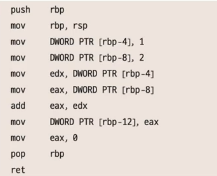

# 01, 소스 코드와 명령어
- 컴퓨터는 우리가 작성한 소스코드를 직독 직해로 이해할 수 없음
- 컴퓨터 내부에서 실행시 고급 언어를 저급 언어로 변환하여 실행한다.

## 고급 업어와 저급 언어
고급 언어  
- 개발자가 이해하기 쉽게 만든 언어
- C, C++, Java, Python

저급 언어  
- 컴퓨터가 이해하고 실행하는 언어
- 명령어
- 종류 : 기계어, 에셈블리어

### 저급 언어 : 기계어와 어셈블리어
기계어   
- 0과 1로 이루어진 명령어로 구성된 저급 언어
- 이진법, 십육진법 등으로 표현 가능

어셈블리어  
- 0과 1로 이루어진 기계어를 읽기 편한 형태로 번역한 저급 언어

 

### 고급 언어 : 컴파일 언어와 인터프리트 언어
- 프로그래머들이 프로그램을 만들 때 사용하는 프로그래밍 언어
- 변환 과정 : 컴파일, 인터프리트

컴파일 언어
- 고급 언어로 작성된 소스 코드는 컴파일러에 의해 컴파일(변환)
- 컴파일 결과로 변환된 코드 : 목적 코드
- 통째로 컴파일!

인터프리트 언어
- 인터프리터에 의해 한줄 씩 실행
- 소스 코드 전체가 저급 언어로 변환되기까지 기다릴 필요 없음

오류 발생 시  
- 컴파일 언어 : 소스 코드 컴파일 중 오류 발생 시 소스 코드 전체가 실행되지 않음
- 인터프리트 언어 : 소스 코드 인터프리트 중 오류가 발생하면 오류 발생 전까지의 코드는 실행