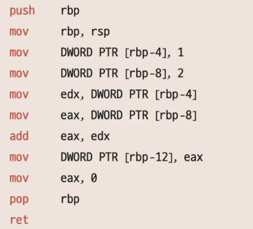
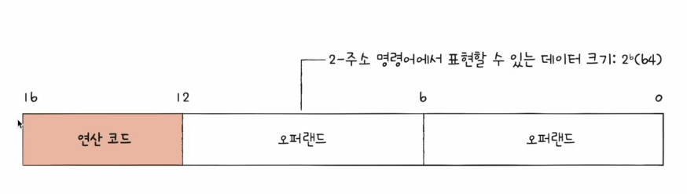

# 02. 명령어의 구조
**무엇을 대상으로, 무엇을 수행하라**  
- 연산 코드와 오퍼랜드로 구성
- 수행할 연산 + 연산에 사용한 데이터 혹은 데이터가 저장된 위치
  - 더해라 + 100과 120을
  - 빼라 + 메모리 32번지의 값과 메모리 33번지 안의 값을

## 오퍼랜드
- 연산에 사용될 데이터 or **연산에 사용될 데이터가 저장된 위치**
- 오프랜드 필드 : 오퍼랜드가 당기는 공간. 주소 필드라고 부르기도 한다!
- 오퍼랜드의 개수는 여러래가 될 수 있고, 하나도 없을 수 있음 -> 개수에 따라 0주소 1주소...  

## 연산 코드
- 수행할 연산
- CPU마다 각기 다른 연산코드를 가지고 있음
  - 데이터 전송, 산술/논리 연산, 제어 흐름 변경, 입출력 제어

### 대표적인 연산 코드의 종류
데이터 전송  
- MOVE : 데이터를 옮겨라
- STORE : 메모리에 저장하라
- LOAD(FETCH) : 메모리에서 cpu로 데이터를 가져와
- PUSH : 스택에 데이터를 저장하라
- POP: 스택의 최상단 데이터를 가져와라

산술/논리 연산  
- ADD / SUBTRACT / MULTIPLY /DIVIDE : 덧셈 / 뺄셈 / 곱셈 / 나눗셈을 수행해라
- INCREMENT / DECREMENT : 오퍼랜드에 1을 더하라 / 오퍼랜드에 1을 빼라
- AND / OR / NOT : AND / OR / NOT 연산을 수행해라
- COMPARE : 두 개의 숫자 또는 TRUE / FALSE 값을 비교하라

제어 흐름 변경  
- JUMP : 특정 주소로 실행 순서를 옮겨라
- CONDITIONAL JUMP : 조건에 부합할 때 특정 주소로 실행 순서를 옮겨라
- HALT : 프로그램의 실행을 멈춰라
- CALL : 되돌아올 주소를 저장한 채 특정 주소로 실행 순서를 옮겨라 -> 함수 실행시에 사용
- RETURN : CALL을 호출할 때 저장했던 주소로 돌아가라

입출력 제어  
- READ (INPUT) : 특정 입출력 장치로부터 데이터를 읽어라
- WRITE(OUTPUT) : 특정 입출력 장치로 데이터를 써라
- START IO : 입출력 장치를 시작하라
- TEST ID : 입출력 장치의 상태를 확인하라

왜 굳이 데이터가 저장된 위치를 사용하는가 ?  
- 명령어 내에서 표현할 수 있는 데이터의 크기가 한정되어 있기 때문 !
- 오퍼랜드의 종류가 늘어날 수록 정보를 표현할 수 있는 개수가 한정된다 : 오퍼랜드별 할당되는 비트가 줄어들기 때문
- 번지를 사용하면 해당 번지의 비트만큼 값을 표현할 수 있으므로 훨씬 더 많은 수를 표현할 수 있음

## 명령어 주소 지정 방식
- 유효 주소 (effective address)  
  - 연산에 사용할 데이터가 저장된 위치
- 명령어 주소 지정 방식 (addressng modes)
  - 연산에 사용할 데이터가 저장된 위치를 찾는 방법
  - 유효 주소를 찾는 방법
  - 다양한 명령어 주소 지정 방식들

## 메모리에 직간접적으로 유효주소를 명식하는 방식   
### 즉시 주소 지정 방식 (immediate addressing mode)
- 연산에 사용할 데이터를 오퍼랜드 필들에 직접 명식
- 가장 간단한 형태의 주소 지정 방식
- 연산에 사용할 데이터의 크기가 작아질 수 있지만, 빠름

### 직접 주소 지정 방식 (direct addressing mode)
- 오퍼랜드 필드에 유효 주소 직접적으로 명식
- 유효 주소를 표현할 수 있는 크기가 연산 코드만큼 줄어듦

### 간접 주소 지정 방식 (indirect addressing mode)
- 오퍼랜드 필드에 유효 주소의 주소 명식
- 앞선 주소 지정 방식들에 비해 속도가 느림 (cpu가 검색하는 시간이 오래 걸림)
- 유효 주소를 충분하게 크게 갖고 갈 수 있는 방식

## 레지스테터 이용하는 방식
### 레지스터 주소 지정 방식 (register addressing mode)
- 연산에 사용할 데이터가 저장된 레지스터 방식
- 메모리에 접근하는 속도보다 레지스터에 접근하는 것이 빠름 -> 레지스터는 cpu 내에 존재하기 때문!

### 레지스터 간접 주소 지정 방식 (register indirect addressing mode)
- 연산에 사용할 데이터를 메모리에 저장
- 그 주소를 저장한 레지스터를 오퍼랜드 필드에 명시

