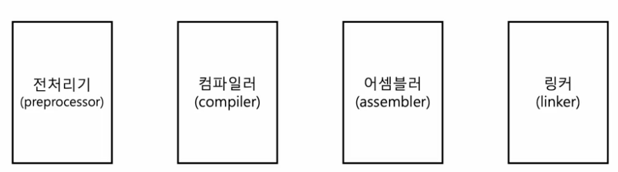

# 추가. C언어의 컴파일 과정

 

1. 전처리 과정 (preprocessing)
   - 본격적으로 컴파일하기 전에 처리할 작업들
   - 외부에 선언된 다양한 소스 코드, 라이브러리 포함 (e.g. #include)
   - 프로그래밍의 편의를 위해 작성된 매크로 변환 (e.g. #define)
   - 컴파일할 영역 명시 (e.g. @if, #ifdef,...)

2. 컴파일 과정 (compiling)
   - 전처리가 완료되어도 여전히 소스 코드
   - 전처리 완료된 소스 코드를 저급 언어(어셈블리 언어)로 변환

3. 어셈블 과정 (assembling)
   - 어셈블리어를 기계어로 변환
   - 목적 코드(object file)를 포함하는 목적 파일이 됨

목적 파일과 실행 파일  
- 목적 파일과 실헹 파일 둘 다 기계어로 이루어진 파일
- 목적 파일 != 실행 파일
- 목적 파일은 링킹(linking)을 거친 이후에야 실행 파일이 된다.

4. 링킹 (linking)
- 각기 다른 목적 코드를 하나의 실행 파일로서 묶어주는 작업