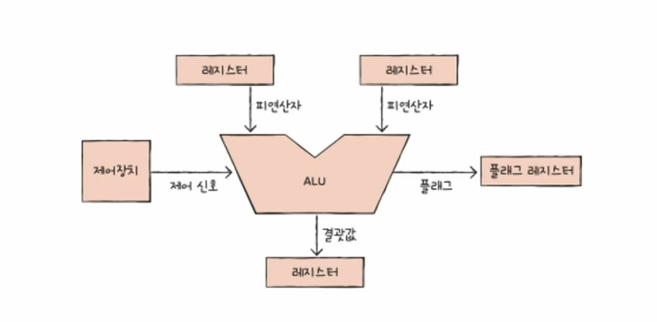
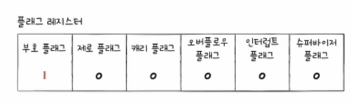
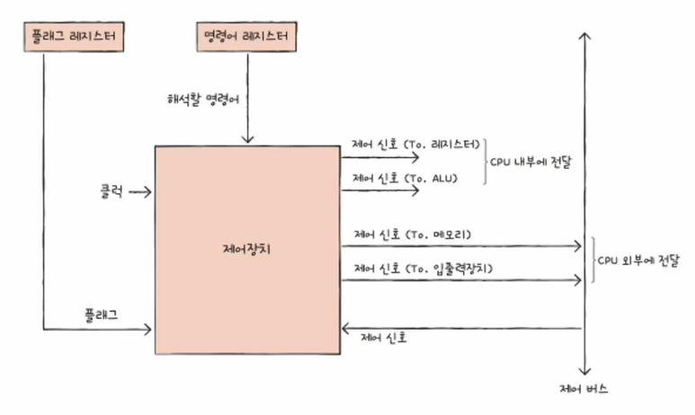
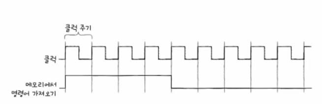

# 01. ALU와 제어장치
- ALU : 계산하는 장치
- 제어장치 : 제어 신호를 발생시키고 명령어를 해석하는 장치

## ALU

### ALU가 받아들이는 정보
계산을 위한 **피연산**자와 **수행할 연산**  
- 레지스터의 피연산자
- 제어장치의 제어신호 (수행할 연산)

### ALU가 내보내는 정보
- 레지스터에 담는 결괏값
  - CPU가 레지스터에 접근하는 속도가 메모리에 접근하는 속도보다 빠르기 때문
  - 임시적으로 계산한 결과값을 레지스터에 담음
- 플래그 레지스터로 내보내는 플래그
  - 연산 결과에 대한 부가 정보
  - flag : 숫자의 얌수 음수 여부를 알려주는 정보
  - 오버플로우 발생하는 경우 : 연산 결과가 레지스터 용량보다 커지는 경우

|  플래그 종류   |                 의미                 |             사용 예시              |
|:---------:|:----------------------------------:|:------------------------------:|
|  부호 플래그   |         연산한 결과의 부호를 나타낸다.          |    1: 계산 결과 음수  0: 계산 결과 양수    |
|  제로 플래그   |        연산 결과가 0인지 여부를 나타낸다.        |      1: 연산 결과  0: 연산 결과 0      |
|  캐리 플래그   |    연산 결과 올림수나 빌림수가 발생했는지를 나타낸다.    | 1: 올림수나 빌림수가 발생했음  0: 발생하지 않았음 |
| 오버플로우 플래그 |        오버플로우가 발생했는지를 나타낸다.         | 1: 오버플로우 발생  0: 오버플로우 발생하지 않음  |
| 인터럽트 플래그  |         인터럽트가 가능한지를 나타낸다.          |    1: 인터럽트 가능  0: 인터럽트 불가능     |
| 슈퍼바이저 플래그 | 커널 모드로 실행중인지, 사용자모드로 실행 중인지를 나타낸다. | 1: 커널모드로 실행 중  0: 사용자 모드로 실행 중 |

## 제어장치

### 제어장치가 받아들이는 정보
- 클럭 : 컴퓨터의 모든 부품을 일사불란하게 움직일 수 있게 하는 시간 단위  

- 해석할 명령어 : 명령어 레지스터라는 특수한 레지스터에 저장되어 있는 명령어
- 플래그 : 플래그 레지스터의 플래그
- 제어 신호 : 외부로부터 CPU로 전달된 제어 신호

### 제저장치가 내보내는 정보
- CPU 내부에 전달하는 제어 신호 : To. 레지스터(어떠한 행동을 해라), ALU(수행할 연산 지시)
- CPU 외부에 전달하는 제어 신호 : To. 메모리(매모리 읽기, 쓰기), 입출력장치(입출력 장치 읽기, 쓰기, 테스트)
