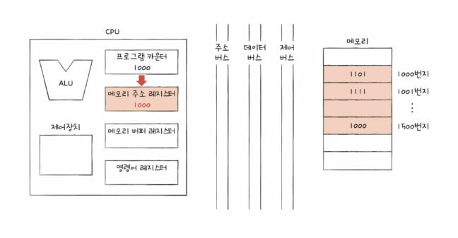
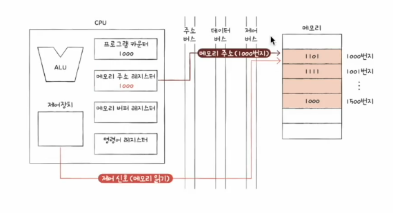
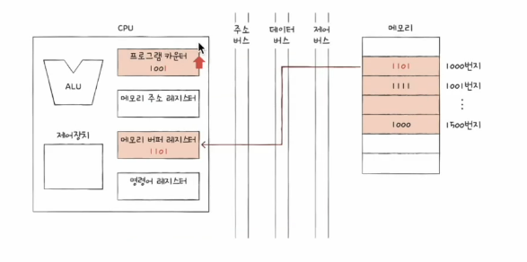
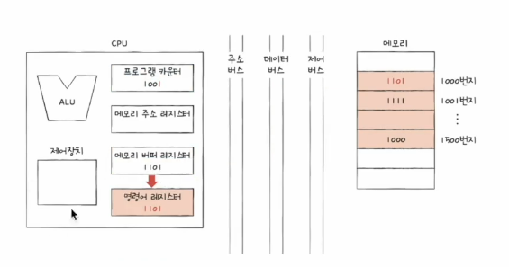
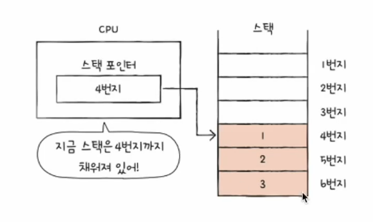
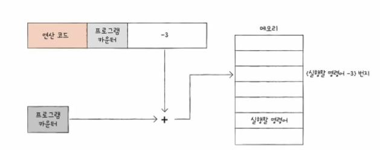
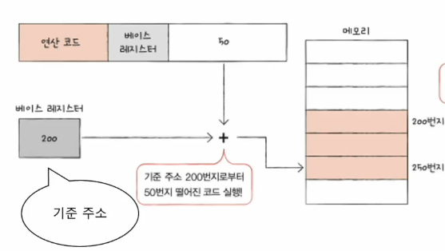
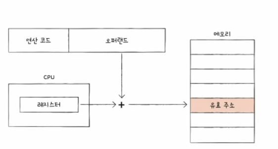
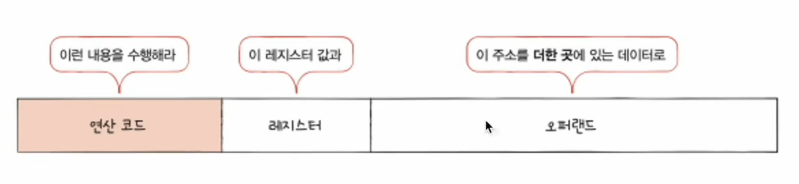

# 02. 레지스터
- CPU 내부의 작은 임시저장장치
- 프로그램 속 명령어 & 데이터는 실행 전후로 레지스터에 저장
- 레지스터에 담긴 값 관찰 가능 -> 개발하고 실행하는 프로그램의 가장 낮은 단계부터 실행 순서, 원리 관찰 가능

## 반드시 알아야 하는 레지스터 : 대부분 사용하는 레지스터
CPU 내부에는 다양한 레지스터 존재. 각기 다른 역할을 가짐

1. 프로그램 카운터(Instruction Pointer)
   - 메모리에서 가져올 명령어의 주소 (메모리에서 읽어들일 명령어의 주소)
2. 명령어 레지스터
   - 해석할 명령어 (방금 메모리에서 읽어들인 명령어)
3. 메모리 주소 레지스터
    - 메모리의 주소. CPU가 읽어들이고자 하는 주소를 주소 버스로 보낼 때 거치는 레지스터
4. 메모리 버퍼 레지스터
   - 메모리와 주고 받을 값(데이터와 명령어). CPU가 정보를 데이터 버스로 주고 받을 때 거치는 레지스터
5. 플래그 레지스터
   - 연산 결과 또는 CPU 상태에 대한 부가적인 정보
6. 범용 레지스터
    - 다양하고 일반적인 상황에서 자유롭게 사용.
7. 스택 포인터
   - 스택의 꼭대기 가리킴
8. 베이스 레지스터
   - 기준 주소 저장

### 레지스터 활용 과정
- 프로그램 카운터, 명령어 레지스터, 메모리 주소 레지스터, 메모리 버퍼 레지스터

1. 프로그램 카운터에서 가져올 명령어 주소를 메모리 주소 레지스터로 복사

2. 메모리에게 메모리 읽기 신호(제어 버스)와 함께 메모리 주소 레지스터에 저장된 주소(주소 버스) 보냄

3. 메모리 버퍼 레지스터에 해당 주소의 값을 받고, 프로그램 카운터는 다음 가져올 명령어의 주소로 변경
    - 프로그램 카운터가 일찍 증가 : 프로그램을 순차적으로 실행할 수 있는 원리

4. 명령어를 해석하기 위해 명령어 레지스터에 복사

+) 순차적인 실행 흐름이 끊기는 경우
- 특정 메모리 주소로 실행 흐름을 이동하는 명령어 실행 시 (e.g. JUMP, CONDITIONAL JUMP, CALL, RET)
- 인터럽트 발생 시
- ETC..

### 특정 레디스터를 이용한 주소 지정 방식
- 스택 주소 지정 방식 
  - 스택과 스택 포인터를 이용한 주소 지정 방식
  - 스택 포인터 : 스택의 꼭대기를 가리키는 레지스터 (스택에 어디까지 차 있는지에 대한 표시)

- 변위 주소 지정 방식
  - 오퍼랜드 필드의 값(변위)과 특정 레지스터 값을 더하여 유효 주소 얻기
  - 상대 주소 지정 방식(프로그램 카운터), 베이스 레지스터 주소 지정 방식(베이스 레지스터)
  - 어떤 연산을 수행할지, 어떤 레지스터와 더할지, 무엇을 더할지
  - 상대 주소 지정 방식
    - 오퍼랜드 필드의 값(변위)과 프로그램 카운터의 값을 더하여 유효 주소 얻기
    - 
  - 베이스 레지스터 주소 지정 방식
    - 오퍼랜드 필드의 값(변위)과 베이스 레지스터 값을 더하여 유효 주소 얻기
    - 베이스 레지스터 : 기준 주소
    - 

