# 03. 명령어 사이클과 인터럽트 - 중요
- 명령어 사이클 : CPU가 메모리 안에 있는 프로그램을 처리하는 정해진 흐름
- 인터럽트 : 정해진 흐름을 끊는 신호

## 명령어 사이클
- 프로그램 속 명령어들이 반복되면 실행되는 일정한 주기  

메모리에 저장된 명령어를 실행하는 과정
- 일반적을 CPU는 인출 사이클과 실행 사이클이 반복되면서 실행된다!

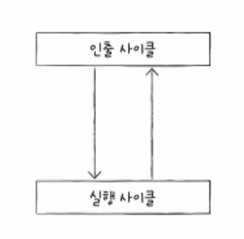

- 인출 사이클 : 가장 먼저 CPU로 갖고 와야 한다.

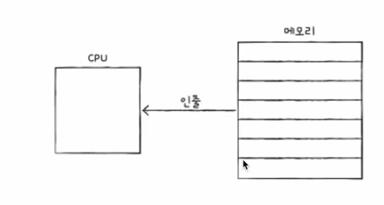

- 실행 사이클 : 갖고 왔으면 실행해야 한다.

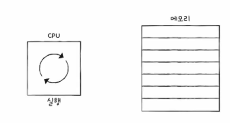

인출 + 실행 외에 추가적인 절차가 필요한 경우
- 추가적으로 메모리에 접근해야 하는 경우
  - 인출 + 간접 + 실행 사이클을 거쳐야 함

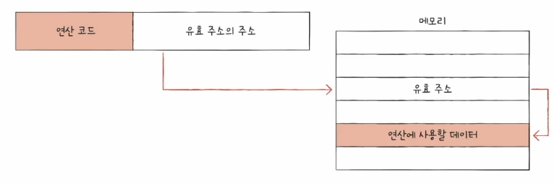
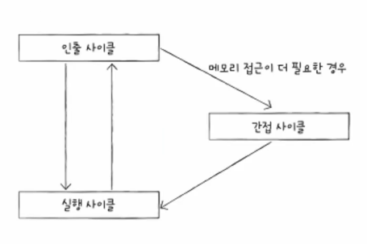

## 인터럽트 (interrupt)
- 방해하다. 중단시키다.
- 'CPU가 꼭 주목해야 할 때', 'CPU가 얼른 처리해야 할 다른 작업이 생겼을 때' 발생
- 종류 : 동기 인터럽트(예외), 비동기 입터럽트 (하드웨어 인터럽트)

### 동기 입터럽트(예외) : CPU가 예기치 못한 상황을 접했을 때 발생
- 예외적인 상황을 먼저 처리해야겠다 !!
- 메모리 주소에 접근했을 때 원하는 데이터가 없거나 디버깅 등
- 폴트, 트랩, 중단, 소프트웨어 인터럽트
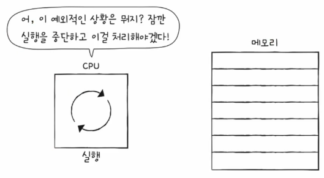

### 비동기 인터럽트(하드웨어 인터럽트)
- 주로 입출력장치(마우스 , 프린트 등)에 의해 발생
- 알림(like 세탁기 완료 알림)과 같은 역할
- **압출력 작업 도중에도 효율적으로 명령어를 처리**하기 위해 하드웨어 인터럽트 사용
  - 입출력 장치는 CPU에 비해 느림
  - 인터럽트가 없다면 CPU는 프린트 완료 여부 주기적으로 확인해야 함
  - 인터럽트가 있다면 입출력 작업 동안 CPU는 다른 일을 할 수 있음

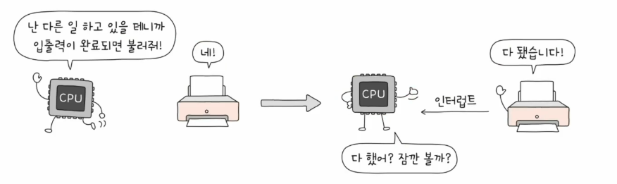

### 하드웨어 입터럽트의 처리 순서
- 처리순서는 종류 상관없이 큰 틀은 유사
1. 입출력 장치는 CPU에 입터럽트 요청 신호를 보낸다.
2. CPU는 실행 사이클이 끝나고 명령어를 인출하기 전 항상 인터럽트 여부를 확인하다.
3. CPU는 인터럽트 요청을 확인하고 인터럽트 플래그를 통해 현재 인터럽트를 받아들일 수 있는지 여부를 확인한다.
4. 인터럽트를 받아들일 수 있다면  CPU는 지금까지의 작업을 백업한다.
5. CPU는 인터럽트 벡터를 찹조하여 인터럽트 서비스 루틴을 실행한다.
6. 인터럽트 서비스 루틴 실행이 끝나면 4에서 백업해 둔 작업을 복구하여 실행을 재개한다.

### 인터럽트 요청 신호  
- CPU 작업을 방행하는 인터럽트에 대한 요청
- 인터럽트를 보내는 입출력 장치와 같은 주체들이 CPU에게 요청을 보내는 신호

### 인터럽트 플래그
- 인터럽트 요청 신호를 받아들일 지 무시할지를 경정하는 비트
- 플래그 레지스터에 포함
- CPU가 실행 사이클 후 플래그 레지스터 속 인터럽트 플래그 확인하여 인터럽트 처리
- 인터럽트를 처리할 수 있는 상황인지 아닌지를 알림
- 모든 인터럽트를 인터럽트 플래그로 막을 수 있는 건 
  - 막을 수 있는 인터럽트 (maskable Interrupt)
  - 막을 수 없는 인터럽트 (non maskable Interrupt) : 긴급한 상황

### 인터럽스 서비스 루틴
- 인터럽트를 처리하는 프로그램
- CPU가 인터럽트를 받아들이기로 헸다면 실행
- 인터럽트가 발생했을 때 해당 인터럽트를 어떻게 처리하기 위한 프로그램
  - 키보드가 입터럽트 요청을 보내면 이렇게 행동해야 한다.
- 인터럽트 서비스 루틴도 프로그램이기에 메모리에 저장

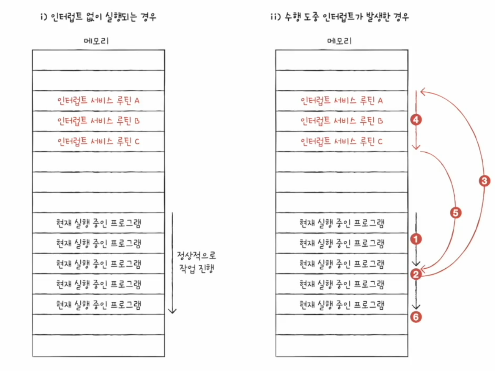

### 인터럽트 벡터
- 인터럽트 서비스 루틴의 시작 주소를 포함하는 인터럽트 서비스 루틴의 식별 정보
- 각각의 인터럽트를 구분하기 위한 정보
- 각 인터럽트 별 서비스 루틴 시작 주소가 다르기 때문

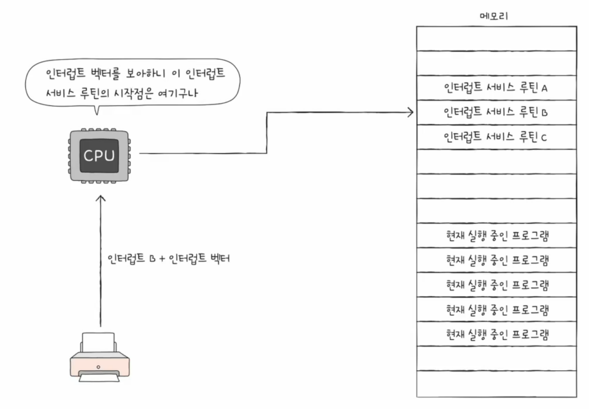

CPU가 인터럽트를 처리한다  
== 인터럽트 서비스 루틴을 실행하고, 본래 수행했던 작업으로 되돌아 온다 (인터럽트 시작 주소는 인터럽트 벡터를 통해 알 수 있음)

- 인터럽트 발생 시 현재 CPU 상태를 스택 영역에 백업 후 처리 

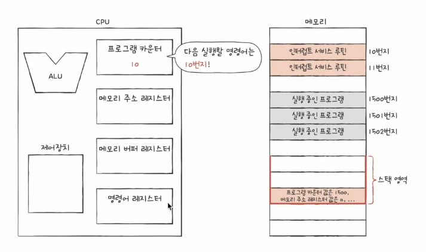

## 최종 명령어 사이클 

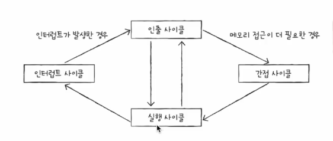