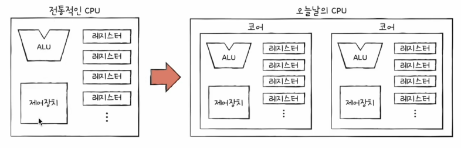
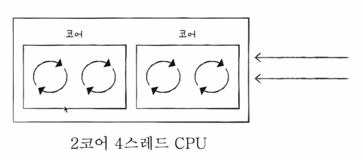

# 01. 빠른 CPU를 위한 설계 기법
CPU의 속도를 빠르게 만드려면? -> 클럭 신호를 빠르게 만드다 ?!  
- 컴퓨터 부품들은 '클럭 신호'에 맞춰 일사불란하게 움직인다.
- CPU는 '명령어 사이클'이라는 정해진 흐름에 맞춰 명령어들을 실행한다.

## 클럭 속도
- 헤르츠(Hz) 단위로 측정
- 헤르츠(Hz) : 1초에 클럭이 반복되는 횟수
- 클럭이 1초에 100번 반복되면 100Hz
- CPU는 유도리 있게 속도를 조정함 (일정하지 않음)
- 클럭 속토를 높이면 빨라지만 발열..

## 코어와 멀티 코어
- 클럭 속도 외 CPU를 빠르게 만드는 방법
- 코어 수를 늘리는 방법 : 듀얼 코어, 멀티 코어
- 스레드 수를 늘리는 방법 : 멀티 스레드

### 코어 (Core)
- CPU내에서 명령어를 실행하는 부품
- 오늘날에는 **명령어를 실행하는 부품**이 여러 개 존재할 수 있음
- 싱글 코어, 듀얼 코어, 트리플코어, 쿼드코어, 핵사코어, 데카코어, 도데카코어
- 멀티 코어 : 여러 개의 코어를 가지고 있는 것!
- 코어 수에 비해 속도가 증가하지는 않음

### 스레드와 멀티 스레드
- 하드웨어적 스레드 : 하나의 코어가 동시에 처리하는 명령어 단위
  - 
- 소프트웨어적 스레드 : 하나의 프로그램에서 독립적으로 실행되는 단위
  - 스레드를 여러 개 만들면 하나의 프로그램을 동시에 여러 군데를 실행할 수 있다.
  - **1코어 1스레드 CPU도 여러 소프트웨어적 스레드를 만들 수 있다.**
  - 
- 가장 중요한 것은 레지스터
- 레지스터 세트 : 하나의 명령어를 실행하기 위해 꼭 필요한 레지스터들
- 하나의 코어가 레지스터 세트 여러 개 가지고 있다면 멀티스레드 포르세서를 설계할 수 있음