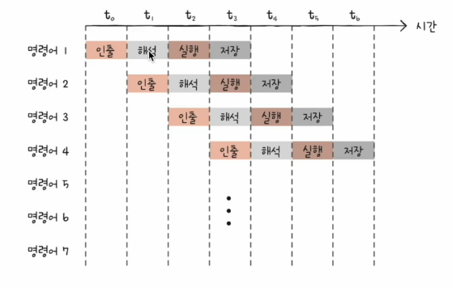
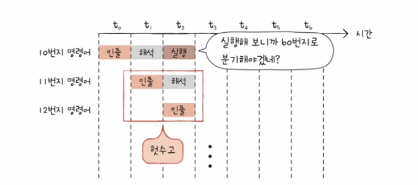
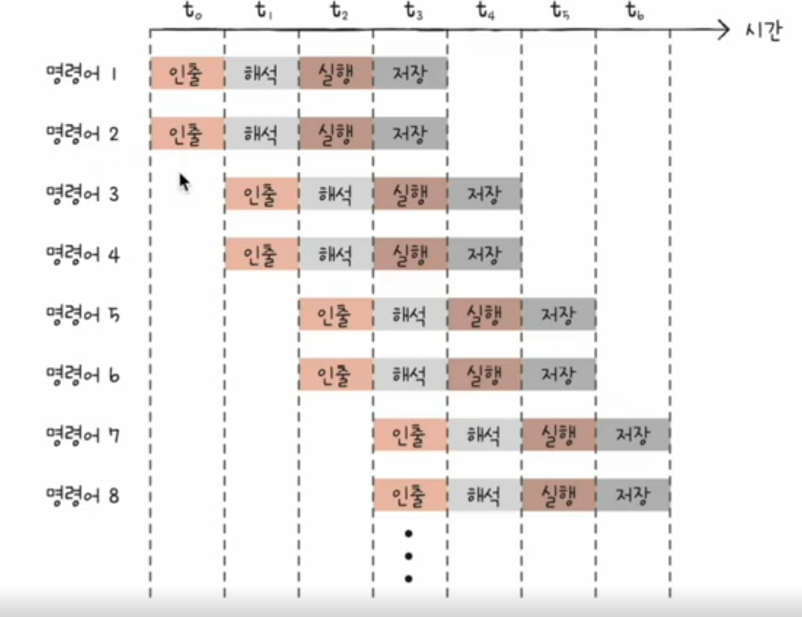
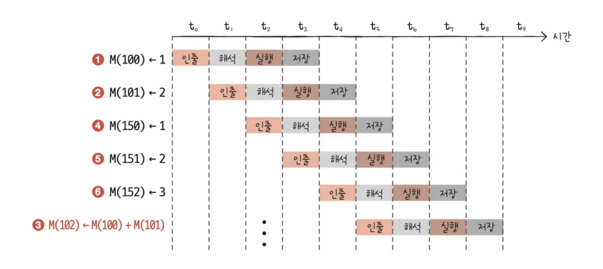

# 02. 명령어 병렬 처리 기법
## 명령어 파이프라인
명령어가 처리되는 과정을 비슷한 시간 간격으로 나누면 ?  
1. 명령어 인출(Instruction Fetch)
2. 명령어 해석(Instruction Decode)
3. 명령어 실행(Execute Instruction)
4. 결과 저장(Write Back)

- 같은 단계가 겹치지만 않는다면 CPU는 "각 단계를 동시에 실애할 수 있다."

**명령어 파이프라이닝**  
동시에 여러 개의 명령어를 겹쳐 실행하는 기법

### 파이프라인 위험(파이프라인 해저드)  
- 명령어 파이프 라인이 성능 향상에 실패하는 경우
- 병렬로 명령어가 올바르게 실행되지 않는 상황
- 데이터 위험, 제어 위험, 구조적 위험

#### 데이터 위험
- 명령어 간의 의존성에 의해 야기
- 모든 명령어를 동시에 처리할 수 없음
  - 이전 명령어를 끝까지 실행해야만 실행할 수 있는 경우가 존재
  - 명령어 1 : R1 <- R2 + R3 : R2 레지스터 값과 R3 레지스터 값을 더한 값을 R1 레지스터에 저장
  - 명령어 2 : R4 <- R1 + R5 : R1 레지스터 값과 R4 레지스터 값을 더한 값을 R5 레지스터에 저장

#### 제어 위험
- 프로그램 카운터의 갑작스러운 변화
- CPU가 실행하고자 하는 메모리 주소 번지가 갑작스럽게 다른 특정 메모리 주소 번지로 실행의 흐름을 바꾸게 되는 명령어
- 점프, 콜, 인터럽트 등 
- 분기 예측 등으로 방지할 수 있음!

#### 구조 위험
- 서로 다른 명령어가 같은 CPU 부품(ALU, 레지스터)를 쓰려고 할 때

## 슈퍼 스칼라
- CPU 내부에 여러 개의 명령어 파이프라인을 포함한 구조
- 이론적으로는 파이프라인 개수에 비례하여 처리 속도 증가
- 하지만! 파이프라인 위험도의 증가로 인해 비례하여 처리 속도가 증가하지는 않음

## 비순차적 명령어 처리 (OOOE)
- 파이프라인의 중단을 방지하기 위해 명령어를 순차적으로 처리하지 않는 명령어 병령 처리 기법
- 의존성이 없는 명령어 순서를 바꾼다면 파이프라인 위험 반지 가능
  - 전체 프로그램 실행 흐름에 영향이 없는 명령어의 순서만 변경!!

