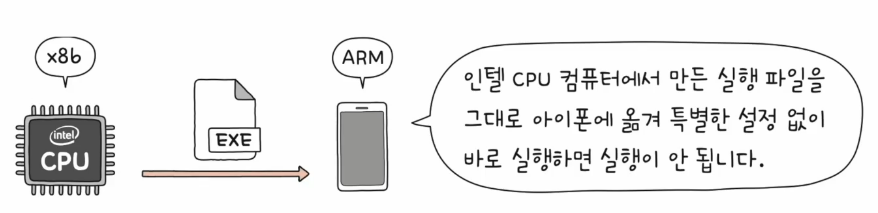
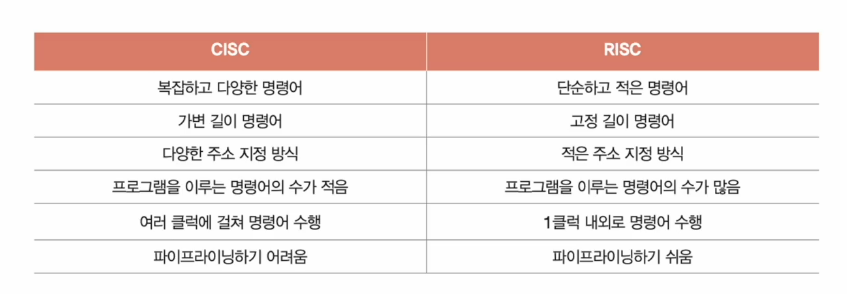

# 03. 명령어 집합 구조, CISC와 RISC
## 명령어 집합 (구조) : ISA
- CPU가 이해할 수 있는 명령어들의 모음
- CPU의 언어이자 하드웨어가 소프트웨어를 어떻게 이해할 지에 대한 약속
- 명령어가 달라지면 그에 따라 명령어 해석 방식, 레지스터의 종류와 개수 등 다양한 것이 달라진다!
- 명령어 집합의 두 축 : CISC와 RISC

## CISC (Complex Instruction Set Computer)
- 복잡합 명령어 집합을 활용하는 컴퓨터(CPU)
- 복잡하고 형태와 크기가 다양한 수의 가변 길이 명령어 집합을 활용
- x86, x86-64는 CISC 기반 명령어 집합 구조
- 다양하고 강력항 명령어를 활용 -> 상대적으로 적은 수의 명령어로도 프로그램을 실행할 수 있음

단점  
- **명령어 파이프라이닝이 불리**
- 명령어가 복잡하고 다양한 기능 제공 -> 명령어 크기와 실행되기까지의 시간이 일정하지 않음
- 명령어 하나를 실행하는데 여러 클럭 주기가 필요
- 대다수의 복잡한 명령어는 사용 빈도가 낮음

## RISC (Reduced Instruction Set Computer)
- 단순하고 적은 수의 고정 길이 명령어 집합을 활용
- 명령어의 종류가 적고, 짧고 규격화된 명령어 사용
- 명령어 파이프라이닝에 유리
- 메모리 접근 최소화(load, store), 레지스터 십분 활용
- 범용 레지스터가 많은 경우가 많다!
- 더많은 명령어로 프로그램을 실행

