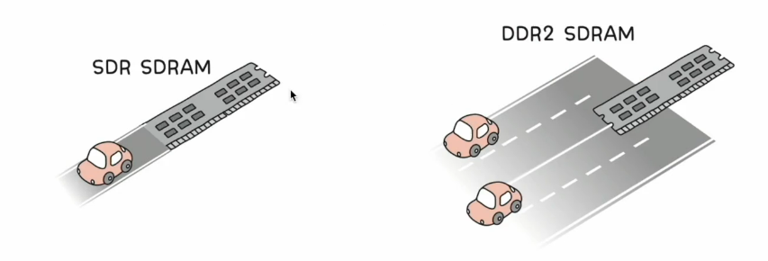

# 01. RAM의 특징과 종류
## RAM의 특징
- 휘발성 저장 장치
- CPU가 실행할 대상을 저장
- 휘발성 저장 장치이므로 보조기억장치(비휘발성 저장 장치)가 필요

## RAM의 용량과 성능
- RAM용량이 크다면
  - 많은 프로그램들을 동시에 실행하는 데에 유리
  - CPU가 한 번에 여러 개의 프로그램을 동시에 실행할 수 있는 성능 향상

## RAM의 종류
### DRAM (Dynamic RAM)
- 저장된 데이터가 **동적으로 사라지는 RAM**
- 데이터 소멸을 막기 위해 주기적으로 재활성화(refresh) 필요
- 일반적으로 메모리로 사용되는 RAM
  - 상대적으로 소비전력이 낮고 저렴. 높은 집적도로 대용량으로 설계하기 용이함

### SRAM (Static RAM)
- 저장된 데이터가 **정적인 (사라지지 않는)** RAM
- 전원을 끄면 삭제된다!! <- RAM이 휘발성이니까
- DRAM보다 일반적으로 빠름
- 일반적으로 캐시 메모리에서 사용되는 RAM
  - 상대적으로 소비전력이 높고 가격이 높음. 낮은 집적도로 "대용량으로 설계할 필요는 없으나 빨라야 하는 장치"에 사용 -> 캐시 메모리

### SDRAM (Synchronous DRAM)
- 특별한 (발전된 형태의) DRAM
- 클럭 신호와 동기화된 DRAM

### DDR SDRAM (Double Data Rate SDRAM)
- 특별한 (발전된 형태의) SDRAM
- 최근 가장 대중적으로 사용하는 RAM
- **대역폭**을 넓혀 속도를 빠르게 만든 SDRAM
  - 대역폭은 데이터를 주고받는 길의 너비
  - DDR SDRAM vs SDRAM(Single Data Rate SDRAM) : 대역폭이 두 배 넓은 SDRAM
  - 
  - DDR2 SDRAM vs DDR SDRAM
  - 