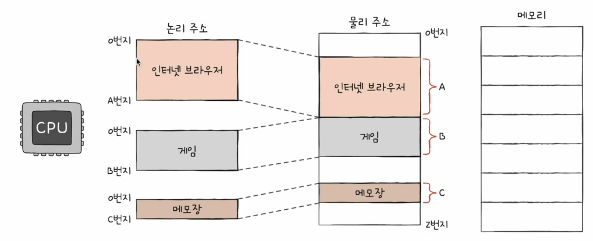
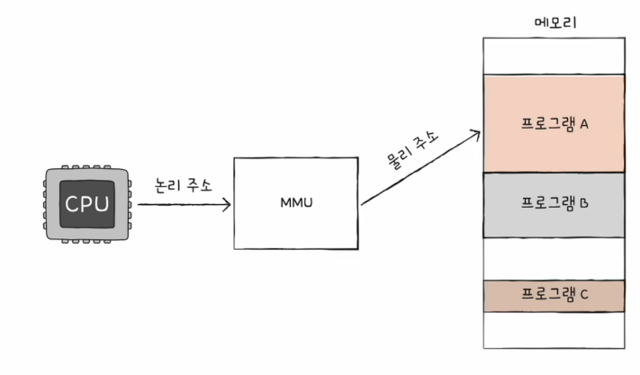
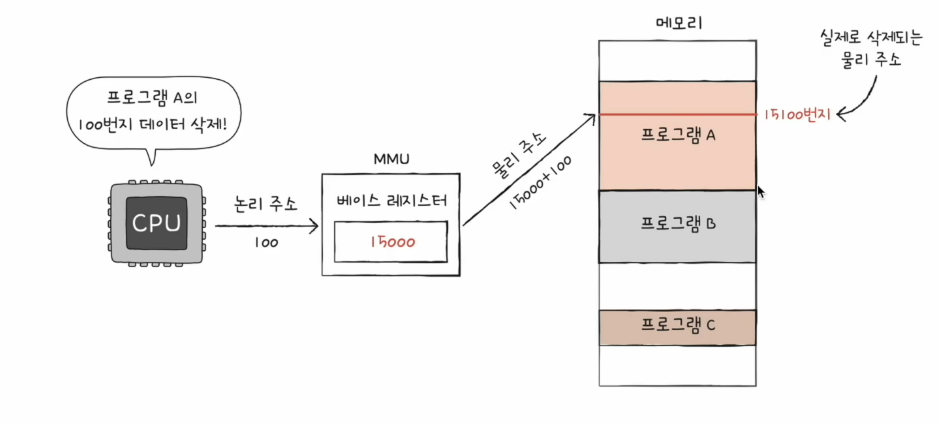
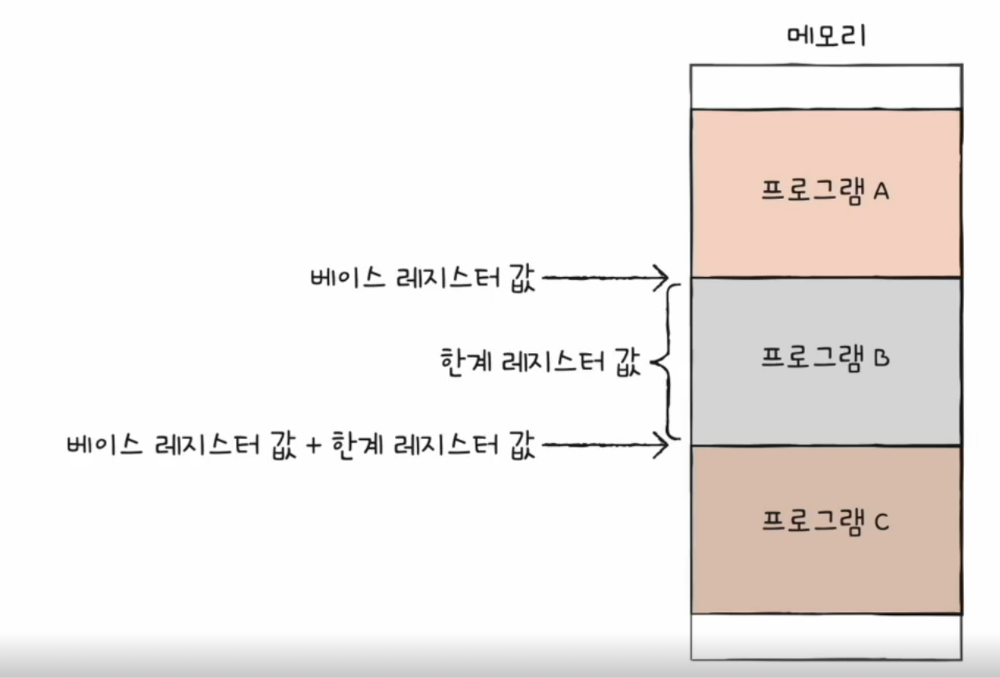
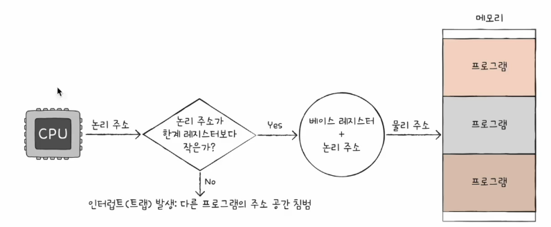

# 02. 메모리와 주소 공간
## 물리 주소와 논리 주소
CPU와 실행 중인 프로그램은 메모리 몇 번지에 무엇이 저장되어 있는지 다 알지 못함  
- 메모리에 저장된 값들은 시시각각 변하기 때문
  - 새롭게 실행되는 프로그램은 새롭게 메모리에 적재
  - 실행이 끝난 프로그램은 메모리에서 삭제
  - 같은 프로그램을 실행하더라고 실행할 때마다 적재되는 주소는 달라짐

### 물리 주소  
- 메모리 입장에서 바라본 주소
- 말 그대로 정보가 실제로 저장된 하드웨어상의 주소

### 논리 주소
- CPU와 실행 중인 프로그램 입장에서 바라본 주소
- 실행 중인 프로그램 각각에게 부여된 0번지부터 시작하는 주소

### 물리 주소와 논리 주소의 변환
- MMU(메모리 관리 장치)라는 하드웨어에 의해 변환
  - 논리 주소와 베이스 레지스터 값(프로그램의 기준 주소)을 더하여 논리 주소를 물리 주소로 변환
  - 베이스 레지스터 값 : 물리 주소 상의 프로그램의 시작 주소. 프로그램의 가장 작은 물리 주소
  - 논리 주소 : 실제로 저장되어 있는 프로그램 시작점으로부터 떨어진 거리

### 메모리 보호
- 한계 레지스터
  - 프로그램의 영역을 침범할 수 있는 명령어의 실행을 막음
  - 논리 주소의 최대 크기를 저장
  - 베이스 레지스터 값 <= 프로그램의 물리 주소 범위 < 베이스 레지스터 + 한계 레지스터 값
  - CPU가 접근하려는 논리 주소는 한계 레지스터가 저장한 값보다 커서는 안 됨

- CPU는 메모리에 접근하기 전 접급하고자 하는 논리 주소가 한계 레지스터보다 작은지를 항상 검사
  - 실행 중인 프로그램의 독립적인 실행 공간을 확보
  - 하나의 프로그램이 다른 프로그램을 침범하지 못하도록 보호

