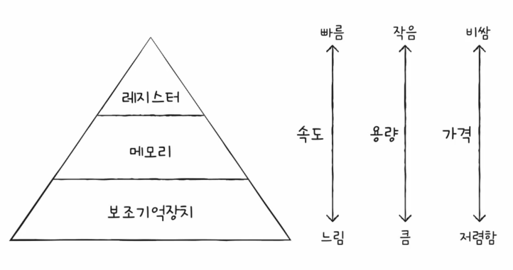
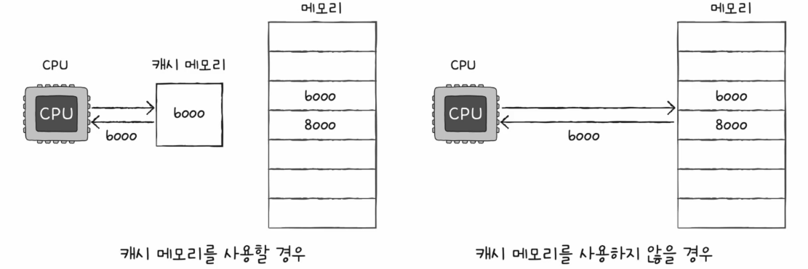
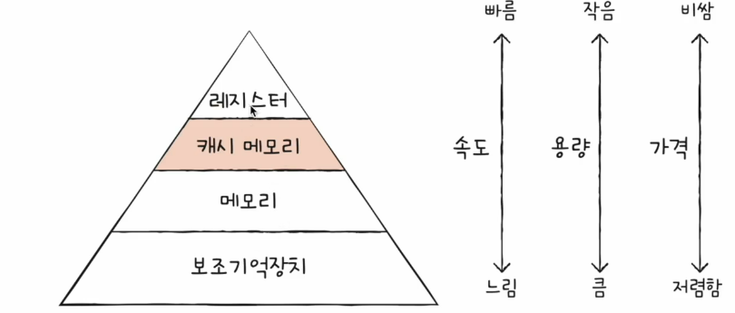
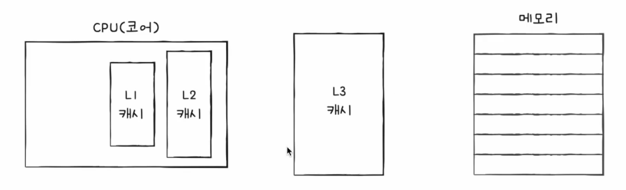
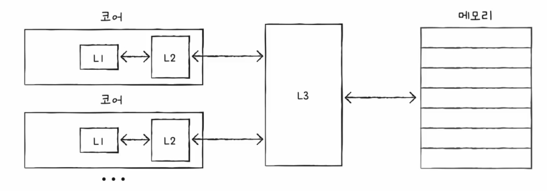
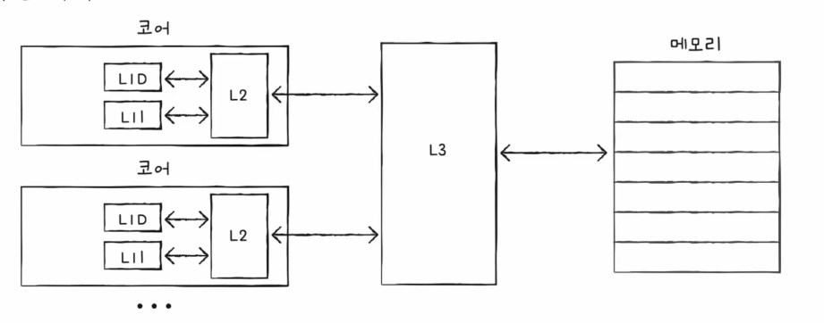
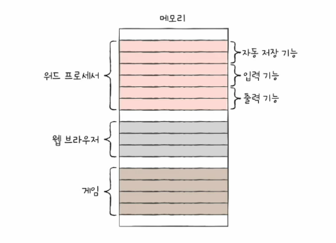

# 03. 캐시 메모리
## 저장 장치 계층 구조
1. CPU와 가까운 저장 장치는 빠르고, 멀리 있는 저장 장치는 느리다.
2. 속도가 빠른 저장 장치는 저장 용량이 작고, 가격이 비싸다.

### 레지스터 vs 메모리(RAM) vs USB 메모리
- 레지스터 : CPU와 가장 가까움. 빠르고 비쌈
- 메모리(RAM) : USB보다 가까움. USB보다 빠르고 비쌈
- USB 메모리 : 가장 멈. 가장 느리고 저렴

저장 장치 계층 구조 (메모리 계층 구조) : 각기 다른 용량과 성능의 저장 장치들을 계층화하여 표현한 구조
- CPU에 얼마나 가까운가?가 기준

## 캐시 메모리
- CPU와 메모리사에 위치. 레지스터보다 용량이 크고 메모리보다 빠른 SRAM 기반의 저장 장치
- CPU의 연산 속도와 메모리 접근 속도의 차이를 조금이나마 줄이기 위해 탄생
- CPU가 매번 메모리에 왔다 갔다 하는 건 시간이 오래 걸림 -> 메몰리에서 CPU가 사용할 일부 데이터를 미리 캐시 메모리로 가져와 쓰자

### 계층적 캐시 메모리 (L1-L2-L3)
- 일반적으로 L1 캐시와 L2 캐시는 코어 내부에, L3 캐시는 코어 외부에

- 멀티코어 프로세서의 캐시 메모리

- 분리형 캐시
    - L1D(데이터만) L1I(명령어만)    

## 참조 지역성의 원리
- CPU가 자주 사용할 법한 내용을 예측하여 저장
- 캐시 히트 : 예측이 들어맞을 경우. CPU가 캐시 메모리에 저장된 값을 활용할 경우
- 캐시 미스 : 예측이 틀렸을 경우. CPU가 메모리에 접근해야 하는 경우
- 캐시 적중률 : 캐시 히트 횟수 / (캐시 히트 횟수 + 캐시 미스 횟수)
  - 캐시 적중률을 높여야 한다!

참조 지역성의 원리  
- CPU가 사용할 법한 데이터를 예측하는 방법
- CPU가 메모리에 접근할 때 주된 경향을 바탕으로 만들어진 원리
1. CPU는 최근에 접근했던 메모리 공간에 다시 접근하려는 경향이 있다.
2. CPU는 접근한 메모리 공간 근처를 접근하려는 경향이 있다. (공간 지역성)
   - 