# 01. 다양한 보조 기억 장치
하드 디스크와 플래시 메모리를 수명이 있다.  

## 하드 디스크
- 자기적인 방식으로 데이터 저장
- 자기 디스크의 일종

### 구성
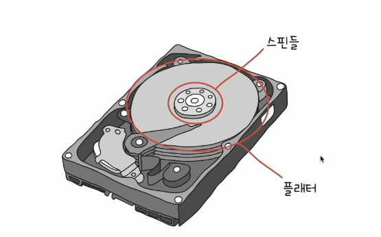
- 플래터
    - 동그란 원판. 수많은 N극과 S극으로 데이터들이 저장된다.
    - 여러겹으로 이루어져 있음. 양면을 모두 사용 -> 많은 양을 저장해야하기 때문
- 스핀들
    - 플래터를 회전시킴
    - RPM(Revolution Per Minute) : 분당 회전수

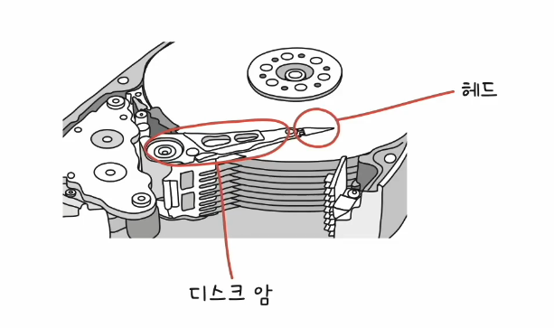

- 헤드
    - 플래터를 읽고 쓸 수 있는 수단
    - 플래터의 자기물질을 읽는 구성요소
    - 면 마다 존재
- 디스크암
    - 헤드를 움직여주는 존재
    - 모든 헤드가 디스크 암에 부착되어 함께 이동
    - 일반적으로 디스크 암에 한 번에 부착해 함꺼번에 움직임

### 저장 단위
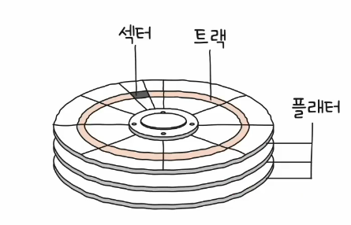

- 기본적으로 트랙(track)과 섹터(sector) 단위로 데이터 저장
- 트랙 : 플래터를 이루고 있는 동심원을 그리는 저장 단위
- 섹터 : 트랙을 나누었을 때 한 조각
    - 섹터의 크기 : 512바이트 ~ 4096바이트
- 블록(block) : 하나 이삭의 섹터를 묶은 것

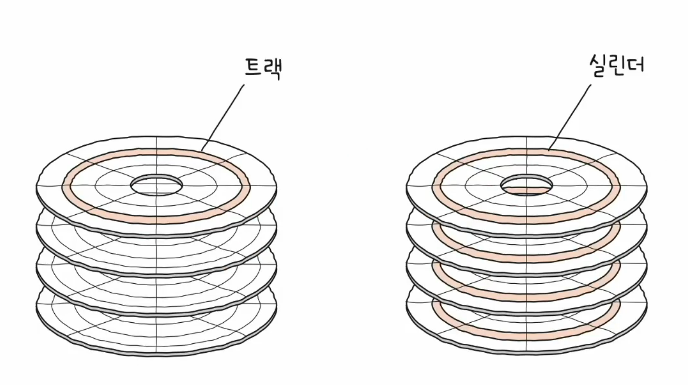

- 실린더 : 여러 겹의 플래터 상에서 **같은 트랙이 위치한 곳**을 보마 연결한 논리적 단위
- 플래터는 트랙과 섹터로 나뉘고, 같은 트랙이 모여 실린더를 이룸

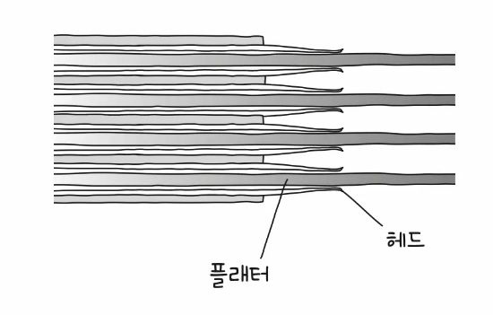

- 연속된 정보는 한 실린더의 기록이 된다!!

### 데이터 접근 과정
하드 디스크가 저장된 데이터에 접근하는 시간  
- 탐색 시간(seek time)
  - 접근하려는 데이터가 저장된 트랙까지 헤드를 이동시키는 시간
  - 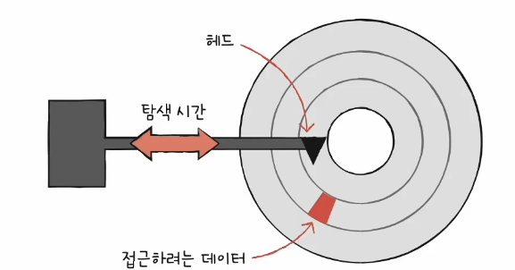
- 회전 지연(rotational latency)
  - 헤드가 있는 곳으로 플래터를 회전시키는 시간
  - 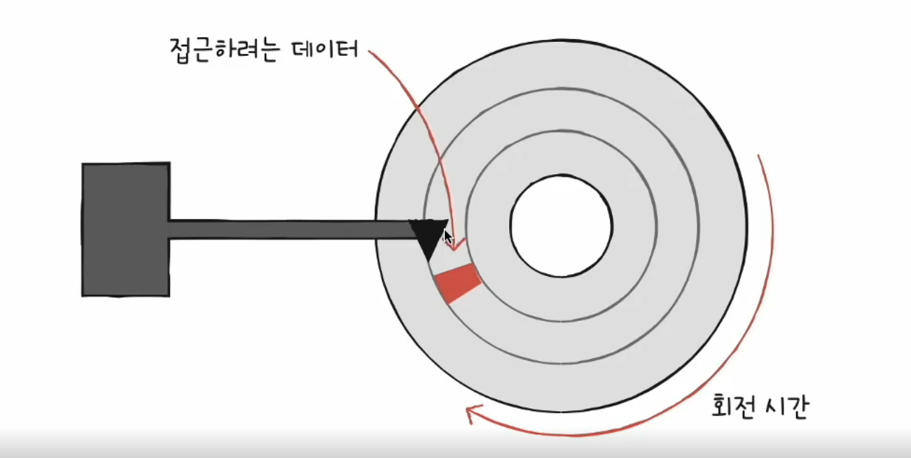
- 전송 시간(transfer time)
  - 하드 디스크와 컴퓨터 간에 데이터를 전송하는 시간
  - 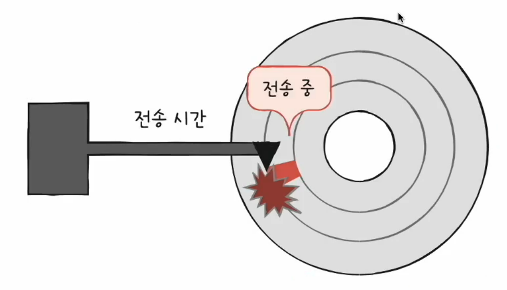

## 플래시 메모리
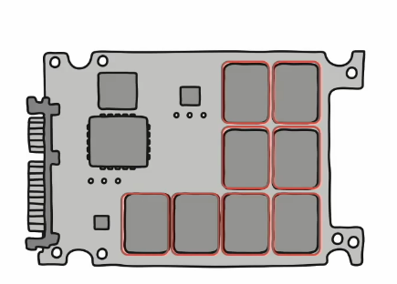

- 전기적으로 데이터를 읽고 쓴느 반도체 기반 저장 장치
- SSD, SD카드, USB 메모리가 플래시 메모리 기반의 저장 장치
- 범용성이 넒어 보조기억장치에만 속한다고 보기에는 어려움!!
- NAND 플래시 메모리(대용량 저장장치로 많이 사용된다!! 앞으로 얘를 설명할 거임), NOR 플래시 메모리

셀(cell)  
- 플래시 메모리에서 데이터를 저장하는 가장 작은 단위
- 셀이 모이고 모여 수 MB, GM, TB 저장 장치가 된다.
- 한 셀에
  - 1비트를 저장할 수 있는 플래시 메모리 : SLC
  - 2비트를 저장할 수 있는 플래시 메모리 : MLC
  - 3비트를 저장할 수 있는 플래시 메모리 : TLC
  - 4비트를 저장할 수 있는 플래시 메모리 : QLC

### SLC, MLC, TLC
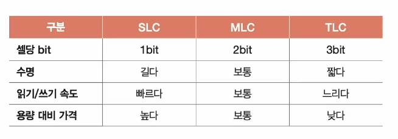

- 셀 = 집, 1비트 -> 사람 한 명

#### SLC

- 한 셀로 두 개의 정보 표현
- 비트의 빠른 입출력
- 긴 수명
- 용량 대비 고가격

#### MLC

- 한 셀로 네 개의 정보 표현 (대용량화 유리)
- SLC보다 느린 입출력
- SLC보다 짧은 수명
- SLC보다 저렴
- 시중에서 많이 사용 

#### TLC
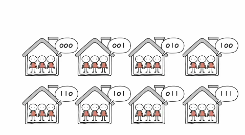

- 한 셀로 여덟 개의 정보 표현 (대용량화 유리)
- MLC보다 느린 입출력
- MLC보다 짧은 수명
- MLC보다 저렴
- 시중에서 많이 사용 

=> 같은 플래시 메모리라도 수명, 가격, 성능이 다르다!

### 저장 단위
셀(cell)
- 플래시 메모리에서 데이터를 저장하는 가장 작은 단위
- 셀이 모이고 모여 수 MB, GM, TB 저장 장치가 된다.

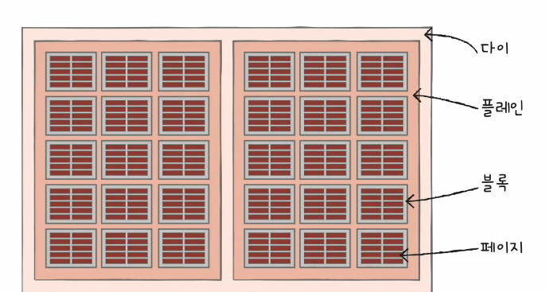

- 셀들이 모여 페이지(page)
- 페이지드이 모여 블록(block)
- 블록이 모여 플레인(plane)
- 플렌인이 모여 다이(die)

#### 읽기/쓰기 단위와 삭제 단위가 다르다.  
- 읽기와 쓰기는 페잊 단위로 이루어짐
- 삭제는 (페이지보다 큰) 블록 단위로 이루어짐

#### 페이지 상태
- Free 상태 : 어떠한 데이터도 저장하고 있지 않아 새로운 데이터를 저장할 수 있는 상태
- Valid 상태 : 이미 유효한 데이터를 저장하고 있는 상태
- Invalid 상태 : 유효하지 않은 데이터(쓰레기값)를 저장하고 있는 상태
- 플래시 메모리는 하드 디스크와 달리 덮어쓰기가 불가능

### 동작 예시
새롭게 저장된 C와 기존에 저장되어 있던 V는 그대로 둔 채 기존의 A만 A'로 수정하고 싶은 경우
- 남은 칸에 A'를 저장하고 A는 Invalid 처리! -> 쓰레기 자리 차지 발생

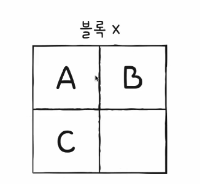

#### 가비지 컬렉션
유효한 페이지들만 새로운 블록으로 복사한 후 기존 블록을 삭제하여 공간을 정리하는 기능  

1. 유효한 페이지들만을 새로운 블록으로 복사
2. 기존의 블록을 삭제

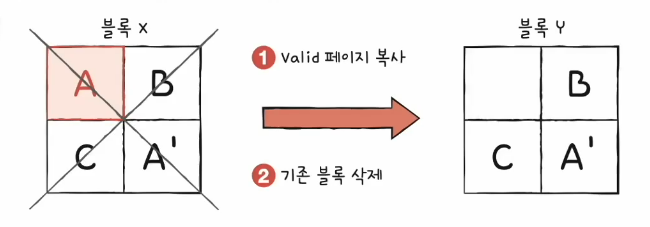