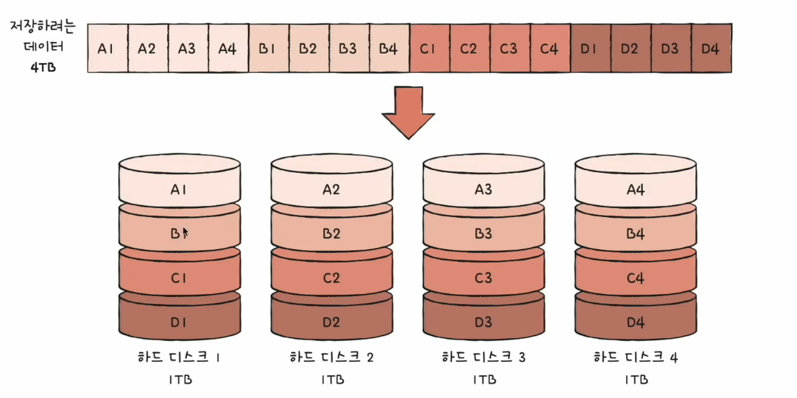
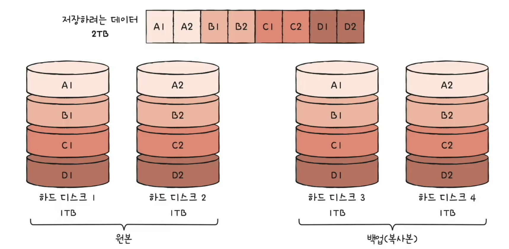
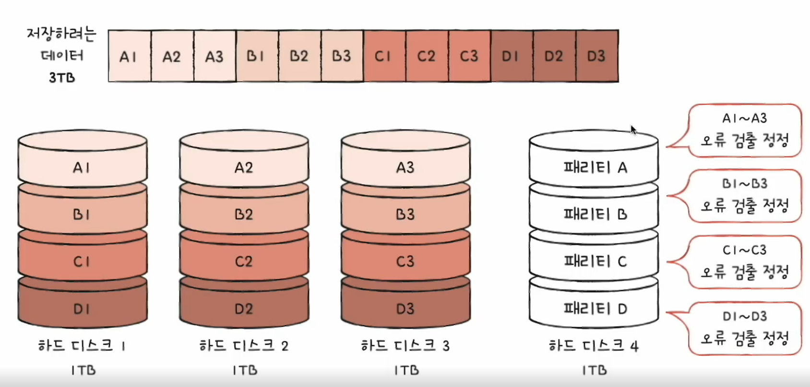
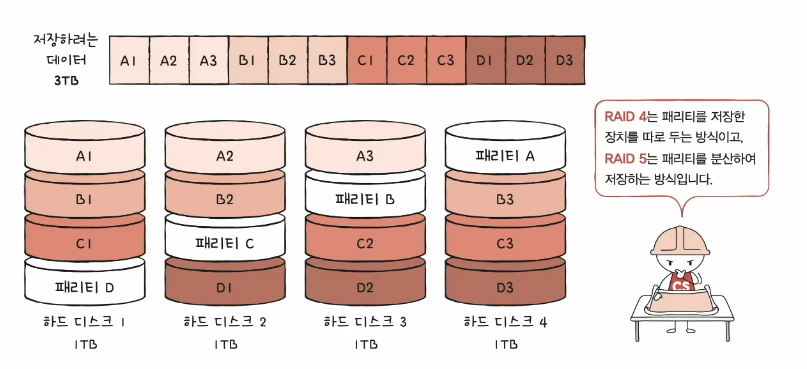
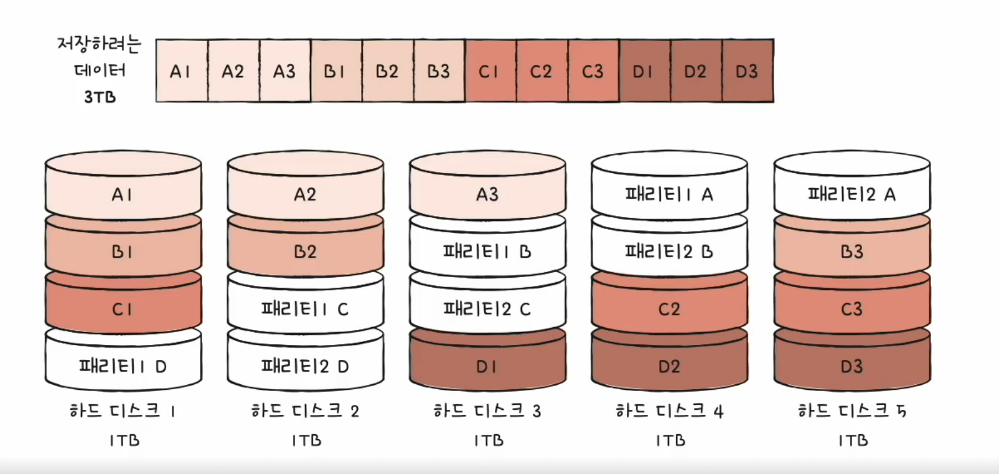

# 02. RAID의 정의와 정류
## RAID (Redundant Array of Independent Disks)
- 하드 디스크와 SS로 사용하는 시술
- 데이터의 안정성 혹은 높은 성능을 위해 여러 물리적 보조기억장치를 마치 하나의 논리적 보조기억장치처럼 사용하는 기술

### RAID 레벨
- RAID를 구성하는 기술
- **RAID 0, RAID 1**, RAID 2, RAID 3, **RAID 4, RAID 5, RAID 6**

### RAID 0
- 데이터를 단순히 나누어 저장하는 구성 방식
- 각 하드 디스크는 번갈아 가며 데이터를 저장
- 저장되는 데이터가 하드 디스크 개수만큼 나뉘어 저장
- 스트라입(strip) : 마치 줄무늬처럼 분산되어 저장된 데이터
- 스타라이핑(striping) : 분산하여 저장하는 것
- 장점 : 입출력 속도의 향상
- 단점 : 저장된 정보가 안전하지 않음 -> 하드 디스크가 하나 고장나면 전테 사용 어려움

### RAID 1
- 미러링(mirroring) : 복사본을 만드는 방식
- 데이터를 쓸 때 원본과 복사본 두 군데에 씀 (느린 쓰기 속도)
- 장점 : 백업 복구가 쉽다
- 단점 : 하드 디스크 개수가 한정되었을 때 사용 가능한 용량이 적어짐
  - 복사본이 만들어지는 용량 만큼 사용 불가 -> 많은 양의 하드 디스크가 필요 -> 비용 증가

### RAID 4
- RAID 1 처럼 완전한 복사본을 만드는 대신 **오류를 검출하고 복구하기 위한 정보**를 저장
- 패리티 비트
  - 패리티를 저장한 장치를 이용해 다른 장티들의 오류를 검출하고, 오류가 있다면 복구
  - 오류 검출만 가능할 뿐 오류 복구는 불가능
- 단점 : 패리티 디스크의 병목 현상 발생할 수 있음

### RAID 5
- 패리티 정보를 분산하여 저장하는 방식

### RAID 6
- 두 종류의 패리티(오류를 검출하고 복구할 수 있는 수단)
- RAID 5보다 안전, 쓰기는 느림

